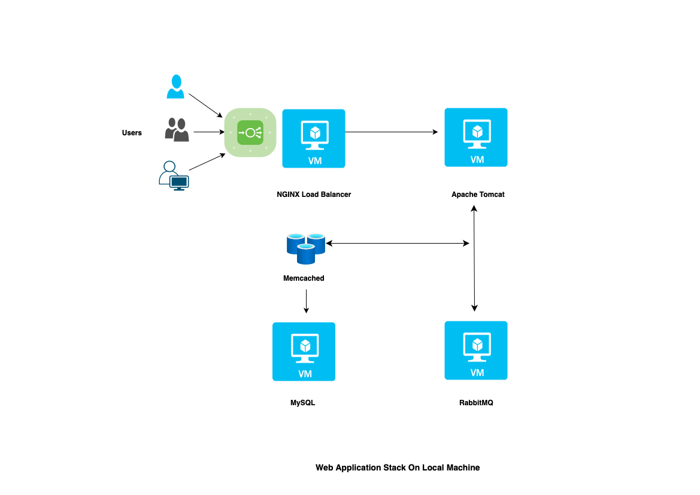
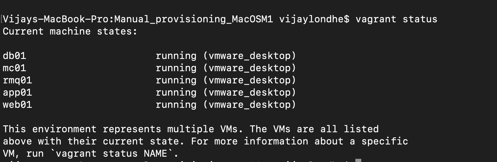
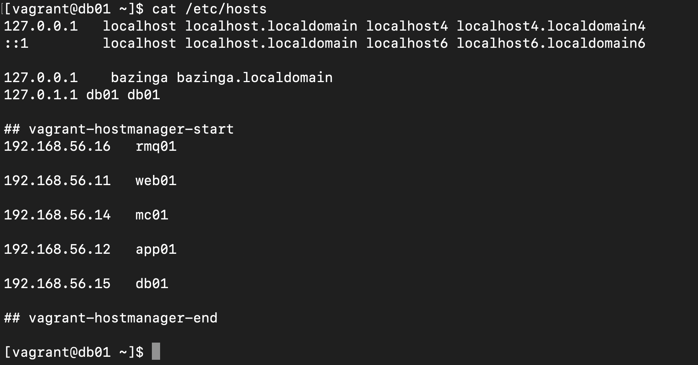

# Project-01: Setup Web Application Stack on Local Machine 

In this project we will setup the Web Application Stack on the local machine. This stack includes following tools and services.

- NGINX: This will be act as load balancer and forward user requests to the Apache Tomcat application server.

- Apache Tomcat: This will be our application server to deploy the java web application.

- RabbitMQ: Used as message broker for the application.

- Memcached: Used to cache data from the MySQL database server for faster user performance. 

- MySQL: Database server for the application.


## Pre-requisite 

- Oracle Virtual Box (for Windows)/ VMware Fusion Tech (for MacOS)
- Vagrant (for VM automation)
- Vagrant Plugin (vagrant-hostmanager/vagrant-vbguest/vagrant-vmware-desktop) 
- Git 
- IDE (VSCode)


## Architecture 



User from the browser will access the nginx service, nginx service then forward request to the apache tomcat server, which then forward request to message broker (RabbitMQ), and rabbitmq will forward request to the memcached and finally to the mysql server.

## Step 1: Setup Virtual Machines


Clone the repository

```
git clone https://github.com/vijaylondhe/vprofile-project.git
```

```
cd vagrant/Manual_provisioning_MacOSM1
```

Run the virtual machines

```
vagrant up
```

Note: This will bring up all the virtual machines listed in Vagrantfile, execute the below command to see the status of virtual machines 

```
vagrant status
```




### Setup VM for MySQL 


Login into MySQL Virtual Machine:

```
vagrant ssh db01
```

Check host file is automatically updated by host-manager vagrant plugin.

```
cat /etc/hosts
```



Set environment variable for db user password

```
DATABASE_PASS='admin123'
```

Make it permenent

```
vi /etc/profile
DATABASE_PASS='admin123'
```

```
source /etc/profile
```


Update the repository and install MariaDB package

```
sudo yum update -y
```

```
sudo yum install epel-release -y 
```

```
sudo yum install git mariadb-server -y

```

Start and Enable MariaDB server

```
sudo systemctl start mariadb
sudo systemctl enable mariadb
```

Run the database installation script 

```
sudo mysql_secure_installation
```

- [ ] *Set user password: admin123*

- [ ] *Remove Anonymous User? Y*

- [ ] *Disallow root login remotely? n*

- [ ] *Remove test database and access to it? Y*

- [ ] *Reload privilege tables now? Y*


Download the source code and initialize the database

```
git clone https://github.com/vijaylondhe/vprofile-project.git
cd vprofile-project/src/main/resources/
mysql -u root -p"$DATABASE_PASS" -e "create database accounts"
mysql -u root -p"$DATABASE_PASS" -e "grant all privileges on accounts.* TO 'admin'@'app01' identified by 'admin123' "
cd ../../..
mysql -u root -p"$DATABASE_PASS" accounts < src/main/resources/db_backup.sql
mysql -u root -p"$DATABASE_PASS" -e "FLUSH PRIVILEGES"
```

Login to the database and verify

```
mysql -u root -p"$DATABASE_PASS"
MariaDB [(none)]> show databases;
MariaDB [(none)]> use accounts;
MariaDB [(none)]> show tables;
exit
```

Restart the database service

```
sudo systemctl restart mariadb
```

Configure firewall for mariadb database on port 3306

```
sudo systemctl start firewalld
sudo systemctl enable firewalld
sudo firewall-cmd --get-active-zones
sudo firewall-cmd --zone=public --add-port=3306/tcp --permanent 
sudo firewall-cmd --reload
sudo systemctl restart mariadb
```


### Setup VM for Memcached

Login to mc01 virtual machine and install memcached package.

```
vagrant ssh mc01
sudo yum update -y 
sudo yum install memcached -y
```

Start and enable the service 

```
sudo systemctl start memcached
sudo systemctl enable memcached
sudo systemctl status memcached
```

Configure firewall for memcached port 11211

```
sudo firewall-cmd --add-port=11211/tcp --permanent
sudo firewall-cmd --reload
```

Make the changes in memcached configuration file

```
sudo sed -i 's/OPTIONS="-l 127.0.0.1"/OPTIONS=""/' /etc/sysconfig/memcached
```

Restart and configure the memcached service 

```
sudo systemctl restart memcached 
sudo memcached -p 11211 -U 11111 -u memcache -d
```

### Setup VM for RabbitMQ

Login to rmq01 instance and install the required packages

```
vagrant ssh rmq01
sudo yum update -y
```

Disable SELINUX on the virual machine 

```
sudo sed -i 's/SELINUX=enforcing/SELINUX=disabled/' /etc/selinux/config
sudo setenforce 0
```

Install dependencies and rabbitmq-server package

```
curl -s https://packagecloud.io/install/repositories/rabbitmq/erlang/script.rpm.sh | sudo bash
sudo yum clean all
sudo yum makecache
sudo yum install erlang -y
sudo yum install rabbitmq-server -y
```

Start and enable the service 

```
sudo systemctl start rabbitmq-server
sudo systemctl enable rabbitmq-server
sudo systemctl status rabbitmq-server
```

Make configuration changes in configuration file, add test user with test password and create user tag as administrator

```
sudo sh -c 'echo "[{rabbit, [{loopback_users, []}]}]." > /etc/rabbitmq/rabbitmq.config'
sudo rabbitmqctl add_user test test
sudo rabbitmqctl set_user_tags test administrator
```

Configure firewall for rabbitmq-server ports 

```
sudo firewall-cmd --add-port=5671/tcp --permanent 
sudo firewall-cmd --add-port=5672/tcp --permanent # firewall-cmd --reload
sudo firewall-cmd --zone=public --add-port=25672/tcp --permanent    #This port is used for inter-node communication.
sudo firewall-cmd --reload
sudo systemctl restart rabbitmq-server
sudo reboot
```


### Setup VM for Apache Tomcat

Login to app01 virtual machine and install latest packages

```
vagrant ssh app01
sudo yum update -y 
```

Install JDK,GIT and MAVEN packages

```
sudo yum install java-1.8.0-openjdk -y
sudo yum install git maven wget -y
```

Download Apache Tomcat Package

```
cd /tmp
wget https://archive.apache.org/dist/tomcat/tomcat-8/v8.5.37/bin/apache-tomcat-8.5.37.tar.gz
tar xzvf apache-tomcat-8.5.37.tar.gz
```

Create Tomcat user and its set home directory and shell 

```
useradd --home-dir /usr/local/tomcat8 --shell /sbin/nologin tomcat
```

Copy Tomcat directory from /tmp to /usr/local/tomcat8/ and set the permission to tomcat user

```
sudo cp -r /tmp/apache-tomcat-8.5.37/* /usr/local/tomcat8/
sudo chown -R tomcat.tomcat /usr/local/tomcat8
```

Setup Systemd for the tomcat

```
vi /etc/systemd/system/tomcat.service
[Unit] 
Description=Tomcat After=network.target

[Service]
User=tomcat
WorkingDirectory=/usr/local/tomcat8 Environment=JRE_HOME=/usr/lib/jvm/jre Environment=JAVA_HOME=/usr/lib/jvm/jre Environment=CATALINA_HOME=/usr/local/tomcat8 Environment=CATALINE_BASE=/usr/local/tomcat8 
ExecStart=/usr/local/tomcat8/bin/catalina.sh run 
ExecStop=/usr/local/tomcat8/bin/shutdown.sh 
SyslogIdentifier=tomcat-%i

[Install] 
WantedBy=multi-user.target
```

Setup firewall for tomcat port and restart the service 

```
sudo systemctl daemon-reload
sudo firewall-cmd --add-port=8080/tcp --permanent 
sudo firewall-cmd --reload
sudo systemctl start tomcat
sudo systemctl enable tomcat
sudo systemctl start firewalld
sudo systemctl enable firewalld
sudo firewall-cmd --get-active-zones
sudo firewall-cmd --zone=public --add-port=8080/tcp --permanent 
sudo firewall-cmd --reload
```

Setup JAVA path for maven

```
sudo echo 'JAVA_HOME=/usr/lib/jvm/jre-1.8.0-openjdk' > /etc/java/maven.conf 
sudo yum install java-1.8.0-openjdk-devel -y
```

### Build the code and Deploy the application

Clone the repository

```
git clone https://github.com/vijaylondhe/vprofile-project.git
cd vprofile-project/src/main/resources/
```

Update the configuration in application.properties 

```
vim application.properties

#JDBC Configutation for Database Connection
jdbc.driverClassName=com.mysql.jdbc.Driver
jdbc.url=jdbc:mysql://db01:3306/accounts?useUnicode=true&characterEncoding=UTF-8&zeroDateTimeBehavior=convertToNull
jdbc.username=admin
jdbc.password=admin123

#Memcached Configuration For Active and StandBy Host
#For Active Host
memcached.active.host=mc01
memcached.active.port=11211
#For StandBy Host
memcached.standBy.host=127.0.0.2
memcached.standBy.port=11211

#RabbitMq Configuration
rabbitmq.address=rmq01
rabbitmq.port=5672
rabbitmq.username=test
rabbitmq.password=test

#Elasticesearch Configuration
elasticsearch.host =192.168.1.85
elasticsearch.port =9300
elasticsearch.cluster=vprofile
elasticsearch.node=vprofilenode

```

Build the code, this will create war file in target directory 

```
mvn install 
```

Deploy the artifact 

```

sudo systemctl stop tomcat
sleep 120
sudo rm -rf /usr/local/tomcat8/webapps/ROOT*
sudo cp target/vprofile-v2.war /usr/local/tomcat8/webapps/ROOT.war 
sudo systemctl start tomcat
sleep 300
```

Change ownership of war file and restart the tomcat service

```
sudo chown tomcat.tomcat usr/local/tomcat8/webapps -R 
sudo systemctl restart tomcat
```


### Setup VM for NGINX

Login to Nginx virtual machine and install the nginx package 

```
vagrant ssh web01 
sudo apt update 
sudo apt upgrade 
sudo apt install nginx -y 
```

Create Nginx configuration file 

```
sudo vim /etc/nginx/sites-available/vproapp

upstream vproapp {
    server app01:8080;
}
server {
    listen 80;
    location / {
        proxy_pass http://vproapp;
    }
}
```

Remove the default nginx configuration

```
rm -rf /etc/nginx/sites-enabled/default
```

Create link to activate the website 

```
ln -s /etc/nginx/sites-available/vproapp /etc/nginx/sites-enabeld/vproapp
```

Restart the nginx service 

```
sudo systemctl restart nginx
```


### Test the Application from browser 

Take IP Address of nginx virtual machine using ip addr command and enter following URL in the browser 

```
http://192.168.56.11
```


