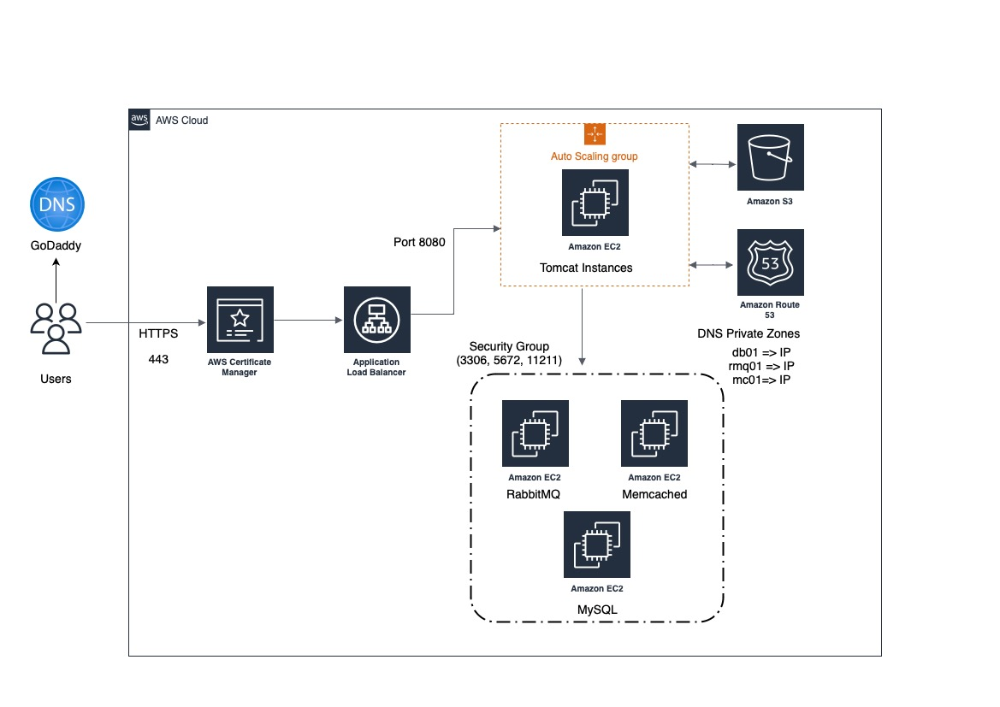

# Project-03: Lift and Shift the WebApplication on AWS 

In this project we will setup the web application stack on the AWS cloud.

Following AWS services will be used 

- EC2
- ELB
- Auto Scaling 
- EBS/EFS
- Route53
- IAM
- ACM
- S3 

## Flow of execution:

- Login to the AWS account.
- Create key pair to access the instances.
- Create Security groups, so that only required ports will be opened on the instances. 
- Launch the EC2 instances (for Apache Tomcat, Memcached, RabbitMQ and MySQL) with userdata.
- Update the IP addresses in Route53. 
- Build the application from the source code.
- Upload the artifact to S3 storage.
- Download the artifact from S3 to EC2 tomcat instance.
- Setup the ELB with HTTPS (Use ACM for SSL certifiacte).
- Map the ELB endpoint url to website name in DNS provider (e.g. GoDaddy).
- Verify the application. 


## Architecture 




### Create Certificate in AWS Certificate Manager (ACM)

- Login to the AWS account and select N.Virginia as region


- Go to Certificate Manager service and click on Request a Certificate 


- Select certificate type as public certificate and click next


- Enter the domain name and DNS validation method as show in below and click on Request 


- You will see Certificate ID and the status as "pending"

- Click on Certificate ID copy the CNAME name and CNAME value and create CNAME record in your DNS provider (e.g. GoDaddy)

- After some time you will see the certifiacte status as "Issued"


### Create Key Pair 

Select N.virgina as region

Go to EC2 service and under the Network and Security select the Key Pairs 

Provide name to keypair e.g. vprofile-key select .pem as private key file format


### Create Security Groups

- Create Security group for Application load balancer 

In inbound rules add 80 and 443 port for all internet access, so that our application will be accessed from the internet.

Security Group Name: SG_ALB


- Create Security group for Apache tomcat instance 

In inbound rules add port 8080 and allow access from security group of ALB.

Security Group Name: SG_Apache_tomcat


- Create Security group for backend services (RabbitMQ, Memcached, MySQL)

In inbound rules add port 3306 (MySQL), 11211 (Memcached), 5672 (RabbitMQ) and allow access to security group of Apache Tomcat only.

Security Group Name: SG_Backend_Services

Also add one inbound rule with ALL traffic with self Security Group ID (This will allow all backend services to communicate with each other). 


### Create EC2 instance for MySQL 

- AMI: Amazon-Linux-2
- Instance Type: t2.micro
- VPC: Default
- Security Group: SG_Backend_Services
- Key Pair: vprofile-key
- Tag: "Name": "vprofile-db01",  "Project": "vprofile"
- User Data: 

```
#!/bin/bash
DATABASE_PASS='admin123'
sudo yum update -y
sudo amazon-linux-extras install epel -y
sudo yum install git zip unzip -y
sudo yum install mariadb-server -y


# starting & enabling mariadb-server
sudo systemctl start mariadb
sudo systemctl enable mariadb
cd /tmp/
git clone https://github.com/vijaylondhe/vprofile-project.git
#restore the dump file for the application
sudo mysqladmin -u root password "$DATABASE_PASS"
sudo mysql -u root -p"$DATABASE_PASS" -e "UPDATE mysql.user SET Password=PASSWORD('$DATABASE_PASS') WHERE User='root'"
sudo mysql -u root -p"$DATABASE_PASS" -e "DELETE FROM mysql.user WHERE User='root' AND Host NOT IN ('localhost', '127.0.0.1', '::1')"
sudo mysql -u root -p"$DATABASE_PASS" -e "DELETE FROM mysql.user WHERE User=''"
sudo mysql -u root -p"$DATABASE_PASS" -e "DELETE FROM mysql.db WHERE Db='test' OR Db='test\_%'"
sudo mysql -u root -p"$DATABASE_PASS" -e "FLUSH PRIVILEGES"
sudo mysql -u root -p"$DATABASE_PASS" -e "create database accounts"
sudo mysql -u root -p"$DATABASE_PASS" -e "grant all privileges on accounts.* TO 'admin'@'localhost' identified by 'admin123'"
sudo mysql -u root -p"$DATABASE_PASS" -e "grant all privileges on accounts.* TO 'admin'@'%' identified by 'admin123'"
sudo mysql -u root -p"$DATABASE_PASS" accounts < /tmp/vprofile-project/src/main/resources/db_backup.sql
sudo mysql -u root -p"$DATABASE_PASS" -e "FLUSH PRIVILEGES"

# Restart mariadb-server
sudo systemctl restart mariadb


#starting the firewall and allowing the mariadb to access from port no. 3306
sudo systemctl start firewalld
sudo systemctl enable firewalld
sudo firewall-cmd --get-active-zones
sudo firewall-cmd --zone=public --add-port=3306/tcp --permanent
sudo firewall-cmd --reload
sudo systemctl restart mariadb

```

### Create EC2 instance for Memcached

- AMI: Amazon-Linux-2
- Instance Type: t2.micro
- VPC: Default
- Security Group: SG_Backend_Services
- Key Pair: vprofile-key
- Tag: "Name": "vprofile-mc01",  "Project": "vprofile"
- User Data: 

```
#!/bin/bash
sudo amazon-linux-extras install epel -y
sudo yum install memcached -y
sudo systemctl start memcached
sudo systemctl enable memcached
sudo systemctl status memcached
sudo memcached -p 11211 -U 11111 -u memcached -d
```


### Create EC2 instance for RabbitMQ

- AMI: Amazon-Linux-2
- Instance Type: t2.micro
- VPC: Default
- Security Group: SG_Backend_Services
- Key Pair: vprofile-key
- Tag: "Name": "vprofile-rmq01",  "Project": "vprofile"
- User Data: 

```
#!/bin/bash
sudo amazon-linux-extras install epel -y
sudo yum update -y
sudo yum install wget -y
cd /tmp/
wget http://packages.erlang-solutions.com/erlang-solutions-2.0-1.noarch.rpm
sudo rpm -Uvh erlang-solutions-2.0-1.noarch.rpm
sudo yum -y install erlang socat
curl -s https://packagecloud.io/install/repositories/rabbitmq/rabbitmq-server/script.rpm.sh | sudo bash
sudo yum install rabbitmq-server -y
sudo systemctl start rabbitmq-server
sudo systemctl enable rabbitmq-server
sudo systemctl status rabbitmq-server
sudo sh -c 'echo "[{rabbit, [{loopback_users, []}]}]." > /etc/rabbitmq/rabbitmq.config'
sudo rabbitmqctl add_user test test
sudo rabbitmqctl set_user_tags test administrator
sudo systemctl restart rabbitmq-server
```

### Create EC2 instance for Apache Tomcat

- AMI: Amazon-Linux-2
- Instance Type: t2.micro
- VPC: Default
- Security Group: SG_Apache_tomcat
- Key Pair: vprofile-key
- Tag: "Name": "vprofile-app01",  "Project": "vprofile"
- User Data: 

```
#!/bin/bash
sudo apt update
sudo apt upgrade -y
sudo apt install openjdk-8-jdk -y
sudo apt install tomcat8 tomcat8-admin tomcat8-docs tomcat8-common git -y
```
### Setup Route53 Private Hosted Zone

- Open Route53 Service

- Create Private Hosted Zone

- Give the name e.g. vprofile.in

- Click on create

- Create A records for all backend services 

```
db01.vprofile.in    172.31.19.22
mc01.vprofile.in    172.31.31.190
rmq01.vprofile.in   172.31.24.225
```

### Build and Deploy the Artifact

- Install JDK, MAVEN and AWS-CLI on the local machine 

- Clone the repository 

```
cd /tmp
git clone https://github.com/vijaylondhe/vprofile-project.git
```

- Edit application.properties file to modify the hostname of backend services.

```
cd vprofile-project/src/main/resources

vi application.properties

#JDBC Configutation for Database Connection
jdbc.driverClassName=com.mysql.jdbc.Driver
jdbc.url=jdbc:mysql://db01.vprofile.in:3306/accounts?useUnicode=true&characterEncoding=UTF-8&zeroDateTimeBehavior=convertToNull
jdbc.username=admin
jdbc.password=admin123

#Memcached Configuration For Active and StandBy Host
#For Active Host
memcached.active.host=mc01.vprofile.in
memcached.active.port=11211
#For StandBy Host
memcached.standBy.host=127.0.0.2
memcached.standBy.port=11211

#RabbitMq Configuration
rabbitmq.address=rmq01.vprofile.in
rabbitmq.port=5672
rabbitmq.username=test
rabbitmq.password=test

#Elasticesearch Configuration
elasticsearch.host =192.168.1.85
elasticsearch.port =9300
elasticsearch.cluster=vprofile
elasticsearch.node=vprofilenode
```

- Generate the WAR file

```
cd /tmp/vprofile-project
mvn install
```

- Copy the WAR file to the S3 bucket on AWS

Create the IAM user with programatic access and s3fullaccess permissiom

- Configure the AWS Credentials 

```
aws configure
```
- Create the S3 bucket

```
aws s3 mb s3://vprofile-artifact-store-815
aws s3 ls
```

- Copy WAR file from local machine to the S3 bucket

```
aws s3 cp /tmp/vprofile-project/target/vprofile-v2.war s3://vprofile-artifact-store-815

aws s3 ls s3://vprofile-artifact-store-815
```

- Create IAM role which will grant access to S3 service and attach to apache tomcat instance.

- Make Sure to add S3FullAccess policy in the role.

- Login to Apache Tomcat instance, and Install the aws-cli package 

```
ssh -i vprofile-key ec2-user@52.134.25.110
sudo -i
yum install aws-cli -y
```

- Copy the artifact from the s3 to /tmp folder

```
aws s3 cp s3://vprofile-artifact-store-815/vprofile-v2.war /tmp/
```

- Copy the Artifact from /tmp to /var/lib/tomcat8/webapps/ as ROOT.war

```
cp /tmp/vprofile-v2.war /var/lib/tomcat8/webapps/ROOT.war
```

- Open the file /var/lib/tomcat8/webapps/ROOT/WEB-INF/classes/application.properties and check the hostname for MySQL, Memcached, and RabbitMQ services are as per A records configured in Route53.


### Create Target group and Application Load Balancer

- In EC2 service, select the Target Group 

- Create the new Target Group 


### Update the Load Balancer endpoint in GoDaddy

### Verify the application

### Setup the AutoScaling Group for Apache Tomcat

Create AMI of apache tomcat instance AMI Name: 

Create Launch Configuration 

    Name
    AMI
    Instance Type 
    Security Group
    IAM Role 


Create Auto Scaling Group 
    
    Name
    Launch Configuration
    VPC
    Subnets
    Enable Load Balancing 
    Select Target Group
    Select Health Check on Laod Balancer 
    Capacity
    Target Tracking Policy CPU utilization 50%