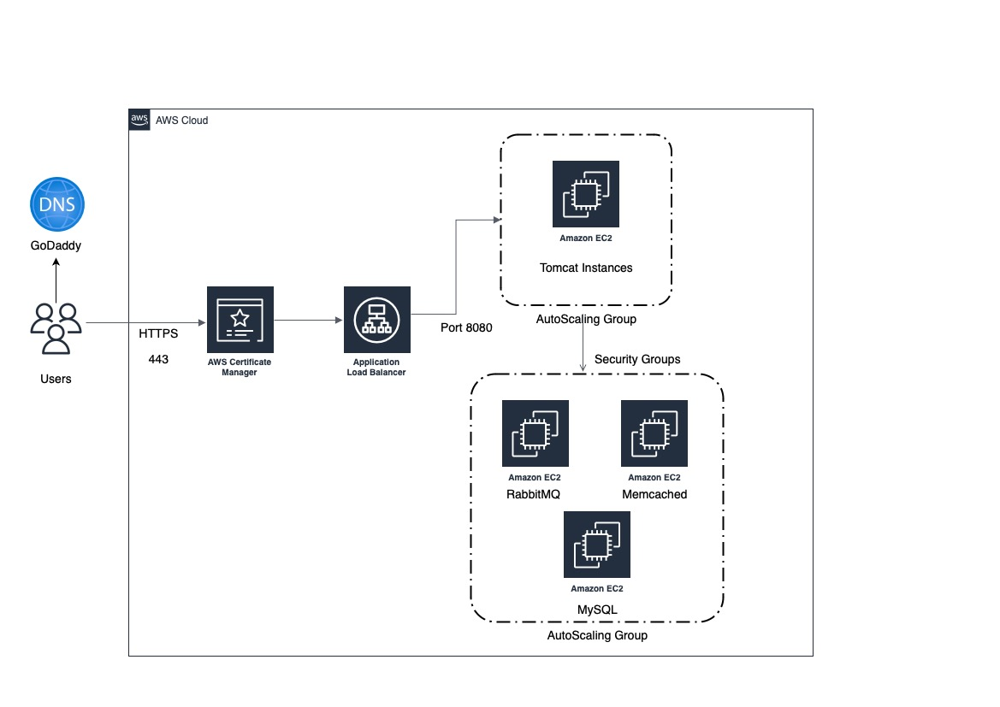
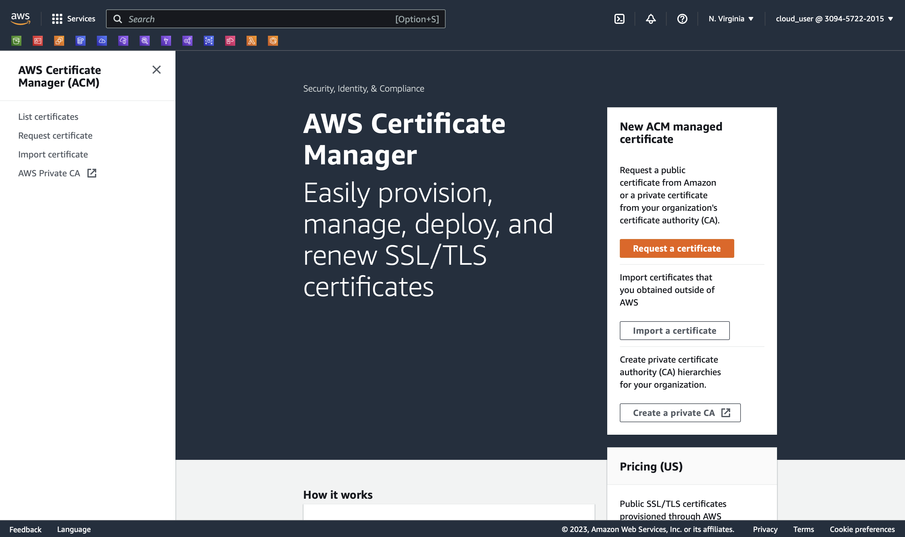
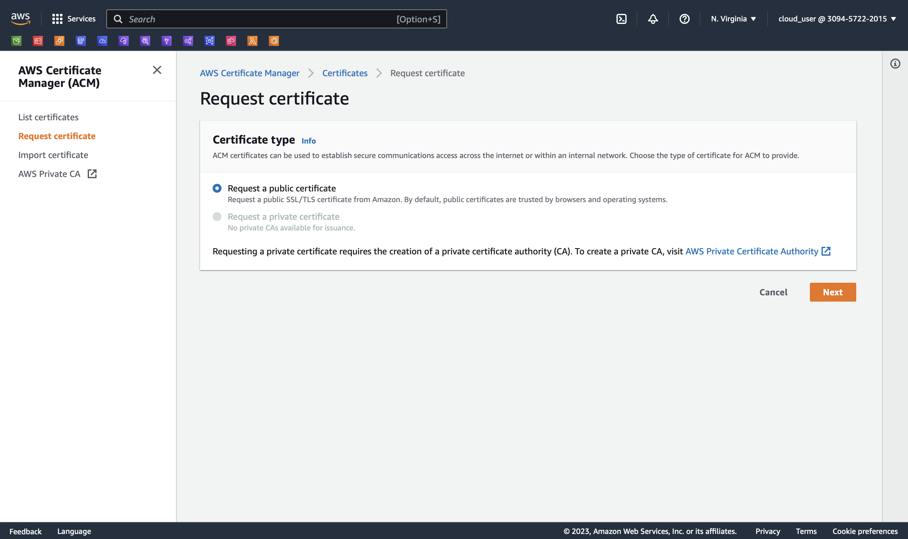
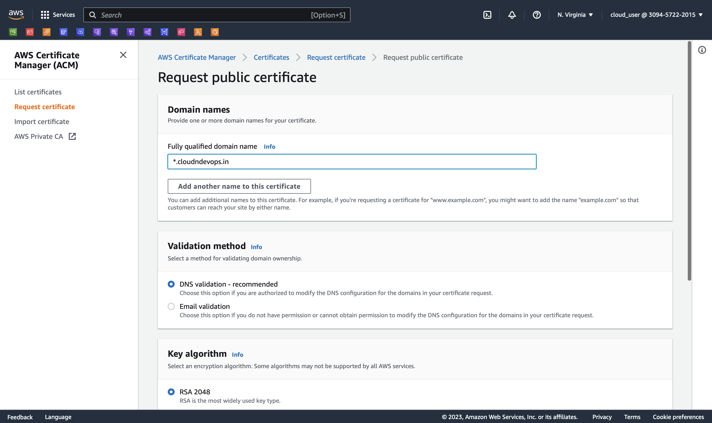
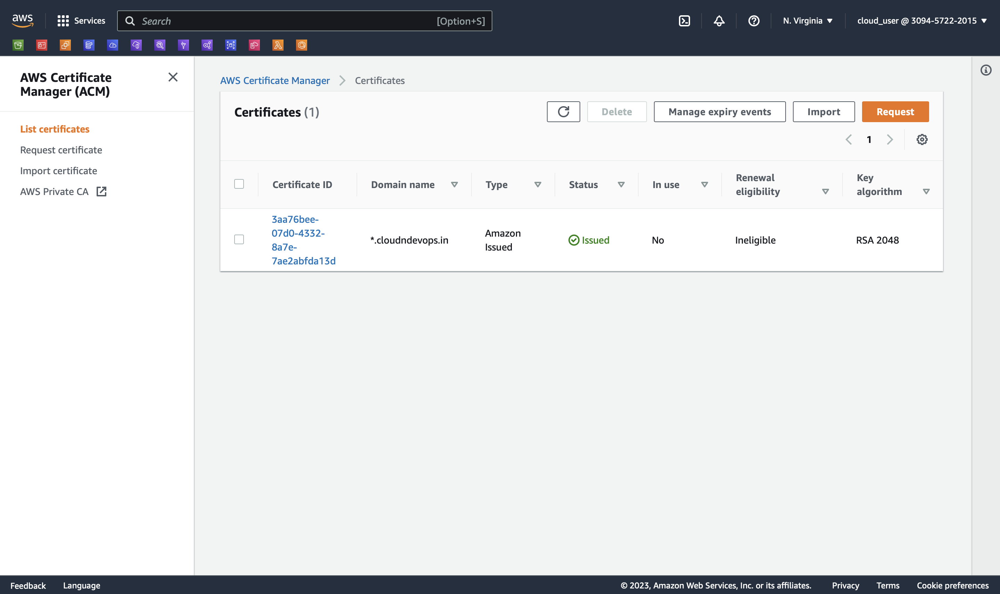
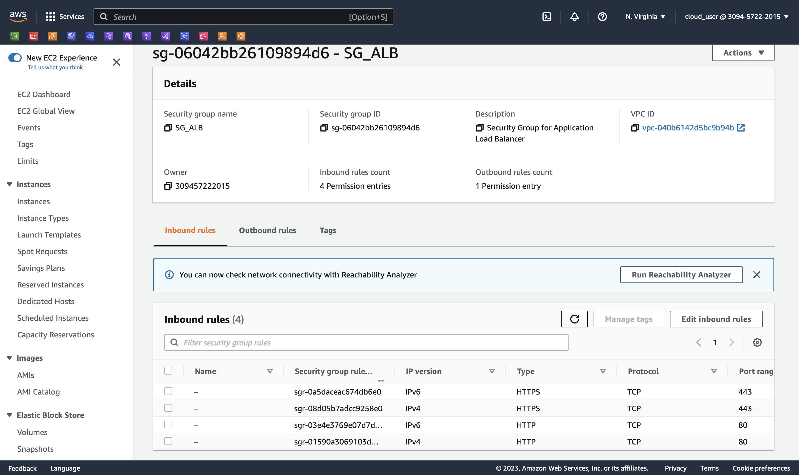
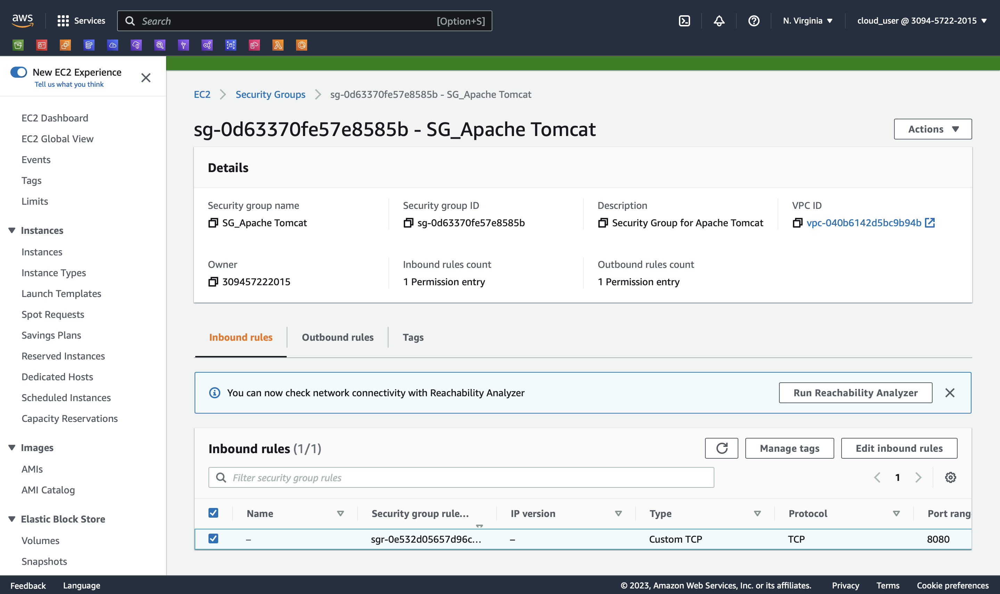
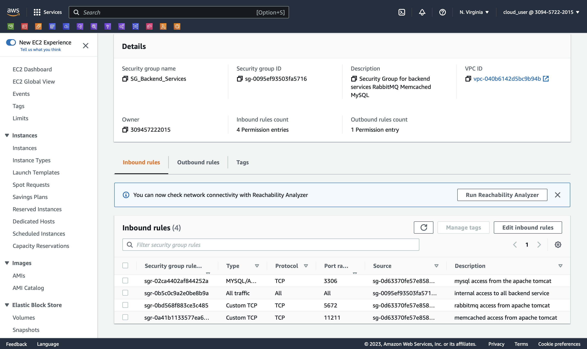

# Project-03: Lift and Shift the WebApplication on AWS 

In this project we will setup the web application stack on the AWS cloud.

Following AWS services will be used 

- EC2
- ELB
- Auto Scaling 
- EBS/EFS
- Route53
- IAM
- ACM
- S3 

## Flow of execution:

- Login to the AWS account.
- Create key pair to access the instances.
- Create Security groups, so that only required ports will be opened on the instances. 
- Launch the EC2 instances (for Apache Tomcat, Memcached, RabbitMQ and MySQL) with userdata.
- Update the IP addresses in Route53. 
- Build the application from the source code.
- Upload the artifact to S3 storage.
- Download the artifact from S3 to EC2 tomcat instance.
- Setup the ELB with HTTPS (Use ACM for SSL certifiacte).
- Map the ELB endpoint url to website name in DNS provider (e.g. GoDaddy).
- Verify the application. 


## Architecture 




### Create Certificate in AWS Certificate Manager (ACM)

- Login to the AWS account and select N.Virginia as region


- Go to Certificate Manager service and click on Request a Certificate 



- Select certificate type as public certificate and click next



- Enter the domain name and DNS validation method as show in below and click on Request 



- You will see Certificate ID and the status as "pending"

- Click on Certificate ID copy the CNAME name and CNAME value and create CNAME record in your DNS provider (e.g. GoDaddy)

- After some time you will see the certifiacte status as "Issued"




### Create Key Pair 

Select N.virgina as region

Go to EC2 service and under the Network and Security select the Key Pairs 

Provide name to keypair e.g. vprofile-key select .pem as private key file format


### Create Security Groups

- Create Security group for Application load balancer 

In inbound rules add 80 and 443 port for all internet access, so that our application will be accessed from the internet.



- Create Security group for Apache tomcat instance 

In inbound rules add port 8080 and allow access from security group of ALB.



- Create Security group for backend services (RabbitMQ, Memcached, MySQL)

In inbound rules add port 3306 (MySQL), 11211 (Memcached), 5672 (RabbitMQ) and allow access to security group of Apache Tomcat only.

Also add one inbound rule with ALL traffic with self Security Group ID (This will allow all backend services to communicate with each other). 




### Create EC2 instance for MySQL 

- AMI: CentOS 7
- Instance Type: t2.micro
- VPC: Default
- Security Group: SG_Backend_Services
- Key Pair: vprofile-key
- Tag: "Name": "vprofile-db01",  "Project": "vprofile"
- User Data: 

```
#!/bin/bash
DATABASE_PASS='admin123'
sudo yum update -y
sudo amazon-linux-extras install epel -y
#sudo yum install epel-release -y
sudo yum install git zip unzip -y
sudo yum install mariadb-server -y


# starting & enabling mariadb-server
sudo systemctl start mariadb
sudo systemctl enable mariadb
cd /tmp/
git clone https://github.com/vijaylondhe/vprofile-project.git
#restore the dump file for the application
sudo mysqladmin -u root password "$DATABASE_PASS"
sudo mysql -u root -p"$DATABASE_PASS" -e "UPDATE mysql.user SET Password=PASSWORD('$DATABASE_PASS') WHERE User='root'"
sudo mysql -u root -p"$DATABASE_PASS" -e "DELETE FROM mysql.user WHERE User='root' AND Host NOT IN ('localhost', '127.0.0.1', '::1')"
sudo mysql -u root -p"$DATABASE_PASS" -e "DELETE FROM mysql.user WHERE User=''"
sudo mysql -u root -p"$DATABASE_PASS" -e "DELETE FROM mysql.db WHERE Db='test' OR Db='test\_%'"
sudo mysql -u root -p"$DATABASE_PASS" -e "FLUSH PRIVILEGES"
sudo mysql -u root -p"$DATABASE_PASS" -e "create database accounts"
sudo mysql -u root -p"$DATABASE_PASS" -e "grant all privileges on accounts.* TO 'admin'@'localhost' identified by 'admin123'"
sudo mysql -u root -p"$DATABASE_PASS" -e "grant all privileges on accounts.* TO 'admin'@'%' identified by 'admin123'"
sudo mysql -u root -p"$DATABASE_PASS" accounts < /tmp/vprofile-project/src/main/resources/db_backup.sql
sudo mysql -u root -p"$DATABASE_PASS" -e "FLUSH PRIVILEGES"

# Restart mariadb-server
sudo systemctl restart mariadb


#starting the firewall and allowing the mariadb to access from port no. 3306
sudo systemctl start firewalld
sudo systemctl enable firewalld
sudo firewall-cmd --get-active-zones
sudo firewall-cmd --zone=public --add-port=3306/tcp --permanent
sudo firewall-cmd --reload
sudo systemctl restart mariadb

```

### Create EC2 instance for Memcached

### Create EC2 instance for RabbitMQ

### Create EC2 instance for Apache Tomcat

### Setup Route53 Private Hosted Zone

### Build and Deploy the Artifact

