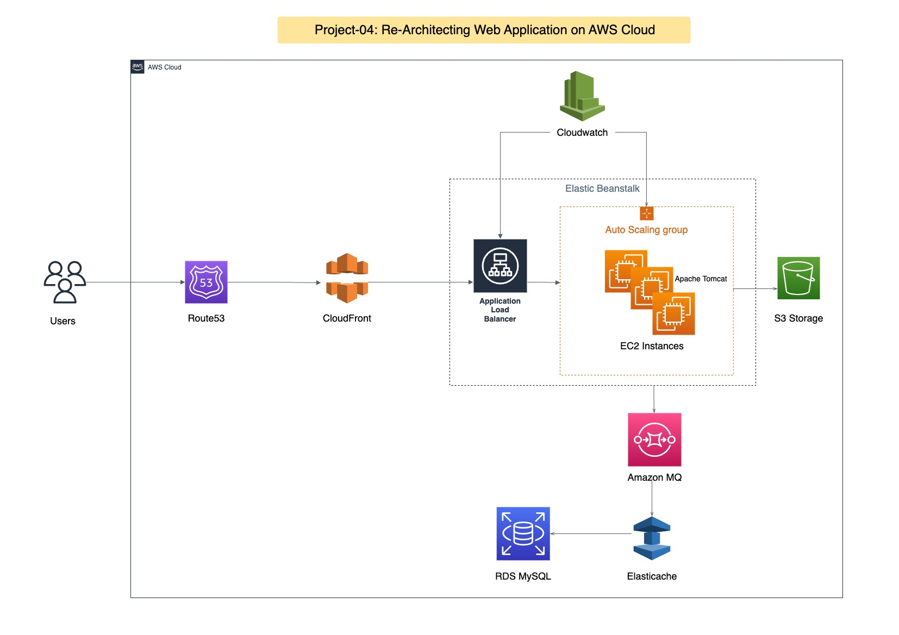

# Project-04: Re-architecting Web App On AWS (Cloudnative)

In this project, we will use AWS managed services to make the web application as cloud native application. 

Following AWS services will be used:

- Elastic Beanstalk

- RDS

- Elasticache

- Active MQ

- Route53

- CloudFront 


## Flow of Execution

- Login to AWS account 
- Create key pair for Beanstalk, RDS instance and Active MQ
- Create RDS Instance
- Configure AWS Elasticache
- Configure AWS Active MQ
- Create Elastic Beanstalk environment
- Update SG of backend to allow traffic from beanstalk SG
- Update SG of backend to allow internal traffic
- Launch the EC2 instance for DB initialization
- Login to instance and initialize RDS database
- Change healthcheck on beanstalk to /login
- Add 443 https listner on ELB
- Build artifact with the Backend Information
- Deploy the artifact to beanstalk 
- Create CDN with SSL cert
- Update the entry in GoDaddy DNS zones 
- Test the URL


## Architecture 




## Steps:

### Create Key Pair 

- Create key pair to login to Elastic Beanstalk Instance. 
- Key Name: vprofile-bean-key
- Key Format: .pem 
- Region: N. Virginia


### Create Security Group for Backend Services

- Security Group Name: vprofile-backend-sg
- Description: Security Group for backend services 
- Inbound Rules: Custom TCP 22 Port Allow from MyIP 
- Save the Rules.
- Edit the Security Group again
- Add Inbound Rule: Allow all traffic for the same security group id
- Note: This will allow all backend services to communicate with each other
- Also delete rule added for the port 22
- Save the Rules

### Create RDS MySQL Instance

- Go to RDS service

- Create DB subnet group:
  - Name: vprofile-rds-subnet-group
  - Description: DB subnet group for vprofile MySQL RDS instance
  - VPC: Default
  - Add Subnets: Select all the availability zones and all the subnets in the az.
  - Click on Create

- Create Parameter Group:
  - Parameter Group Details
  - Parameter Group Family: mysql5.7
  - Type: DB Parameter Group
  - Group Name: vprofile-rds-parameter-group
  - Description: parameter group for MySQL RDS instance
  - Click on Create
  - Note: This parameter group created with default parameters, you can edit the required parameters. 

- Now, we have security group, DB subnet group and parameter group, so lets create RDS instance.

- Create RDS Instance: 
  - Click on Databases, create database
  - Database creation method: Standard Create 
  - Engine Type: MySQL 
  - Version: MySQL 5.7.22
  - Templates: Dev/Test
  - DB Instance Identifier: vprofile-rds-mysql
  - Master username: Admin
  - Password: Auto generated 
  - DB Instance Class: Burstable Classes (db.t3.micro)
  - Storage: gp2 20GB
  - Availability & Durability: Do not create stand by instance 
  - VPC: default
  - Subnet Group: vprofile-rds-subnet-group
  - Public Access: No
  - Security Group: vprofile-backend-sg
  - Database Port: 3306 
  - Database Authentication: Password Authentication
  - Additional Configuration
  - Initial Database Name: accounts
  - DB Parameter Group: vprofile-rds-parameter-group
  - Enable Automatic Backup: Yes (Backup Retention: 7 days)
  - Backup Window: No Preference
  - Monitoring: Disable Enhanced Monitoring
  - Enable delete protection 
  - Click on Create Database
  - Click on View Credential Detail (Copy this credential in text file, to use it later in application.properties file)


### Configure ElastiCache 

- Create Parameter Group:
  - Name: vprofile-memcached-parameter-group
  - Description: vprofile-memcached-parameter-group
  - Family: Memcached1.4
  - Click on Create 

- Create Subnet Group:
  - Click on Create Subnet Group 
  - Name: vprofile-memcached-subnet-group
  - Description: vprofile-memcached-subnet-group
  - VPC: default
  - Select all the subnet in all availability zones 
  - Click on Create 

- Create Cluster:
  - Click on Get Started 
  - Create Cluster -> Create Memcached Cluster
  - Location: AWS Cloud
  - Name: vprofile-elasticache-service 
  - Description: vprofile-elasticache-service 
  - Engine Version: 1.4.5
  - Port: 11211
  - Parameter Groups: vprofile-memcached-parameter-group
  - Node Type: cache.t2.micro
  - Number of Nodes: 1 
  - Subnet Group Setting: vprofile-memcached-subnet-group
  - Availability Zone: No Prefernce
  - Security Group: vprofile-backend-sg
  - Tags: Name: vprofile-elasticache-service 
  - Click on Create 


### Configrue Amazon MQ

- Go to Amazon MQ service
- Click on Get Started 
- Broker Engine Type: RabbitMQ
- Deployment Mode: Single-instance Broker 
- Broker Name: vprofile-rmq
- Broker Instance Type: mq.t3.micro
- RabbitMQ Access:
- Username: rabbit
- Password: *****
- Broker Engine Version: 3.9.16
- Network and Security: Access Type -> Private Access
- VPC and Subnet: Use default VPC and subnets
- Security Group: vprofile-backend-sg
- Click on Create

### Initialize the Database

- Lauch new EC2 instance
- Instance Name: mysql-client
- AMI: Ubuntu 18.04
- Instance Type: t2.micro
- Key Pair: vprofile-bean-key
- VPC: default
- Security Group: Create new SG -> Name: mysqlclient-sg Port-> 22 From -> MyIP
- User Data:

```
#!/bin/bash
sudo apt update
sudo apt install mysql-client -y
```

- Launch the instance
- Edit the SG of Backend Service and Add the access for mysql-client instance
- Port 3306 -> SG (mysqlclient-sg)
- Get the instance public ip and login into it 
- Clone the repository

```
git clone https://github.com/vijaylondhe/vprofile-project.git
cd vprofile-project/src/main/resources
mysql -h <rds_endpoint> -u admin -p<rds_password> accounts < db_backup.sql
```

- Login to mysql database and check db is initialzed or not 

```
mysql -h <rds_endpoint> -u admin -p<rds_password>
```

```
show databases;
show tables;
```