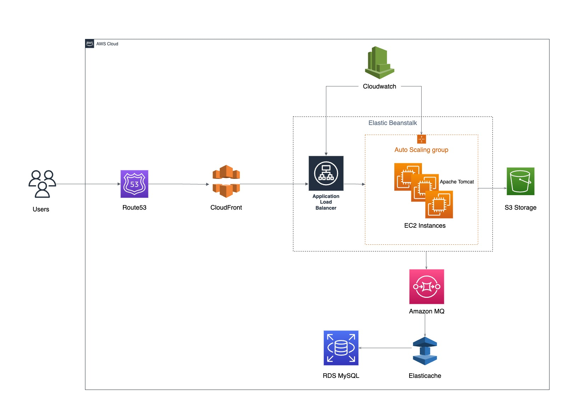

# Project-04: Re-architecting Web App On AWS (Cloudnative)

In this project, we will use AWS managed services to make the web application as cloud native application. 

Following AWS services will be used:

- Elastic Beanstalk

- RDS

- Elasticache

- Active MQ

- Route53

- CloudFront 

## Flow of Execution

- Login to AWS account 
- Create key pair for Beanstalk, RDS instance and Active MQ
- Create RDS Instance
- Configure AWS Elasticache
- Configure AWS Active MQ
- Create Elastic Beanstalk environment
- Update SG of backend to allow traffic from beanstalk SG
- Update SG of backend to allow internal traffic
- Launch the EC2 instance for DB initialization
- Login to instance and initialize RDS database
- Change healthcheck on beanstalk to /login
- Add 443 https listner on ELB
- Build artifact with the Backend Information
- Deploy the artifact to beanstalk 
- Create CDN with SSL cert
- Update the entry in GoDaddy DNS zones 
- Test the URL

## Architecture 

