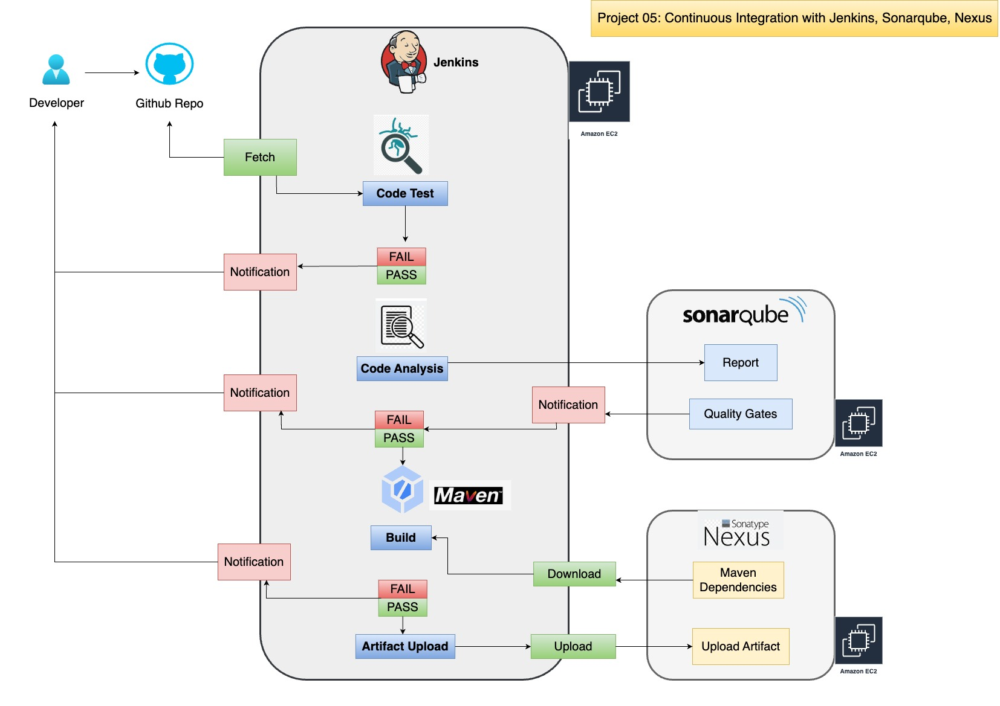

# Project-05: Continuous Integration with Jenkins, Sonarqube, Nexus and Slack

### Objectives:

- Build and Test the source code for every commit made by developer. 
- Setup completely automated process.
- Notify to developer for every build status.
- Fix the code if error or bug found instantly rather than waiting.
- Fault isolation.
- Short MTTR (Mean Time to Repair).
- Fast turn around on new feature changes.
- Less dispruptive.

### Tools Used:

- Jenkins: Continuous integration server
- Git/GitHub: Version control system
- Maven: To build the code 
- Checkstyle: To analysis the code
- Slack: For the notification
- Sonatype Nexus: To store the artifact and download the dependency for maven 
- Sonarqube: To analysis the code using sonar scanner and publish the report to dashboard
- AWS EC2: Compute resource to host all this tools


### CI Workflow:


### Flow of Execution:

- Login to AWS
- Create key pair
- Create Security group for Jenkins, Sonarqube and Nexus
- Create EC2 instance with user data for Jenkins, Sonarqube and Nexus
- Post Installation
  - Jenkins setup and plugins
  - Nexus setup and repository setup 
  - Sonarqube login test
- Git
  - Create github repository & migrate code 
  - Integrate github repo with vscode and test it
- Build job with nexus integration 
- Setup Github Webhook
- Sonarqube server integration
- Nexus artifact upload stage
- Slack notification


### Architecture:




### Steps:

### Step 1: Create Key Pair and Security Group:

- Login to AWS account
- Go to the EC2 service
- Select N. Virginia as region
- Click on Key Pair
- Key Name: vprofile-ci-key
- Key Pair Type: RSA
- Private key file format: .pem 
- Click on Create Key Pair


- Go to VPC service
- Click on Security Groups
- Create Security Group for Jenkins Instance
  - Security Group Name: jenkins-sg
  - Description: Security Group for Jenkins Instance
  - VPC: default 
  - Inbound rules: 
    - Rule 1
    ```
    Type: Custom TCP 
    Port range: 22
    Source: MyIP
    Description: for ssh access to jenkins 
    ```

    - Rule 2
    ```
    Type: Custom TCP 
    Port range: 8080
    Source: Anywhere IPv4 (0.0.0.0/0)
    Description: for jenkins console access and for github webhook
    ```

    - Rule 3
    ```
    Type: Custom TCP 
    Port range: 8080
    Source: Anywhere IPv6 (::/0)
    Description: for jenkins console access
    ```
  
  - Click on Create Security Group 


- Create Security Group for Nexus Instance
  - Security Group Name: nexus-sg
  - Description: Security Group for Nexus Instance
  - VPC: default 
  - Inbound rules: 
    - Rule 1
    ```
    Type: Custom TCP 
    Port range: 22
    Source: MyIP
    Description: for ssh access to nexus instance 
    ```

    - Rule 2
    ```
    Type: Custom TCP 
    Port range: 8081
    Source: MyIP
    Description: for nexus console access 
    ```

    - Rule 3
    ```
    Type: Custom TCP 
    Port range: 8081
    Source: Custom (sg id of jenkins-sg)
    Description: to upload artifact to nexus from jenkins job and download the dependency from nexus
    ```
  
  - Click on Create Security Group 


- Create Security Group for Sonar Instance
  - Security Group Name: sonar-sg
  - Description: Security Group for Sonar Instance
  - VPC: default 
  - Inbound rules: 
    - Rule 1
    ```
    Type: Custom TCP 
    Port range: 22
    Source: MyIP
    Description: for ssh access to sonar instance 
    ```

    - Rule 2
    ```
    Type: Custom TCP 
    Port range: 80
    Source: MyIP
    Description: for sonar console access 
    ```

    - Rule 3
    ```
    Type: Custom TCP 
    Port range: 80
    Source: Custom (sg id of jenkins-sg)
    Description: to upload test results to sonar from jenkins job 
    ```
  
  - Click on Create Security Group 


- Modify Security Group of Jenkins Instance
  - Inbound rules:
    - Rule 4
    ```
    Type: Custom TCP 
    Port range: 8080
    Source: Custom (sg id of sonar-sg)
    Description: for ssh access to soanr instance 
    ```


### Step 2: Create EC2 Instances for Jenkins, Nexus and Sonarqube:

- Create EC2 instance for `Jenkins` 
  - Instance Name: JenkinsServer
  - AMI: Ubuntu 20.04
  - Instance Type: t3.medium
  - Key Pair: vprofile-ci-key
  - VPC: default
  - Security Groups: jenkins-sg
  - User Data:

    ```
    #!/bin/bash
    sudo apt update
    sudo apt install openjdk-11-jdk -y
    sudo apt install ca-certificates -y 
    sudo apt install maven git wget unzip -y
    curl -fsSL https://pkg.jenkins.io/debian-stable/jenkins.io.key | sudo tee \
    /usr/share/keyrings/jenkins-keyring.asc > /dev/null
    echo deb [signed-by=/usr/share/keyrings/jenkins-keyring.asc] \
    https://pkg.jenkins.io/debian-stable binary/ | sudo tee \
    /etc/apt/sources.list.d/jenkins.list > /dev/null
    sudo apt-get update
    sudo apt-get install jenkins -y
    ```
  - Launch Instance


- Create EC2 instance for `Nexus`
  - Instance Name: NexusServer
  - AMI: Amazon Linux 2
  - Instance Type: t3.medium
  - Key Pair: vprofile-ci-key
  - VPC: default
  - Security Groups: nexus-sg
  - User Data:

    ```
    #!/bin/bash
    yum install java-1.8.0-openjdk.x86_64 wget -y   
    mkdir -p /opt/nexus/   
    mkdir -p /tmp/nexus/                           
    cd /tmp/nexus/
    NEXUSURL="https://download.sonatype.com/nexus/3/latest-unix.tar.gz"
    wget $NEXUSURL -O nexus.tar.gz
    EXTOUT=`tar xzvf nexus.tar.gz`
    NEXUSDIR=`echo $EXTOUT | cut -d '/' -f1`
    rm -rf /tmp/nexus/nexus.tar.gz
    rsync -avzh /tmp/nexus/ /opt/nexus/
    useradd nexus
    chown -R nexus.nexus /opt/nexus 
    cat <<EOT>> /etc/systemd/system/nexus.service
    [Unit]                                                                          
    Description=nexus service                                                       
    After=network.target                                                            
                                                                    
    [Service]                                                                       
    Type=forking                                                                    
    LimitNOFILE=65536                                                               
    ExecStart=/opt/nexus/$NEXUSDIR/bin/nexus start                                  
    ExecStop=/opt/nexus/$NEXUSDIR/bin/nexus stop                                    
    User=nexus                                                                      
    Restart=on-abort                                                                
                                                                    
    [Install]                                                                       
    WantedBy=multi-user.target                                                      

    EOT

    echo 'run_as_user="nexus"' > /opt/nexus/$NEXUSDIR/bin/nexus.rc
    systemctl daemon-reload
    systemctl start nexus
    systemctl enable nexus
    ```
  - Launch Instance


- Create EC2 instance for `Sonarqube` 
  - Instance Name: SonarServer
  - AMI: Ubuntu 18.04
  - Instance Type: t3.medium
  - Key Pair: vprofile-ci-key
  - VPC: default
  - Security Groups: sonar-sg
  - User Data:

    ```
    #!/bin/bash
    cp /etc/sysctl.conf /root/sysctl.conf_backup
    cat <<EOT> /etc/sysctl.conf
    vm.max_map_count=262144
    fs.file-max=65536
    ulimit -n 65536
    ulimit -u 4096
    EOT
    cp /etc/security/limits.conf /root/sec_limit.conf_backup
    cat <<EOT> /etc/security/limits.conf
    sonarqube   -   nofile   65536
    sonarqube   -   nproc    409
    EOT

    sudo apt-get update -y
    sudo apt-get install openjdk-11-jdk -y
    sudo update-alternatives --config java

    java -version

    sudo apt update
    wget -q https://www.postgresql.org/media/keys/ACCC4CF8.asc -O - | sudo apt-key add -

    sudo sh -c 'echo "deb http://apt.postgresql.org/pub/repos/apt/ `lsb_release -cs`-pgdg main" >> /etc/apt/sources.list.d/pgdg.list'
    sudo apt install postgresql postgresql-contrib -y
    #sudo -u postgres psql -c "SELECT version();"
    sudo systemctl enable postgresql.service
    sudo systemctl start  postgresql.service
    sudo echo "postgres:admin123" | chpasswd
    runuser -l postgres -c "createuser sonar"
    sudo -i -u postgres psql -c "ALTER USER sonar WITH ENCRYPTED PASSWORD 'admin123';"
    sudo -i -u postgres psql -c "CREATE DATABASE sonarqube OWNER sonar;"
    sudo -i -u postgres psql -c "GRANT ALL PRIVILEGES ON DATABASE sonarqube to sonar;"
    systemctl restart  postgresql
    #systemctl status -l   postgresql
    netstat -tulpena | grep postgres
    sudo mkdir -p /sonarqube/
    cd /sonarqube/
    sudo curl -O https://binaries.sonarsource.com/Distribution/sonarqube/sonarqube-8.3.0.34182.zip
    sudo apt-get install zip -y
    sudo unzip -o sonarqube-8.3.0.34182.zip -d /opt/
    sudo mv /opt/sonarqube-8.3.0.34182/ /opt/sonarqube
    sudo groupadd sonar
    sudo useradd -c "SonarQube - User" -d /opt/sonarqube/ -g sonar sonar
    sudo chown sonar:sonar /opt/sonarqube/ -R
    cp /opt/sonarqube/conf/sonar.properties /root/sonar.properties_backup
    cat <<EOT> /opt/sonarqube/conf/sonar.properties
    sonar.jdbc.username=sonar
    sonar.jdbc.password=admin123
    sonar.jdbc.url=jdbc:postgresql://localhost/sonarqube
    sonar.web.host=0.0.0.0
    sonar.web.port=9000
    sonar.web.javaAdditionalOpts=-server
    sonar.search.javaOpts=-Xmx512m -Xms512m -XX:+HeapDumpOnOutOfMemoryError
    sonar.log.level=INFO
    sonar.path.logs=logs
    EOT

    cat <<EOT> /etc/systemd/system/sonarqube.service
    [Unit]
    Description=SonarQube service
    After=syslog.target network.target

    [Service]
    Type=forking

    ExecStart=/opt/sonarqube/bin/linux-x86-64/sonar.sh start
    ExecStop=/opt/sonarqube/bin/linux-x86-64/sonar.sh stop

    User=sonar
    Group=sonar
    Restart=always

    LimitNOFILE=65536
    LimitNPROC=4096


    [Install]
    WantedBy=multi-user.target
    EOT

    systemctl daemon-reload
    systemctl enable sonarqube.service
    #systemctl start sonarqube.service
    #systemctl status -l sonarqube.service
    apt-get install nginx -y
    rm -rf /etc/nginx/sites-enabled/default
    rm -rf /etc/nginx/sites-available/default
    cat <<EOT> /etc/nginx/sites-available/sonarqube
    server{
        listen      80;
        server_name sonarqube.cloudndevops.in;

        access_log  /var/log/nginx/sonar.access.log;
        error_log   /var/log/nginx/sonar.error.log;

        proxy_buffers 16 64k;
        proxy_buffer_size 128k;

        location / {
            proxy_pass  http://127.0.0.1:9000;
            proxy_next_upstream error timeout invalid_header http_500 http_502 http_503 http_504;
            proxy_redirect off;
                
            proxy_set_header    Host            \$host;
            proxy_set_header    X-Real-IP       \$remote_addr;
            proxy_set_header    X-Forwarded-For \$proxy_add_x_forwarded_for;
            proxy_set_header    X-Forwarded-Proto http;
        }
    }
    EOT
    ln -s /etc/nginx/sites-available/sonarqube /etc/nginx/sites-enabled/sonarqube
    systemctl enable nginx.service
    #systemctl restart nginx.service
    sudo ufw allow 80,9000,9001/tcp

    echo "System reboot in 30 sec"
    sleep 30
    reboot
    ```
  - Launch Instance


### Step 3: Post Installation Tasks:

- Login to the Jenkins instance
- `ssh -i vprofile-ci-key ubuntu@<public_ip_address_of_jenkins>`
- Check the Jenkins service is running or not 
- Switch to the root user `sudo -i`
- Run the command `systemctl status jenkins`
- Open the browser and type `http://<public_ip_address_of_jenkins>:8080`

- Get the initial password for the jenkins from `/var/lib/jenkins/secrets/initialAdminPassword`
- Click on Install suggested plugins
- Setup the Admin username, full name and E-mail id 
- Set Jenkins URL -> Save and Finish
- Login to the Jenkins UI 
- Install the required plugin for our CI pipeline
- Go to the Manage Jenkins -> Manage Plugins -> Click on Available

```
Plugin required 
1. Maven Integration: To build the source code using maven
2. GitHub Integration: To integrate our code with jenkins 
3. Nexus Artifact Uploader: To upload artifact to nexus server
4. Sonarqube Scanner: To static code analysis
5. Slack Notification: To send the notification to developer
6. Build Timestamp: To version the artifact

```

- Click on install without restart
- Once plugins installation is complete go back to Dashboard


- Login to the Nexus instance
- `ssh -i vprofile-ci-key ec2-user@<public_ip_address_of_nexus>`
- Switch to the root user `sudo -i`
- Check the Nexus service is running or not 
- Run the command `systemctl status nexus`
- Open the browser and type `http://<public_ip_address_of_nexus>:8081`
- Click on Sign in 
- Get the initial password from the file `/opt/nexus/sonatype-work/nexus3/admin.password`
- Login and give the new password
- Click on Disable anonymous access -> Next -> Finish

- Create 4 different repositories
- Click on Settings -> Repository -> Repositories  Create Repository

- Create Repository -> `maven2 (hosted)`
- Name: `vprofile-release` => This will store our artifact
- Version Policy -> `release`
- Click on Create Repository

- Create Repository -> `maven2 (proxy)`
- Name: `vpro-maven-central` => This will store maven dependencies
- Proxy -> Remote Storage -> `https://repo1.maven.org/maven2/`
- Click on Create Repository

- Create Repository -> `maven2 (hosted)`
- Name: `vprofile-snapshot` => This will store snapshot artifact
- Version Policy -> `snapshot`
- Click on Create Repository

- Create Repository -> `maven2 (group)`
- Name: `vpro-maven-group` => This will use to group all above 3 repositories
- Version Policy -> `release`
- In Group section add above 3 repositories in Member repositories (`vprofile-release`, `vpro-maven-central`, `vprofile-snapshot`) 
- Click on Create Repository


- Login to the Sonarqube instance
- `ssh -i vprofile-ci-key ec2-user@<public_ip_address_of_sonarqube>`
- Switch to the root user `sudo -i`
- Check the Sonarqube service is running or not 
- Run the command `systemctl status sonar`
- Open the browser and type `http://<public_ip_address_of_sonarqube>`
- Click on Login
- Username: `admin`, Password: `admin`


### Step 4: Create Repository in GitHub:

- Login to github 
- Create private repository to store the source code and other required files for pipeline
- Repository Name: `vprociproject`
- Click on Create Repository


- Setup the SSH authentication between your local machine and github account
- On local machine run -> `ssh-keygen`
- This will create private and public key i.e (`id_rsa` and `id_rsa.pub`)
- Copy public key
- Go to github settings -> SSH and GPG key -> New SSH key
- Title: `mylaptopkey`
- Key: `paste the public key`
- Click on Add SSH key 
- Test the connection from local machine `ssh -T git@github.com`


- On the local machine execute below commands
```
mkdir vprociproject
cd vprociproject
git init
touch README.md 
git add . 
git commit -m "first commit"
git branch -M main
git remote add origin https://github.com/vijaylondhe/vprociproject.git
git push -u origin main
```

- Download the `src`, `userdata`, `Jenkinsfile`, `pom.xml`, `settings.xml` from this project repository and paste in current directory `vprociproject`

```
git status
git add . 
git commit -m "added source code"
git push -u origin main 
```

- Create new branch `ci-jenkins`
- `git checkout -b ci-jenkins`
- `git branch`
- Push all the branches to remote repo
- `git push --all origin`
- Open the github repo and see the branch has been created with all files and directories


### Step 5: Build the job with Nexus Repo:

- SSH into the Jenkins instance
- `ssh -i vprofile-ci-key ubuntu@<public_ip_address_of_jenkins>`
- Switch to the root user `sudo -i`
- `sudo apt update`
- `sudo apt install openjdk-8-jdk -y`
- `java -version`
- Get the jdk8 path 


- Login to Jenkins console 
- Go to Manage Jenkins -> Global Tool Configuration 
- JDK -> JDK Installation
- Name: OracleJDK8
- JAVA_HOME: /usr/lib/jvm/java-1.8.0-openjdk-amd64
- Maven -> Add Maven 
- Name: MAVEN3
- Version: 3.8.6
- Click on Save 


- Store Nexus Credentials to login from jenkins 
- Go to Manage Jenkins -> Manage Credentials
- Click on Jenkins -> Global Credentials -> Add Credentials
- Kind: Username with Password
- Username: admin
- Password: xxxxx
- ID: nexuslogin
- Description: nexuslogin
- Click on Create


- Create Jenkins Pipeline 
- On local machine 
- `cd vprociproject`
- `vim Jenkinsfile`

```
pipeline {
    agent any 
    tools {
        maven "MAVEN3"
        jdk "OracleJDK8"
    }
    environment {
        SNAP_REPO = 'vprofile-snapshot'
        NEXUS_USER = 'admin'
        NEXUS_PASS = 'admin123'
        RELEASE_REPO = 'vprofile-release'
        CENTRAL_REPO = 'vpro-maven-central'
        NEXUSIP = '172.31.5.4'
        NEXUSPORT = '8081'
        NEXUS_GRP_REPO = 'vpro-maven-group'
        NEXUS_LOGIN = 'nexuslogin'
    }
    stages {
        stage('Build') {
            steps {
                sh 'mvn -s settings.xml -DskipTests install'
            }
        }
    }
}
```

- Save and exit the file 
- Push the code to github
- `git add .`
- `git commit -m "added jenkinsfile"`
- `git push -u origin ci-jenkins`

- Go to Jenkins Console 
- Click on + New Item on Dashboard
- Name: vprofile-ci-pipeline
- Click on Pipeline -> OK
- In `Pipeline` section select the `Pipeline Script from SCM`
- SCM -> Git 
- Repository URL: `git@github.com:vijaylondhe/vprociproject.git`
- Credentials: Add the Credentials as `SSH Username with private key`
- ID: `githublogin`
- Description: `githublogin`
- Username: `git`
- Private Key -> Enter Directly -> `paste the private key from local machine i.e ~/.ssh/id_rsa`
- Click on Add


- SSH into Jenkins instance 
- `ssh -i vprofile-ci-key ubuntu@<public_ip_address_of_jenkins>`
- Switch to the root user `sudo -i`
- Switch to the `jenkins` user `su - jenkins`
- Execute the command `git ls-remote -h git@github.com:vijaylondhe/vprociproject.git HEAD`
- Verify the key is added into known_hosts
- `cat .ssh/known_hosts`

- Go back to the Jenkins Console 
- Select the 'githublogin' credential 
- Branches to build: `ci-jenkins`
- Script Path: `Jenkinsfile`
- Save the job
- Click on `Build Now` 


### Step 6: Configure Github Webhook:

- Copy the Jenkins URL `http://<jenkins_public_ip>:8080/`
- Go to Github Console 
- Inside our project repository click on settings 
- Select Webhook -> Add Webhook
- Payload URL: `http://<jenkins_public_ip>:8080/github-webhook/`
- Content Type: `application/json`
- Event: `Just the push event`
- Click on Add Webhook 


- Go to the Jenkins Console 
- Click on Job -> Configure -> Build Triggers 
- [x] Github hook trigger for GITscm polling 
- Save the configuration 


- On local machine 
- Edit the Jenkinsfile and add post section to archive the artifact, also add stages for unit test and checkstyle

```
pipeline {
    agent any 
    tools {
        maven "MAVEN3"
        jdk "OracleJDK8"
    }
    environment {
        SNAP_REPO = 'vprofile-snapshot'
        NEXUS_USER = 'admin'
        NEXUS_PASS = 'admin123'
        RELEASE_REPO = 'vprofile-release'
        CENTRAL_REPO = 'vpro-maven-central'
        NEXUSIP = '172.31.5.4'
        NEXUSPORT = '8081'
        NEXUS_GRP_REPO = 'vpro-maven-group'
        NEXUS_LOGIN = 'nexuslogin'
    }
    stages {
        stage('Build') {
            steps {
                sh 'mvn -s settings.xml -DskipTests install'
            }
            post {
                success {
                    echo "Archiving the artifact.."
                    archiveArtifacts artifacts: '**/*.war'
                }
            }
        }
        stage('Test') {
            steps {
                sh 'mvn -s settings.xml test'
            }
        }
        stage('Checkstyle Analysis'){
            steps {
                sh 'mvn -s settings.xml checkstyle:checkstyle'
            }
        }
    }
}
```

- Save and exit the file 
- Push the code to github
- `git add .`
- `git commit -m "added stages for unit test and code analysis"`
- `git push -u origin ci-jenkins`
- Pipeline will be triggered automatically 


### Step 6: Configure Code Analysis with Sonarqube:

