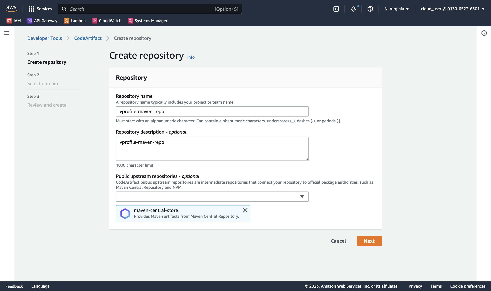
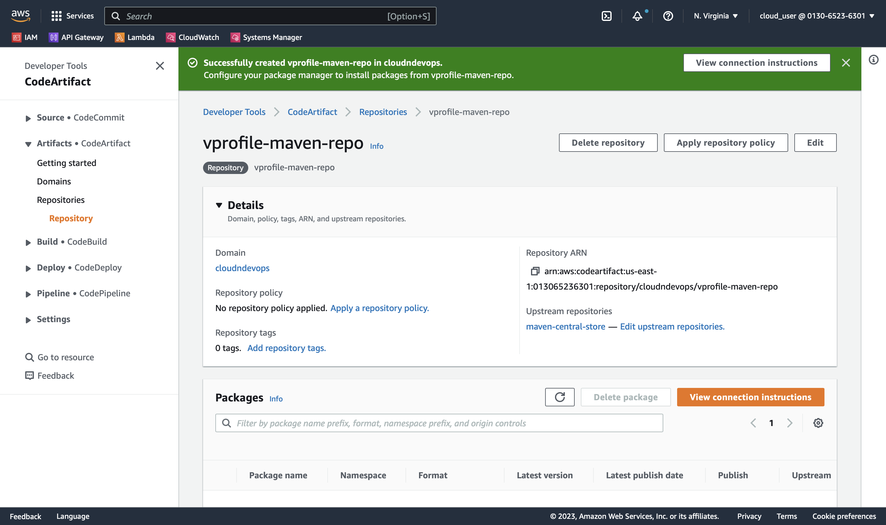
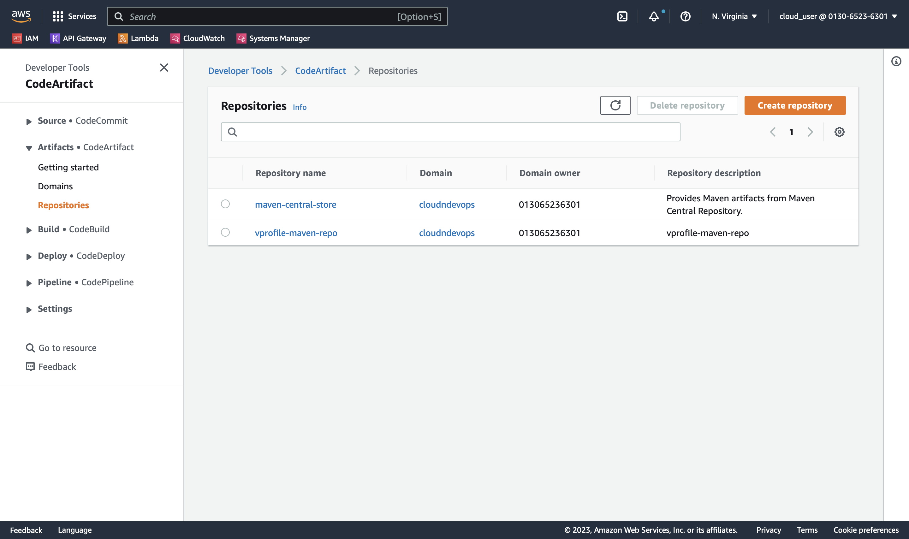
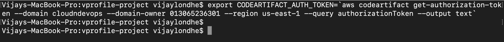

# Project-06: Continuous Integration with AWS

### Objectives:

- In this project, instead of jenkins as countinous integration server we will use AWS managed services to build and test our source code. 

- This will reduce the operational overhead to manage the servers deployed for jenkins, nexus repository and sonarqube.


### Tools/Services Used:

- AWS CodeCommit
- AWS CodeBuild
- AWS CodeArtifact
- AWS CodePipeline
- AWS Systems Manager
- AWS S3 
- AWS SNS
- SonarCloud

### Architecture:


### Flow of Execution:

- Login to AWS account
- CodeCommit:
  - Create CodeCommit Repo
  - Create IAM user with CodeCommit policy
  - Generate SSH Keys locally
  - Exchange keys with IAM user
  - Put source code from github repo to CodeCommit repo and push
- CodeArtifact:
  - Create IAM user with CodeArtifact access
  - Install AWS CLI and configure
  - Export auth token
  - Update settings.xml file in source code top level directory with below details
  - Update pom.xml file with repo details 
- Sonar Cloud:
  - Create sonar cloud account 
  - Generate the token 
  - Create SSM paramter with sonar details 
  - Create Build project 
  - Update CodeBuild role to access SSM parameter store
- Create notifications for sns or slack
- Build Project:
  - Update pom.xml with artifact version with timestamp
  - Create variables in SSM => parameter store
  - Create build project 
  - Update codebuild role to access SSM parameter store
- Create Pipeline:
  - CodeCommit
  - Testcode
  - Build
  - Deploy to S3 bucket
- Test the Pipeline


### Step 1: Create CodeCommit Repository and IAM User:

- Login to AWS Console 
- Go to CodeCommit Service
  - Create New Repository
  - Name: `vprofile-code-repo`


- Create IAM role for CodeCommit:
  - Click on create new role
  - Add Permissions => Create Policy
  - Choose Service => CodeCommit 
  - In Actions => Click on All CodeCommit actions 
  - In Resources => Select Specific => Add ARN (Provide Region and Repository Name)

    

  - Click on Add
  - Click on Tags => Review 
  - Policy Name: `vprofile-code-admin-policy`
  - Click on Create Role
  - Attach new policy: `vprofile-code-admin-policy`
  - Click Next 
  - Provide Role Name: `vprofile-code-admin-role`
  - Click on Create Role


- Create IAM user 
  - Create user
  - Name: `vprofile-code-admin`
  - Attach Policy `vprofile-code-admin-policy`


- Create SSH keys in local system
  - Execute `ssh-keygen` command
  - Provide the path for the keys 


- Upload SSH keys to IAM user
  - Go to IAM user
  - Select the user `vprofile-code-admin`
  - Go to security credentials
  - Upload the keys in SSH Public Keys for CodeCommit
  - Copy the content of `.ssh/vprofile-repo_id_rsa.pub` and paste it.


- Create config file for the codecommit
  - Go to `cd ~/.ssh`
  - Create file `vim config`
  ```
  Host git-codecommit.us-east-1.amazonaws.com
    User <SSH_Key_ID_from IAM_user>
    IdentityFile ~/.ssh/vprofile-repo_id_rsa
  ```

  - Test the SSH connection with CodeCommit
  ```
  ssh git-codecommit.us-east-1.amazonaws.com
  ```


- Clone the github repository in local and convert this repository to codecommit repository

- Use this repository location: `https://github.com/devopshydclub/vprofile-project.git` 

```
git checkout master
git branch -a | grep -v HEAD | cur -d'/' -f3 | grep -v master > /tmp/branches
for i in `cat  /tmp/branches`; do git checkout $i; done
git fetch --tags
git remote rm origin
git remote add origin ssh://git-codecommit.us-east-1.amazonaws.com/v1/repos/vprofile-code-repo
cat .git/config
git push origin --all
git push --tags
```
- Go to the CodeCommit service and check `vprofile-code-repo` repository have added files from our local repository.


### Step 2: Setup CodeArtifact:

- Create repository in Code Artifact 
  - Go to Code Artifact Service 
  - Click on Create Repository
  - Name: `vprofile-maven-repo`
  - Description: `vprofile-maven-repo`
  - Public Upstream Repositories: `maven-central-store`
  - Click on Next



  - Select the Domain
  - AWS Account: `Select this Account`
  - Domain Name: `cloudndevops`
  - Check the domain url is generated below 
  - Click on Next


  - Review and Create 
  - Click on Create Repository



- You will see two repositories are created 



- Click on the `maven-central-store` repository
- Click on `View connection instructions`
- Step 1: Choose package manager client `mvn`
- Step 2: Select Configuration Method `Pull from your repository`


- Above commands we need to execute on our local machine 
- We required IAM user with AWS CLI access to run this command from local machine 
- Create the IAM user:
  - Go to the IAM Service
  - Click on Create User
  - Username: vprofile-cart-admin
  - Attach Policy: `AWSCodeArtifactAdminAccess`
  - Review and Create User
- Go to the user
- 

- Login to the local machine
  - Install AWS CLI if not installed 
  - under the security credentials create access keys
  - Run the command: `aws configure`
  - Enter Access Key ID and Secret Access Key
  - Default Region Name: `us-east-1`
  - Default output format: `json`
 
- Export a CodeArtifact authorization token 



- Update the settings.xml file 
  - Update servers section
  - Update Profile section
  - Update mirror section


- Update the pom.xml file 
  - Update repositories section


- Push the code the CodeCommit repository on ci-aws branch

```
git add .
git commit -m "updated pom.xml and settings.xml file"
git push origin ci-aws
```


### Step 3: Setup SonarCloud Account:

- Open the brower 
- Enter the sonarcloud url `https://sonarcloud.io`
- Click on Login 
- You can login to sonarcloud by using your github/bitbucket/gitlab/azure devops credentials
- Steps: 
  - Go to My Account 
  - Under the Security Tab Generate Token
  - Token Name: `vprofile-sonar-cloud`
  - Click on My Projects tab
  - Click on Analyze New Project -> `create project manually`
    - Create an organization 
    - Name: `vprofile-sonar-cloud-project`
    - Key: `vprofile-soanr-cloud-project`
   


  - Project Name: `vprofile-repo`
  - Project Key: `vprofile-repo`
  - Click on Setup 


- Note down the below details, required for our next step.
  - Sonarcloud URL: `https://sonarcloud.io`
  - Organization Name: `vprofile-soanr-cloud-project`
  - Project Name: `vprofile-repo`
  - Token: `<token-vprofile-sonar-cloud>`


### Step 4: Setup SSM Parameter Store:

create parameter store in systems manager
create organization name 
create host https://sonarcloud.io
project vprofile-repo
sonartoken securestring 
codeartifact-token securestring

### Step 5: Setup CodeBuild for Sonarqube Code Analysis:

modify code build role to access the parameter store
create iam policy and attach to the role 
create codebuild project 
add buidlspec file 
set cloudwatch logs for the build 

- Buildspec file for sonarqube code analysis

```
version: 0.2 
env: 
  parameter-store:
    LOGIN: sonartoken
    HOST: HOST
    Organization: Organization
    Project: Project
    CODEARTIFACT_AUTH_TOKEN: CODEARTIFACT_AUTH_TOKEN
phases:
  install:
    runtime-versions:
      java: corretto8
    commands:
    - cp ./settings.xml /root/.m2/settings.xml
  pre_build:
    commands: 
      - apt-get update 
      - apt-get install -y jq checkstyle
      - wget http://www-eu.apache.org/dist/maven/maven-3/3.5.4/binaries/apache-maven-3.5.4-bin.tar.gz
      - tar xzf apache-maven-3.5.4-bin.tar.gz
      - ln -s apache-maven-3.5.4 maven
      - wget https://binaries.sonarsource.com/Distribution/sonar-scanner-cli/sonar-scanner-cli-3.3.0.1492-linux.zip
      - unzip ./sonar-scanner-cli-3.3.0.1492-linux.zip
      - export PATH=$PATH:/sonar-scanner-3.3.0.1492-linux/bin/
  build:
    commands:
      - mvn test
      - mvn checkstyle:checkstyle
      - echo "Installing JDK11 as its a dependency for sonarqube code analysis"
      - apt-get install -y openjdk-11-jdk
      - export JAVA_HOME=/usr/lib/jvm/java-11-openjdk-amd64
      - mvn sonar:sonar -Dsonar.login=$LOGIN -Dsonar.host.url=$HOST -Dsonar.projectKey=$Project -Dsonar.organization=$Organization -Dsonar.java.binaries=target/test-classes/com/visualpathit/account/controllerTest/ -Dsonar.junit.reportsPath=target/surefire-reports/ -Dsonar.jacoco.reportsPath=target/jacoco.exec -Dsonar.java.checkstyle.reportPaths=target/checkstyle-result.xml
      - sleep 5 
      - curl https://sonarcloud.io/api/qualitygates/project_status?projectKey=$Project >result.json 
      - cat result.json
      - if [ $(jq -r '.projectStatus.status' result.json) = ERROR ] ; then $CODEBUILD_BUILD_SUCCEEDING -eq 0 ;fi
```

### Step 6: Setup CodeBuild for Build Artifact:

- Buildspec file to build the artifact and store in code artifact

```
version: 0.2
env:
  parameter-store:
    CODEARTIFACT_AUTH_TOKEN: CODEARTIFACT_AUTH_TOKEN
phases:
  install:
    runtime-versions:
      java: corretto8
    commands:
      - cp ./settings.xml /root/.m2/settings.xml
  pre_build:
    commands:
      - apt-get update 
      - apt-get install -y jq 
      - wget http://www-eu.apache.org/dist/maven/maven-3/3.5.4/binaries/apache-maven-3.5.4-bin.tar.gz
      - tar xzf apache-maven-3.5.4-bin.tar.gz
      - ln -s apache-maven-3.5.4 maven
  build:
    commands:
      - mvn clean install -DskipTests
artifacts:
  files:
    - target/**/*.war
  discard-paths: yes
```

### Step 7: Setup CodePipeline:

create pipeline 
source - code commit and repo name 
add build artifact stage 
create piepline 
add stage for sonarqube analysis
create bucket with folder 
add stage for deploy to s3
extact the artifact 
setup notification 
run the pipeline 