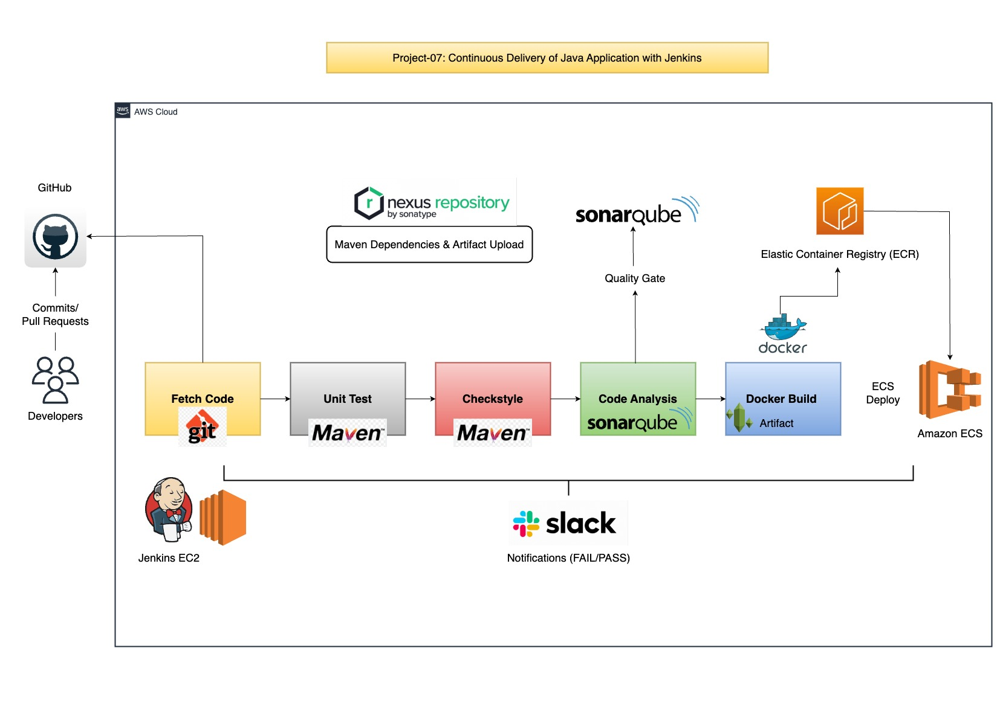

# Project-07: Continuous Delivery of Java Application with Jenkins & Tools 

### Continuous Delivery Process:

- In Agile SDLC, developer makes regular code changes (commits/pull requests) and this changes need to be build and tested, also the build artifacts and test reports are generated. 

- After the artifacts are generated and before the application is deployed to the production systems, it should pass from the various integraion and performance tests.

- This testing is performed on the TEST/PRE-PROD/STAGING environments.

- Afte the test reports get evaulated, manual approval is given for the application depoyment on production environment.


### Objectives:

Setup the Continuous delivery pipeline with jenkins to fetch the latest docker image of our application and deploy docker container on ECS.

### Tools/Services Used:

- `Jenkins`: Continuous Integration and Continuous Delivery Server.

- `Nexus Sonatype Repository`: Download Maven Dependency and Upload Build Artifact.

- `Sonarqube`: Sonarqube scanner for code analysis, and sonarqube server to check the quality gates.

- `Maven`: Used in jenkins to build the java application.

- `Git`: Used to store our source code with jenkins pipeline code.

- `Slack`: For notification 

- `Docker`: To build the docker image from our application

- `AWS Elastic Container Registry (ECR)`: To publish and store the docker image.

- `AWS Elastic Container Service (ECS)`: Used to host the docker containers for our application.

- `AWS CLI`: Used to run from the jenkins to fetch the latest image from ECR and and run the service in ECS.


### Architecture:




### Flow of Execution:

1. Update the github webhook with the Jenkins new IP address.

2. Copy Docker files to our repo.

3. Prepare two separate Jenkinsfile for staging and prod in source code.

4. AWS Steps:
   - IAM, ECR Repo Setup

5. Jenkins Steps: 
   - Install the plugins
     - Amazon ECR
     - Docker, Docker Build and Publish
     - Pipeline: aws steps

6. Install Docker Engine and AWS CLI on Jenkins Instance.

7. Write Jenkinsfile for Build and Publish the docker image to ECR.

8. ECS Setup:
   - Cluster, Task Defination, Service

9. Update Jenkinsfile with code Deploy docker image to ECS.

10. Repeat the steps for prod ECS cluster.

11. Promoting docker image for prod.  


### Step 1: Create Separate Branch in Github and Update the Webhook:

- Please this below github repository `https://github.com/vijaylondhe/vprofileproject-complete.git`

- Select docker branch 
- Download Docker-files folder to your local machine 

- Create New branch in our existing repo `https://github.com/vijaylondhe/vprociproject.git`

```
git checkout ci-jenkins
git checkout -b cicd-jenkins
```

- Copy the Docker-files folder to the repo 
- Create two separate directories for staging and production environment and copy the existing `Jenkinsfile` in it.

```
mkdir StagePipeline/ ProdPipeline/
cp Jenkinsfile StagePipeline/
cp Jenkinsfile ProdPipeline/
git rm Jenkinsfile
```

- Add the new files and commit to repository on new branch.

```
git add .
git commit -m "added cicd-jenkins branch"
git push origin cicd-jenkins
```


### Step 2: Create IAM user and ECR: 

- Create IAM User:
  - Go to the IAM service 
  - Click on Create User
  - User Name: `cicdjenkins`
  - Set Permissions: Attach existing policies directly `AmazonEC2ContainerRegistryFullAccess`, `AmazonECS_FullAccess`
  - Download Access Key ID and Secret Access Key (This will require in later steps to connect to ECR, ECS etc.)

- Create Repository in ECR:
  - Go to the ECR service
  - Click on Create Repository
  - Visibility Setting: Private
  - Repository Name: `vprofileappimg`
  - Click on Create Repository
  - Note down the repository url.


### Step 3: Jenkins Configuration: 

- Install necessary plugins 
  - Go to the Jenkins Console
  - Click on Manage Jenkins -> Manage Plugins
  - Click on Available
  - Install below mentioned plugins

```
Docker Pipeline
CloudBees Docker Build and Publish
Amazon ECR
Pipline: AWS Steps
```

- Setup the AWS Credentials 
  - Go to the Manage Jenkins 
  - Click on Manage Credentials
  - Inside Global Credentials -> Add Credentials
  - In the Kind -> Select AWS Credentials
  - ID: `awscreds` 
  - Description: `awscreds`
  - Access Key ID: `<access_key_id_of_aws_user>`
  - Secret Access Key: `<secret_access_key_of_aws_user>`


- Install AWS CLI on Jenkins instance
  - SSH into Jenkins instance
  - Switch to the root user
  - Run the below commands

```
apt update && apt install awscli -y
```

  - Refer the docker documentation to install the docker on ubuntu `https://docs.docker.com/engine/install/ubuntu/`
  - Add the jenkins user in docker group, so that we can execute the docker commands from the jenkins.

```
sudo su - jenkins
usermod -aG docker jenkins
id jenkins
systemctl restart jenkins
``` 

