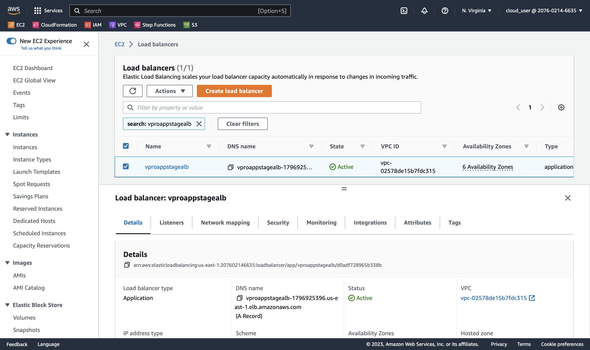
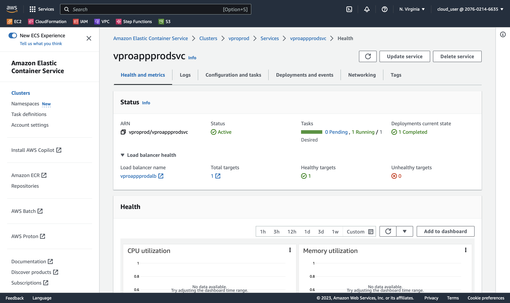
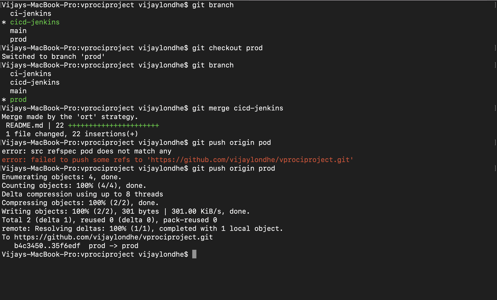

# Project-07: Continuous Delivery of Java Application with Jenkins & Tools 

### Continuous Delivery Process:

- In Agile SDLC, developer makes regular code changes (commits/pull requests) and this changes need to be build and tested, also the build artifacts and test reports are generated. 

- After the artifacts are generated and before the application is deployed to the production systems, it should pass from the various integraion and performance tests.

- This testing is performed on the TEST/PRE-PROD/STAGING environments.

- Afte the test reports get evaulated, manual approval is given for the application depoyment on production environment.


### Objectives:

Setup the Continuous delivery pipeline with jenkins to fetch the latest docker image of our application and deploy docker container on ECS.

### Tools/Services Used:

- `Jenkins`: Continuous Integration and Continuous Delivery Server.

- `Nexus Sonatype Repository`: Download Maven Dependency and Upload Build Artifact.

- `Sonarqube`: Sonarqube scanner for code analysis, and sonarqube server to check the quality gates.

- `Maven`: Used in jenkins to build the java application.

- `Git`: Used to store our source code with jenkins pipeline code.

- `Slack`: For notification 

- `Docker`: To build the docker image from our application

- `AWS Elastic Container Registry (ECR)`: To publish and store the docker image.

- `AWS Elastic Container Service (ECS)`: Used to host the docker containers for our application.

- `AWS CLI`: Used to run from the jenkins to fetch the latest image from ECR and and run the service in ECS.


### Architecture:


### Flow of Execution:

1. Update the github webhook with the Jenkins new IP address.

2. Copy Docker files to our repo.

3. Prepare two separate Jenkinsfile for staging and prod in source code.

4. AWS Steps:
   - IAM, ECR Repo Setup

5. Jenkins Steps: 
   - Install the plugins
     - Amazon ECR
     - Docker, Docker Build and Publish
     - Pipeline: aws steps

6. Install Docker Engine and AWS CLI on Jenkins Instance.

7. Write Jenkinsfile for Build and Publish the docker image to ECR.

8. ECS Setup:
   - Cluster, Task Defination, Service

9. Update Jenkinsfile with code Deploy docker image to ECS.

10. Repeat the steps for prod ECS cluster.

11. Promoting docker image for prod.  


### Step 1: Create Separate Branch in Github and Update the Webhook:

- Please use this github repository for reference `https://github.com/vijaylondhe/vprofileproject-complete.git`

- Select docker branch 
- Download Docker-files folder to your local machine 

- Create New branch in our existing repo `https://github.com/vijaylondhe/vprociproject.git`

```
git checkout ci-jenkins
git checkout -b cicd-jenkins
```

- Copy the Docker-files folder to the repo 
- Create two separate directories for staging and production environment and copy the existing `Jenkinsfile` in it.

```
mkdir StagePipeline/ ProdPipeline/
cp Jenkinsfile StagePipeline/
cp Jenkinsfile ProdPipeline/
git rm Jenkinsfile
```

- Add the new files and commit to repository on new branch.

```
git add .
git commit -m "added cicd-jenkins branch"
git push origin cicd-jenkins
```


### Step 2: Create IAM user and ECR: 

- Create IAM User:
  - Go to the IAM service 
  - Click on Create User
  - User Name: `cicdjenkins`
  - Set Permissions: Attach existing policies directly `AmazonEC2ContainerRegistryFullAccess`, `AmazonECS_FullAccess`
  - Download Access Key ID and Secret Access Key (This will require in later steps to connect to ECR, ECS etc.)


- Create Repository in ECR:
  - Go to the ECR service
  - Click on Create Repository
  - Visibility Setting: Private
  - Repository Name: `vprofileappimg`
  - Click on Create Repository
  - Note down the repository url.


### Step 3: Jenkins Configuration: 

- Install necessary plugins 
  - Go to the Jenkins Console
  - Click on Manage Jenkins -> Manage Plugins
  - Click on Available
  - Install below mentioned plugins

```
Docker Pipeline
CloudBees Docker Build and Publish
Amazon ECR
Pipline: AWS Steps
```

- Setup the AWS Credentials 
  - Go to the Manage Jenkins 
  - Click on Manage Credentials
  - Inside Global Credentials -> Add Credentials
  - In the Kind -> Select AWS Credentials
  - ID: `awscreds` 
  - Description: `awscreds`
  - Access Key ID: `<access_key_id_of_aws_user>`
  - Secret Access Key: `<secret_access_key_of_aws_user>`


- Install AWS CLI on Jenkins instance
  - SSH into Jenkins instance
  - Switch to the root user
  - Run the below commands

```
apt update && apt install awscli -y
```

  - Refer the docker documentation to install the docker on ubuntu `https://docs.docker.com/engine/install/ubuntu/`
  - Add the jenkins user in docker group, so that we can execute the docker commands from the jenkins.

```
usermod -aG docker jenkins
sudo su - jenkins
id jenkins
switch to root user 
systemctl restart jenkins
``` 


### Step 4: Setup Jenkins Pipeline for Docker Build and Push: 

- Write Dockerfile for app image 
- cd /Docker-files/app/multistage/
- vi Dockerfile
```
FROM openjdk:8 AS BUILD_IMAGE
RUN apt update && apt install maven -y
RUN git clone -b vp-docker https://github.com/imranvisualpath/vprofile-repo.git
RUN cd vprofile-repo && mvn install

FROM tomcat:8-jre11

RUN rm -rf /usr/local/tomcat/webapps/*

COPY --from=BUILD_IMAGE vprofile-repo/target/vprofile-v2.war /usr/local/tomcat/webapps/ROOT.war

EXPOSE 8080
CMD ["catalina.sh", "run"]
```

- Update Jenkinsfile with Build and Push steps for the application
- vi StagePipeline/Jenkinsfile
```
pipeline {
    agent any 
    tools {
        maven "MAVEN3"
        jdk "OracleJDK8"
    }
    environment {
        SNAP_REPO = 'vprofile-snapshot'
        NEXUS_USER = 'admin'
        NEXUS_PASS = 'admin123'
        RELEASE_REPO = 'vprofile-release'
        CENTRAL_REPO = 'vpro-maven-central'
        NEXUSIP = '172.31.28.209'
        NEXUSPORT = '8081'
        NEXUS_GRP_REPO = 'vpro-maven-group'
        NEXUS_LOGIN = 'nexuslogin'
        SONARSERVER = 'sonarserver'
        SONARSCANNER = 'sonarscanner'
        registryCredential = 'ecr:us-east-1:awscreds'
        appRegistry = '207602146635.dkr.ecr.us-east-1.amazonaws.com/vprofileappimg'
        vprofileRegistry = 'https://207602146635.dkr.ecr.us-east-1.amazonaws.com'
        cluster = 'vprostaging'
        service = 'vproappstagesvc'

    }
    stages {
        stage('Build') {
            steps {
                sh 'mvn -s settings.xml -DskipTests install'
            }
        }
        stage('Checkstyle Analysis'){
            steps {
                sh 'mvn -s settings.xml checkstyle:checkstyle'
            }
        }
        stage('Sonar Analysis'){
            environment {
                scannerHome = tool "${SONARSCANNER}"
            }
            steps {
                withSonarQubeEnv("${SONARSERVER}"){
                    sh '''${scannerHome}/bin/sonar-scanner -Dsonar.projectKey=vprofile \
                    -Dsonar.projectName=vprofile-repo \
                    -Dsonar.projectVersion=1.0 \
                    -Dsonar.sources=src/ \
                    -Dsonar.java.binaries=target/test-classes/com/visualpathit/account/controllerTest/ \
                    -Dsonar.junit.reportsPath=target/surefire-reports/ \
                    -Dsonar.jacoco.reportsPath=target/jacoco.exec \
                    -Dsonar.java.checkstyle.reportPaths=target/checkstyle-result.xml'''
                }
            }
        }
        /*
        stage('Quality Gate'){
            steps {
                timeout(time: 1, unit: 'HOURS'){
                    waitForQualityGate abortPipeline:true
                }
            }
        }*/
        stage('UploadArtifact'){
            steps {
                    nexusArtifactUploader(
                    nexusVersion: 'nexus3',
                    protocol: 'http',
                    nexusUrl: "${NEXUSIP}:${NEXUSPORT}",
                    groupId: 'QA',
                    version: "${env.BUILD_ID}-${env.BUILD_TIMESTAMP}",
                    repository: "${RELEASE_REPO}",
                    credentialsId: "${NEXUS_LOGIN}",
                    artifacts: [
                        [artifactId: 'vproapp',
                        classifier: '',
                        file: 'target/vprofile-v2.war',
                        type: 'war']
                    ]
                )
            }
        }
        stage('Build App Image'){
            steps {
                script {
                    dockerImage = docker.build( appRegistry + ":$BUILD_NUMBER", "./Docker-files/app/multistage/")
                }
            }
        }
        stage('Upload App Image'){
            steps{
                script {
                    docker.withRegistry(vprofileRegistry, registryCredential){
                        dockerImage.push("$BUILD_NUMBER")
                        dockerImage.push('latest')
                    }
                }
            }
        }
    }
    /*
    post{
        always {
            echo 'Slack Notifications.'
            slackSend channel: '#jenkinscicd',
            color: COLOR_MAP[currentBuild.currentResult],
            message: "*${currentBuild.currentResult}:* Job ${env.JOB_NAME} build ${env.BUILD_NUMBER} \n More info at: ${env.BUILD_URL}" 
        }
    }*/
}
```

- Commit and push the changes to the github on `cicd-jenkins` branch
- Go to the Jenkins console 
- Create new pipeline for staging environment

```
Name: vprofile-cicd-pipeline-docker
Type: Pipeline
Build Trigger : GitSCM polling
Pipeline from SCM
URL : git@github.com:vijaylondhe/vprociproject.git
crdentials: githublogin
branch: cicd-jenkins
ScriptPath: StagePipeline/Jenkinsfile
```

- Click on Build and see the pipeline will start the execution.
- Check the logs, pipeline is successful.
- Go to the AWS console and check ECR service, new docker is uploaded with new tags.


### Step 5: Setup ECS for Staging Environment:

- Go to the ECS service:
- Create the cluster 

```
Cluster Name: vprostaging
```


- Create the Task Defination: 

```
Name: vproappstagetask
containerName: vproapp
Port: 8080
Image URI: paste the ECR endpoint
Environment: Fargate 1 vCPU, 2 GB memory
```


- Create the Service: 

```
Name:  vproappstagesvc
Replica: 1
task definition: vproappstagetask
Security Group: Create New (vproappstagesg), Allow inbound port 8080 from everywhere
Load Balancer: Create New Application Load Balancer
Target Group: vproappstagetg, Protocol:HTTP, Port:80
Health check Path: /login
Grace period: 30 
```

- Change the Port to the 8080 in Security Group


- Change the Port to the 8080 in Target Group Health Check


- You can see our ECS cluster service running, we can check the ALB URL


### Step 6: Setup Jenkins Pipeline for deployment to Staging Environment:

- Add the environment varibale for cluster name and service name. 

```
    environment {
                cluster = 'vprostaging'
        service = 'vproappstagesvc'
    }
```

- Edit the pipeline and add the stage for deploy to ECS staging environment.

```
    stage('Deploy to ECS staging'){
        steps {
            withAWS(credentials: 'awscreds', region: 'us-east-1'){
                sh 'aws ecs update-service --cluster ${cluster} --service ${service} --force-new-deployment'
            }
        }
    }
```

- Push the code to the github on `cicd-jenkins` branch
- You will see our pipeline start executing in jenkins console 


- Validate: 

  - Check application docker image is uploded to ECR

  
  
  - Check ECS service is updated with new image and running the desired tasks
  

  - Check the ALB DNS address
  


### Step 7: Setup ECS Cluster for Production Environment:

- Go to the ECS service:
- Create the cluster 

```
Cluster Name: vproprod
```


- Create the Task Defination: 

```
Name: vproappprodtask
containerName: vproapp
Port: 8080
Image URI: paste the ECR endpoint
Environment: Fargate 1 vCPU, 2 GB memory
```


- Create the Service: 

```
Name:  vproappprodsvc
Replica: 1
task definition: vproappprodtask
Security Group: Create New (vproappprodsg), Allow inbound port 8080 from everywhere
Load Balancer: Create New Application Load Balancer
Target Group: vproappprodtg, Protocol:HTTP, Port:80
Health check Path: /login
Grace period: 30 
```




- Change the Port to the 8080 in Security Group
- Change the Port to the 8080 in Target Group Health Check
- You can see our ECS cluster service running, we can check the ALB URL


### Step 8: Setup Jenkins Pipeline for deployment to Production Environment:

- Create the new branch `prod` from the `cicd-jenkins` branch.
- `git checkout -b prod`


- Edit the pipeline and add the stage for deploy to ECS prod environment.
- `vi ProdPipeline/Jenkinsfile`

```
pipeline {
    agent any 
    environment {
        cluster = "vproprod"
        service = "vproappprodsvc"
    }
    stages {
        stage('Deploy to ECS Staging') {
            steps {
                        withAWS(credentials: 'awscreds', region: 'us-east-1') {
                            sh 'aws ecs update-service --cluster ${cluster} --service ${service} --force-new-deployment'
                        }
            }
        }
    }

}
```

- Push the code to github 
- `git add .`
- `git commit -m "Added pipeline for prod"`
- `git push origin prod`

- Go to the Jenkins Console 
- Create New Pipeline for the Prod Environment 
- Copy the settings from the staging pipeline `vprofile-cicd-pipeline-docker`
- Go to the Pipeline Configuration 
- Change the branch from `cicd-jenkins` to `prod`
- Click on Build 
- This will start the build process and update the prod ECS service with the latest docker image available at ECR. 


### Step 9: Validate the Complete Pipeline from Staging to Prod:

- Checkout `cicd-jenkins` branch i.e. staging branch
- `git checkout cicd-jenkins`
- Update some sample text in README.md file
- Push the code to the github
- `git add .`
- `git commit -m "added content in README file"`
- `git push origin cicd-jenkins`


- This will trigger the jenkins pipeline for stating environment.
- This will build the new docker image and upload to ECR then it also updates the ECS service.


- Now merge the changes of `cicd-jenkins` i.e staging branch to `prod` branch
- `git checkout prod`
- `git merge cicd-jenkins`
- `git push origin prod`



- This will trigger the jenkins pipeline for the production environment and update the ECS service.


- Validate the ECS service is now running the new task


- Open the ALB DNS endpoint in browser 


- Note: We can also create pull request to merge the changes from staging branch to prod branch, in git webhook configure the pull request event to trigger the pipeline automatically once the pull request is approved. 

