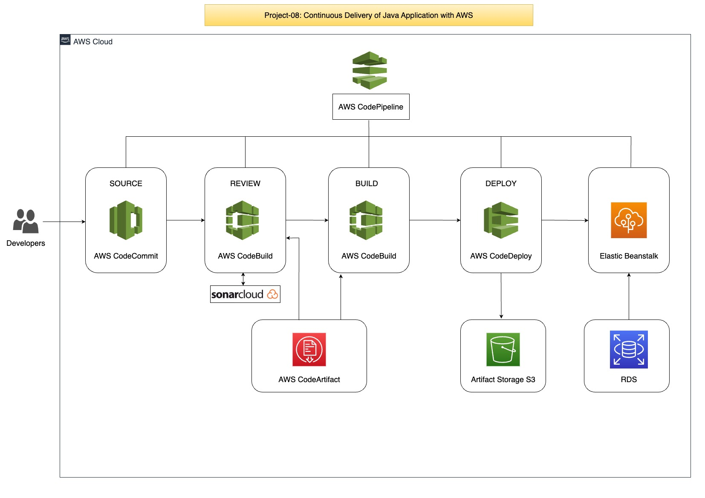

# Project-08: Continuous Delivery of Java Application with AWS 

### Objectives:
Setup the Continuous delivery pipeline with AWS to deploy the application on AWS Elastic beanstalk. 

### Tools/Services Used:

- AWS CodeCommit 
- AWS CodeBuild
- AWS CodeArtifact
- AWS CodeDeploy
- AWS CodePipeline
- AWS Elastic Beanstalk
- AWS RDS
- AWS SNS
- AWS IAM 
- AWS Systems Manager (Parameter Store)
- SonarCloud
- Checkstyle
- Selenium

### Benefits:

- To reduce the operationl overhead, we will use AWS managed services. 

- Below are the comparision of traditionl CI/CD tools with AWS managed tools for CI/CD.

| Traditional CI/CD Tools | Cloud Native/Managed CI/CD Tools  |
  | ------ | ------ |
  | GitHub | AWS CodeCommit |
  | Nexus Sonatype | AWS CodeArtifact |
  | Jenkins Job | AWS CodeBuild |
  | Sonarqube Server | Sonar Cloud |
  | Jenkins Pipeline | AWS CodePipeline |
  | Tomcat on VM | Elastic Beanstalk |
  | MySQL on VM | RDS MySQL |

### Architecture: 

### Flow of Execution:

1. Login to AWS Account 

2. CodeCommit:
   - Create CodeCommit Repo
   - Sync it with the local repository

3. CodeArtifact:
   - Create Repository
   - Update settings.xml file in source code top level directory
   - Update pom.xml file with repo details
   - Generate token and store in SSM parameter store

4. Sonar Setup:
   - Create sonar cloud account  
   - Generate the token and store in SSM parameter store
   - Create Build Project
   - Update CodeBuild role to access the SSM Parameter store

5. Create the notification for SNS or slack

6. Build Project:
   - Create variables in SSM => parameter store
   - Create Build Project

7. Create Pipeline:
   - CodeCommit
   - TestCode
   - Build
   - Deploy to S3 bucket

8. Create Elastic Beanstalk & RDS:
   - Update RDS security group
   - Deploy DB in RDS
   - Switch to cd-aws branch
   - Update settings.xml and pom.xml
   - Create another job to create artifact with buildspec file in cd-aws
   - Create deploy job to beanstalk
   - Create build job for software testing 
   - Upload sceenshot to S3 bucket

9. Update the Pipeline:
   - CodeCommit
   - TestCode
   - Build & Store
   - Deploy to S3
   - Build & Release
   - Deploy to Beanstalk
   - Build Job for Selenium test scripts
   - Upload result to S3

10. Test the Pipeline
