# Project-08: Continuous Delivery of Java Application with AWS 

### Objectives:
Setup the Continuous delivery pipeline with AWS to deploy the application on AWS Elastic beanstalk. 

### Tools/Services Used:

- AWS CodeCommit 
- AWS CodeBuild
- AWS CodeArtifact
- AWS CodeDeploy
- AWS CodePipeline
- AWS Elastic Beanstalk
- AWS RDS
- AWS SNS
- AWS IAM 
- AWS Systems Manager (Parameter Store)
- SonarCloud
- Checkstyle
- Selenium

### Benefits:

- To reduce the operationl overhead, we will use AWS managed services. 

- Below are the comparision of traditionl CI/CD tools with AWS managed tools for CI/CD.


| Traditional CI/CD Tools | Cloud Native/Managed CI/CD Tools  |
  | ------ | ------ |
  | GitHub | AWS CodeCommit |
  | Nexus Sonatype | AWS CodeArtifact |
  | Jenkins Job | AWS CodeBuild |
  | Sonarqube Server | Sonar Cloud |
  | Jenkins Pipeline | AWS CodePipeline |
  | Tomcat on VM | Elastic Beanstalk |
  | MySQL on VM | RDS MySQL |

### Architecture: 

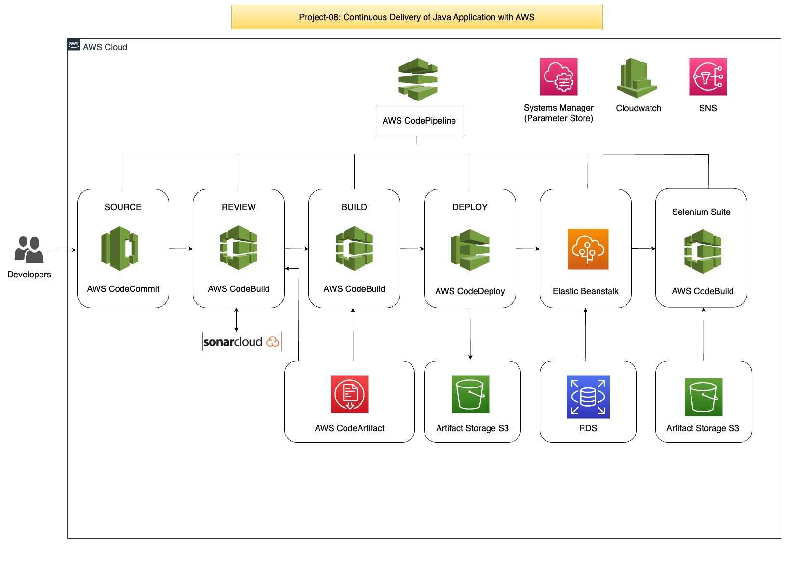

### Flow of Execution:

- Login to AWS Account 

- CodeCommit:
  - Create CodeCommit Repo
  - Sync it with the local repository

- CodeArtifact:
  - Create Repository
  - Update settings.xml file in source code top level directory
  - Update pom.xml file with repo details
  - Generate token and store in SSM parameter store

- Sonar Setup:
  - Create sonar cloud account  
  - Generate the token and store in SSM parameter store
  - Create Build Project
  - Update CodeBuild role to access the SSM Parameter store

- Create the notification for SNS or slack

- Build Project:
  - Create variables in SSM => parameter store
  - Create Build Project

- Create Pipeline:
  - CodeCommit
  - TestCode
  - Build
  - Deploy to S3 bucket

- Create Elastic Beanstalk & RDS:
  - Update RDS security group
  - Deploy DB in RDS
  - Switch to cd-aws branch
  - Update settings.xml and pom.xml
  - Create another job to create artifact with buildspec file in cd-aws
  - Create deploy job to beanstalk
  - Create build job for software testing 
  - Upload sceenshot to S3 bucket

- Update the Pipeline:
  - CodeCommit
  - TestCode
  - Build & Store
  - Deploy to S3
  - Build & Release
  - Deploy to Beanstalk
  - Build Job for Selenium test scripts
  - Upload result to S3

- Test the Pipeline


### Step 1: Create CodeCommit Repository and IAM User:

- Login to AWS Console 
- Go to CodeCommit Service
  - Create New Repository
  - Name: `vprofile-code-repo`


- Create IAM role for CodeCommit:
  - Click on create new role
  - Add Permissions => Create Policy
  - Choose Service => CodeCommit 
  - In Actions => Click on All CodeCommit actions 
  - In Resources => Select Specific => Add ARN (Provide Region and Repository Name)

    

  - Click on Add
  - Click on Tags => Review 
  - Policy Name: `vprofile-code-admin-policy`
  - Click on Create Role
  - Attach new policy: `vprofile-code-admin-policy`
  - Click Next 
  - Provide Role Name: `vprofile-code-admin-role`
  - Click on Create Role


- Create IAM user 
  - Create user
  - Name: `vprofile-code-admin`
  - Attach Policy `vprofile-code-admin-policy`


- Create SSH keys in local system
  - Execute `ssh-keygen` command
  - Provide the path for the keys 


- Upload SSH keys to IAM user
  - Go to IAM user
  - Select the user `vprofile-code-admin`
  - Go to security credentials
  - Upload the keys in SSH Public Keys for CodeCommit
  - Copy the content of `.ssh/vprofile-repo_id_rsa.pub` and paste it.


- Create config file for the codecommit
  - Go to `cd ~/.ssh`
  - Create file `vim config`
  ```
  Host git-codecommit.us-east-1.amazonaws.com
    User <SSH_Key_ID_from IAM_user>
    IdentityFile ~/.ssh/vprofile-repo_id_rsa
  ```

  - Test the SSH connection with CodeCommit
  ```
  ssh git-codecommit.us-east-1.amazonaws.com
  ```


- Clone the github repository in local and convert this repository to codecommit repository

- Use this repository location: `https://github.com/devopshydclub/vprofile-project.git` 

```
git checkout master
git branch -a | grep -v HEAD | cur -d'/' -f3 | grep -v master > /tmp/branches
for i in `cat  /tmp/branches`; do git checkout $i; done
git fetch --tags
git remote rm origin
git remote add origin ssh://git-codecommit.us-east-1.amazonaws.com/v1/repos/vprofile-code-repo
cat .git/config
git push origin --all
git push --tags
```
- Go to the CodeCommit service and check `vprofile-code-repo` repository have added files from our local repository.


### Step 2: Setup CodeArtifact:

- Create repository in Code Artifact 
  - Go to Code Artifact Service 
  - Click on Create Repository
  - Name: `vprofile-maven-repo`
  - Description: `vprofile-maven-repo`
  - Public Upstream Repositories: `maven-central-store`
  - Click on Next


  - Select the Domain
  - AWS Account: `Select this Account`
  - Domain Name: `cloudndevops`
  - Check the domain url is generated below 
  - Click on Next

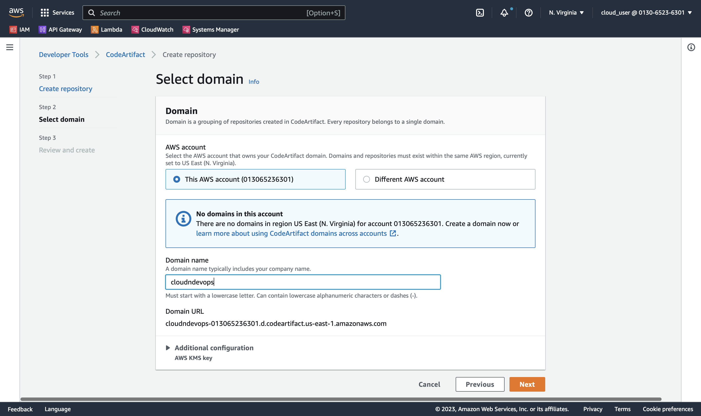

  - Review and Create 
  - Click on Create Repository


- You will see two repositories are created 


- Click on the `maven-central-store` repository
- Click on `View connection instructions`
- Step 1: Choose package manager client `mvn`
- Step 2: Select Configuration Method `Pull from your repository`


- Above commands we need to execute on our local machine 
- We required IAM user with AWS CLI access to run this command from local machine 
- Create the IAM user:
  - Go to the IAM Service
  - Click on Create User
  - Username: vprofile-cart-admin
  - Attach Policy: `AWSCodeArtifactAdminAccess`
  - Review and Create User
- Go to the user
  - Under the security credentials, generate the access keys for the user 

- Login to the local machine
  - Install AWS CLI if not installed 
  - Run the command: `aws configure`
  - Enter Access Key ID and Secret Access Key
  - Default Region Name: `us-east-1`
  - Default output format: `json`
 
- Export a CodeArtifact authorization token 


- Update the settings.xml file 
  - Update servers section
  - Update Profile section
  - Update mirror section


- Update the pom.xml file 
  - Update repositories section


- Push the code the CodeCommit repository on ci-aws branch

```
git add .
git commit -m "updated pom.xml and settings.xml file"
git push origin ci-aws
```
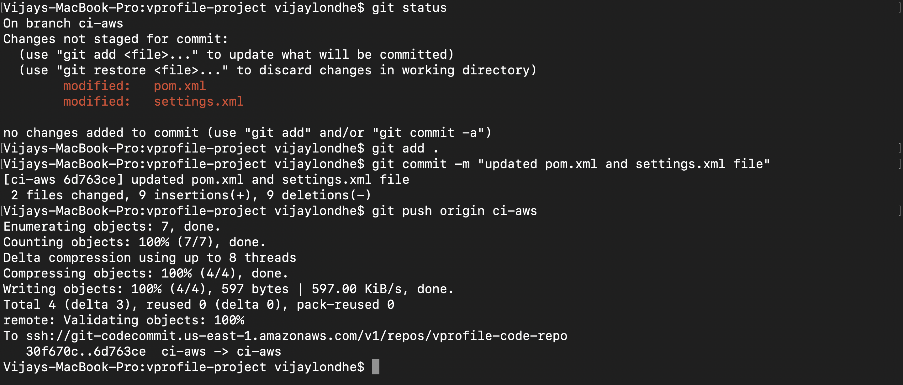


### Step 3: Setup SonarCloud Account:

- Open the brower 
- Enter the sonarcloud url `https://sonarcloud.io`
- Click on Login 
- You can login to sonarcloud by using your github/bitbucket/gitlab/azure devops credentials
- Steps: 
  - Go to My Account 
  - Under the Security Tab Generate Token
  - Token Name: `vprofile-sonar-cloud`
  - Click on My Projects tab
  - Click on Analyze New Project -> `create project manually`
    - Create an organization 
    - Name: `vprofile-sonar-cloud-project`
    - Key: `vprofile-soanr-cloud-project`
   


  - Project Name: `vprofile-repo`
  - Project Key: `vprofile-repo`
  - Click on Setup 


- Note down the below details, required for our next step.
  - Sonarcloud URL: `https://sonarcloud.io`
  - Organization Name: `vprofile-soanr-cloud-project`
  - Project Name: `vprofile-repo`
  - Token: `<token-vprofile-sonar-cloud>`


### Step 4: Setup SSM Parameter Store:

- Go to the Systems Manager Service 
- In Application Management section -> Click on `Parameter Store`
- Click on `Create Parameter`
- Create 5 parameters as per details shown below

```
Name: Organization
Type: String
Value: vprofile-soanr-cloud-project
```

```
Name: HOST
Type: String
Value: https://sonarcloud.io
```

```
Name: Project
Type: String
Value: vprofile-repo
```

```
Name: sonartoken
Type: SecureString
Value: <enter-the-token-genrated-from-sonarcloud>
```

```
Name: codeartifact-token
Type: SecureString
Value: <enter-the-token-genrated-from-codeartifact>
```


### Step 5: Setup CodeBuild Job for Sonarqube Code Analysis:

- Go to CodeBuild Service 
- Craete CodeBuild Project
  - ProjectName: vprofile-sonar-build
  - Source: CodeCommit
  - Branch: ci-aws
  - Environment: Ubuntu
  - Runtime: Standard
  - Image:aws/codebuild/standard:5.0
  - Create New service role
  - Role Name: codebuild-vprofile-sonar-build-service-role
  - BuildSpec: Insert Build Command

```
version: 0.2 
env: 
  parameter-store:
    LOGIN: sonartoken
    HOST: HOST
    Organization: Organization
    Project: Project
    CODEARTIFACT_AUTH_TOKEN: codeartifact-token
phases:
  install:
    runtime-versions:
      java: corretto8
    commands:
    - cp ./settings.xml /root/.m2/settings.xml
  pre_build:
    commands: 
      - apt-get update 
      - apt-get install -y jq checkstyle
      - wget http://www-eu.apache.org/dist/maven/maven-3/3.5.4/binaries/apache-maven-3.5.4-bin.tar.gz
      - tar xzf apache-maven-3.5.4-bin.tar.gz
      - ln -s apache-maven-3.5.4 maven
      - wget https://binaries.sonarsource.com/Distribution/sonar-scanner-cli/sonar-scanner-cli-3.3.0.1492-linux.zip
      - unzip ./sonar-scanner-cli-3.3.0.1492-linux.zip
      - export PATH=$PATH:/sonar-scanner-3.3.0.1492-linux/bin/
  build:
    commands:
      - mvn test
      - mvn checkstyle:checkstyle
      - echo "Installing JDK11 as its a dependency for sonarqube code analysis"
      - apt-get install -y openjdk-11-jdk
      - export JAVA_HOME=/usr/lib/jvm/java-11-openjdk-amd64
      - mvn sonar:sonar -Dsonar.login=$LOGIN -Dsonar.host.url=$HOST -Dsonar.projectKey=$Project -Dsonar.organization=$Organization -Dsonar.java.binaries=target/test-classes/com/visualpathit/account/controllerTest/ -Dsonar.junit.reportsPath=target/surefire-reports/ -Dsonar.jacoco.reportsPath=target/jacoco.exec -Dsonar.java.checkstyle.reportPaths=target/checkstyle-result.xml
      - sleep 5 
      - curl https://sonarcloud.io/api/qualitygates/project_status?projectKey=$Project >result.json 
      - cat result.json
      - if [ $(jq -r '.projectStatus.status' result.json) = ERROR ] ; then $CODEBUILD_BUILD_SUCCEEDING -eq 0 ;fi
```

- Logs-> Cloudwatch -> GroupName: `vprofile-build-logs`, Stream Name: `sonar-logs`
- Click on Create Build Project
 


- Go to the IAM
- Create IAM policy for access to SSM Paramters
  - Policy Name: `vprofile-parameter-store-policy`
  - Add the permission as per below 


- Edit the Role: `codebuild-vprofile-sonar-build-service-role`
- Add the permission -> attach policy `vprofile-parameter-store-policy`


- Go to the CodeBuild service 
- Select Project: `vprofile-sonar-build`
- Click on `Start Build`


- Click on Build Logs, you will see the build is started 


- Once the build process is completed check the Phase details 


### Step 6: Setup CodeBuild Job for Build Artifact:

- Go to CodeBuild Service 
- Craete CodeBuild Project
  - ProjectName: vprofile-build-artifact
  - Source: CodeCommit
  - Branch: ci-aws
  - Environment: Ubuntu
  - Runtime: Standard
  - Image:aws/codebuild/standard:5.0
  - Create New service role
  - Role Name: codebuild-vprofile-build-artifact-service-role
  - BuildSpec: Insert Build Command


- Buildspec file to build the artifact and store in code artifact

```
version: 0.2
env:
  parameter-store:
    CODEARTIFACT_AUTH_TOKEN: codeartifact-token
phases:
  install:
    runtime-versions:
      java: corretto8
    commands:
      - cp ./settings.xml /root/.m2/settings.xml
  pre_build:
    commands:
      - apt-get update 
      - apt-get install -y jq 
      - wget http://www-eu.apache.org/dist/maven/maven-3/3.5.4/binaries/apache-maven-3.5.4-bin.tar.gz
      - tar xzf apache-maven-3.5.4-bin.tar.gz
      - ln -s apache-maven-3.5.4 maven
  build:
    commands:
      - mvn clean install -DskipTests
artifacts:
  files:
    - target/**/*.war
  discard-paths: yes
```

- Logs-> Cloudwatch -> GroupName: `vprofile-build-logs`, Stream Name: `codeartifact-logs`
- Click on Create Build Project


- Edit the IAM Role: 
  - Go to the IAM Service 
  - Edit the Role: `codebuild-vprofile-build-artifact-service-role`
  - Add the permission -> attach policy `vprofile-parameter-store-policy`


- Go to the CodeBuild service 
- Select Project: `vprofile-build-artifact`
- Click on `Start Build`


- Click on Build Logs, you will see the build is started 


- Once the build process is completed check the Phase details 


### Step 7: Setup CodePipeline:

- Create SNS topic and subscription for pipeline notification 
- Go to SNS service
  - Create Topic: `vprofile-topic`


  - Create Subscription
  - Protocol: `Email`
  - Endpoint: `<your_email_id>`


- Go to the CodePipeline service 
- Create Pipeline 

```
Pipeline Name: vprofile-pipeline
Service Role: Create New Service Role
Click on Next 
```


```
Add Source Stage
Source Provider: AWS CodeCommit
Repository Name: vprofile-code-repo
Branch Name: ci-aws
Change detection options: Amazon Cloudwatch Events 
```


```
Add Build Stage
Build Provider: AWS CodeBuild
Project Name: vprofile-build-artifact
Build Type: Single Build 
```


```
Add deploy Stage
Click on Skip Deploy Stage 
We will do this later by editing the pipeline
```


- Click on Create Pipeline 
- You will see the pipeline is created and started the execution
- Stop the execution of pipeline 


#### Add Test stage for Sonarcode Analysis

- Click on `Edit`
- In Add stage give the stage name as `Test`


- In Edit Action add the below details 
```
Action Name: Sonarqube-analysis
Action Provider: AWS CodeBuild
Input Artifact: Source Artifact
Project Name: vprofile-sonar-build
Build Type: Single Build 
Click on Create
```


#### Add Stage for Deploy to S3 (To upload build artifact in S3)

- After the Build Stage add the New stage 


- In Edit Action add the below details 
```
Action Name: Deploy-to-s3
Action Provider: Amazon S3
Input Artifact: Build Artifact
Bucket: vprofile-artifact-bukcet-815
Deployment Path: pipeline-artifacts
Select Checkbox for Extract file before deploy
Click on Done
```


- Save the Pipeline 

- In Pipeline, click on Settings -> CodePipeline -> Notifications.
- We need to setup the notification to our pipeline  
- Provide the topic name 


### Step 8: Validate and Run the CI Pipeline:

- Click On Pipeline -> `vprofile-pipeline`
- Click on Release Change 
- This will trigger the pipeline. 
- After the pipeline completes, go to the S3 bucket and check artifact is uploaded 
- Open sonarcloud project and check reports are generated for 'vprofile-sonar-cloud-project'


### Step 9: Setup Elastic Beanstalk Environment:

- Go to the Elastic Beanstalk Service 
- Create New Application 

```
Application Name: vprofile-app
Platform: Tomcat
Application Code: Sample Application
Configure more options: 
Capacity: Load Balanced (Min: 2, Max: 4)
Security: Virtual machine key pair: Provide Key Pair(vprofile-app-key)
```

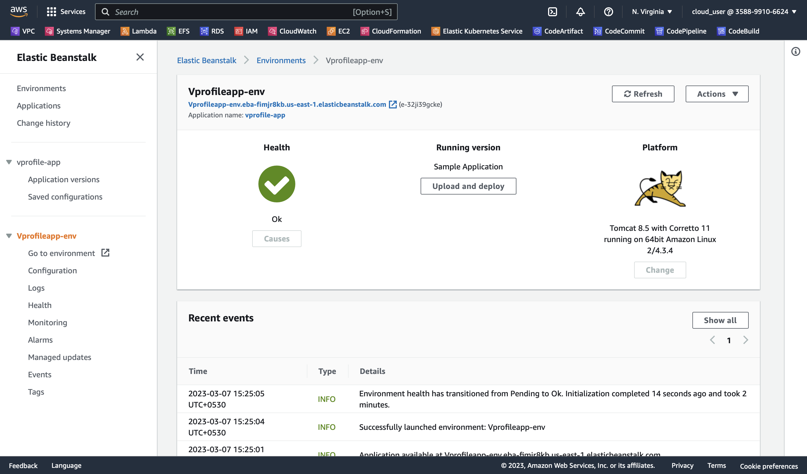


### Step 10: Setup MySQL RDS:

- Go to the RDS Service
- Click on Create Database 

```
Standard Create 
Select MySQL DB Engine
Version: 5.7
DB Identifier: vprofile-cicd-mysql
Master Username: admin
Password: Auto Genearted 
Instance Configuration: t2.medium
Connectivity: Select default VPC, create new security group (vprofile-cicd-rds-mysql-sg) 
Initial DB Name: accounts
```

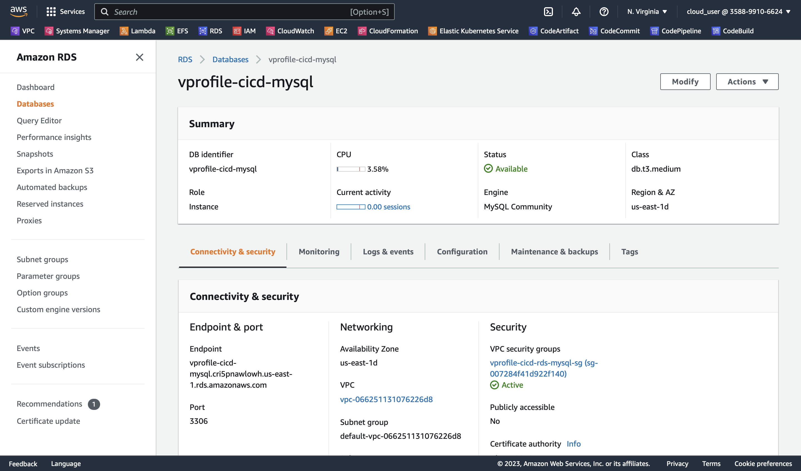


### Step 11: Initialize MySQL RDS Instance:

- Update security group of RDS instance to provide access to elastic beanstalk instances.

- Add Port 3306 for security group id of elastic beanstalk instances.

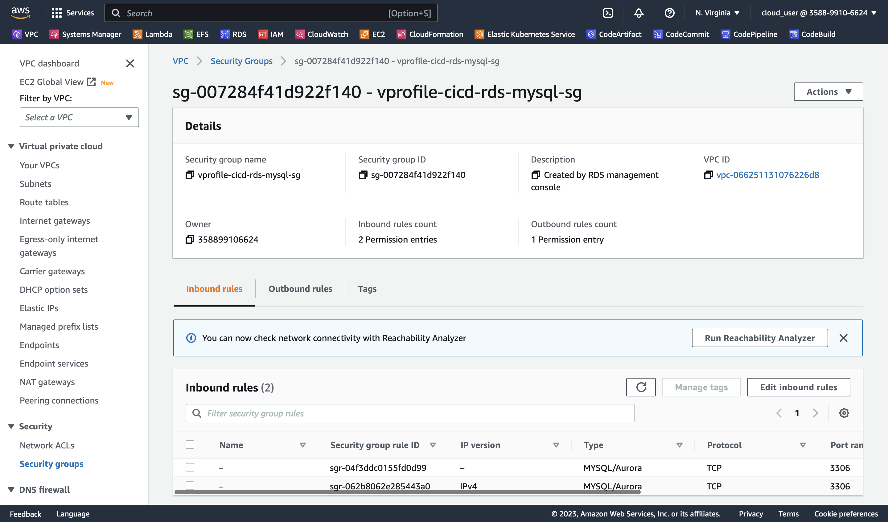

- Login to the Elastic beanstalk instance 
- `ssh -i vprofile-app-key ec2-user@x.x.x.x`
- Execute below commands to initialize the database 

```
sudo -i
yum install mysql git -y
mysql -h <RDS_endpoint> -u <RDS_username> -p<RDS_password>
show databases;
git clone https://github.com/vijaylondhe/vprofileproject-complete.git
cd vprofileproject-all/
git checkout cd-aws
cd src/main/resources
mysql -h <RDS_endpoint> -u <RDS_username> -p<RDS_password> accounts < db_backup.sql
mysql -h <RDS_endpoint> -u <RDS_username> -p<RDS_password>
use accounts;
show tables;
```

### Step 12: Create New Branch & Update the Code:

- Create new branch `cd-aws`
- `git checkout -b cd-aws`
- Update the maven repository location in settings.xml and pom.xml files and push the code.
- Go to the CodeArtifact service, select the repository and view connection settings 
- Copy the repository url.

- `vi pom.xml`

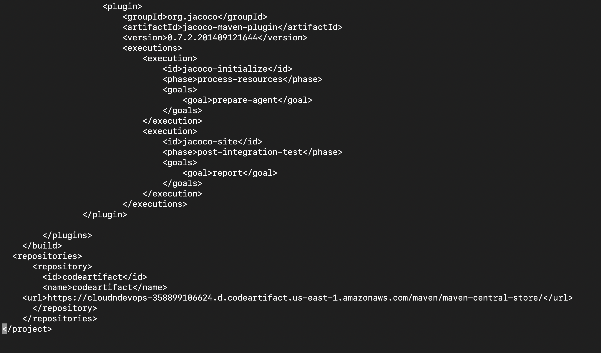

- `vi settings.xml`

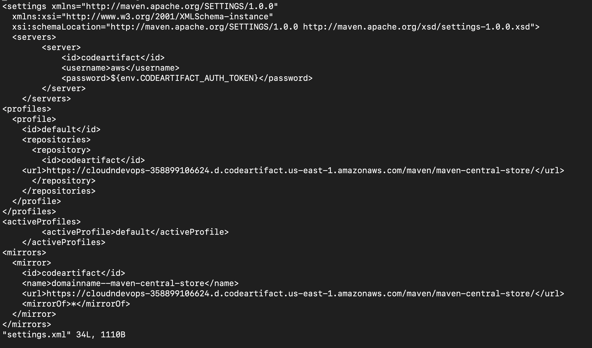

- `git add .`
- `git commit -m "updated repository location"`
- `git push origin cd-aws`

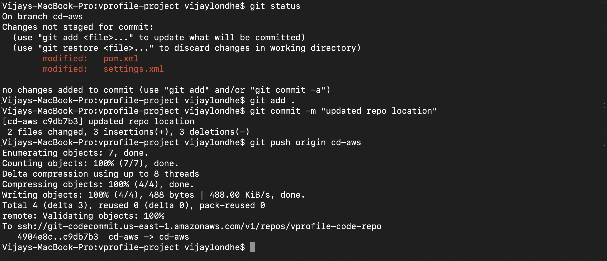


### Step 13: Setup CodeBuild Job for Deploy to Elastic Beanstalk:

- Go to the CodeBuild Service 
- Create CodeBuild Project for deploying artifact to the elastic beanstalk 

```
Project Name: vprofile-build-release
Source Provider: AWS CodeCommit 
Repository: vprofile-code-repo
Branch: cd-aws
Environment: Ubuntu 
Image:aws/codebuild/standard:5.0
Use Existing service role which has access to parameter store
```

- Insert build commands:
```
version: 0.2
env:
  parameter-store:
    CODEARTIFACT_AUTH_TOKEN: codeartifact-token
    dbhost: RDS-Endpoint
    dbuser: RDSUSER
    dbpass: RDSPASS
phases:
  install:
    runtime-versions:
      java: corretto8
    commands:
      - cp ./settings.xml /root/.m2/settings.xml
  pre_build:
    commands:
      - sed -i "s/jdbc.password=admin123/jdbc.password=$dbpass/" src/main/resources/application.properties
      - sed -i "s/jdbc.username=admin/jdbc.username=$dbuser/" src/main/resources/application.properties
      - sed -i "s/db01:3306/$dbhost:3306/" src/main/resources/application.properties
      - apt-get update
      - apt-get install -y jq
      - wget http://www-eu.apache.org/dist/maven/maven-3/3.5.4/binaries/apache-maven-3.5.4-bin.tar.gz
      - tar xzf apache-maven-3.5.4-bin.tar.gz
      - ln -s apache-maven-3.5.4 maven
  build:
    commands:
      - mvn clean install -DskipTests
artifacts:
  files:
     - '**/*'
  base-directory: 'target/vprofile-v2'
```

- Logs-> Cloudwatch -> GroupName: `vprofile-build-logs`, Stream Name: `release-logs`
- Create Parameter store for RDS Username/Endpoint/Password

```
RDS-Endpoint: String : Value <RDS_Endpoint>
RDSUSER: String : Value <RDS_Username>
RDSPASS: SecureString : Value <RDS_Password>
```

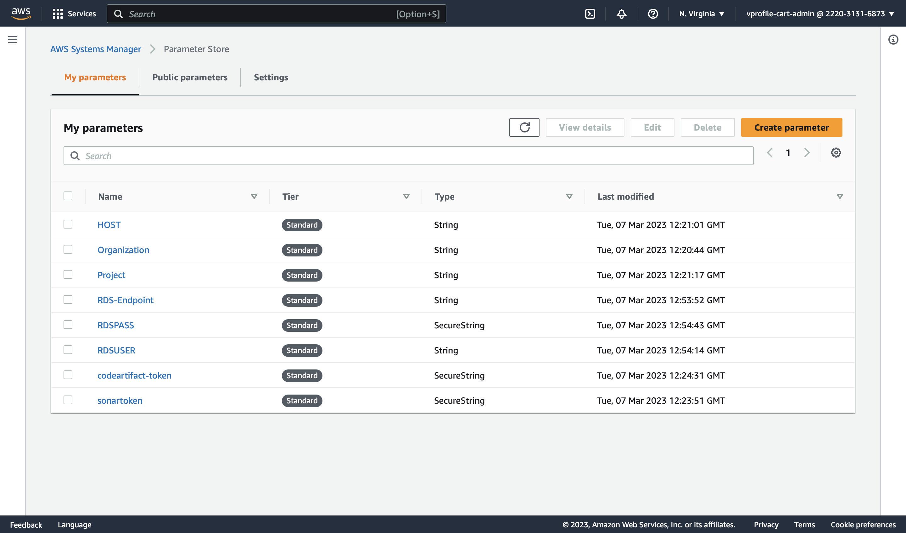

- Go to the CodeBuild Service 
- Select the `vprofile-build-release` build project 
- Click on Build.


### Step 14: Setup CodeBuild Job for Selenium Automation Tests:

- Go to the CodeBuild service
- In this project we will run the Selenium automation scripts and store the artifacts in the S3 bucket.
- 

```
Project Name: vprofile-selenium-testing
Source Provider: AWS CodeCommit 
Repository: vprofile-code-repo
Branch: cd-aws
Environment: Windows Server 2019 
Runtime: Base 
Image: 1.0 
Use Existing service role which has access to parameter store
```
- Insert build commands:

```
version: 0.2

#env:
#  variables:
#    PROJECT: AspNetMvcSampleApp
#   DOTNET_FRAMEWORK: 4.6.1
phases:
  build:
    commands:
      - Set-ExecutionPolicy Bypass -Scope Process -Force; iex ((New-Object System.Net.WebClient).DownloadString('https://chocolatey.org/install.ps1'))
      - choco install jdk8 -y
      - choco install maven -y
      - choco install googlechrome -y
      - choco install git -y
      - mkdir C:\output
      - Start-Sleep -s 360
      - cd src\seleniumscripts\
      - mvn clean test -Dsurefire  -Durl=http://pineapple-env.eba-xvrnrqp3.us-east-1.elasticbeanstalk.com/login -Dusr=admin_vp -Dpass=admin_vp -DsShotPath=C:\\output\\ScrnSht_
      - cp C:\output\* .
artifacts:
  files:
    - '**/*'
```

- Make sure to update the elastic beanstalk environemnt url in mvn test command.
- Artifacts: Type: S3
- Bucketname: vprofile-cicd-testoutput-vd-815
- Enable semantic versioning
- Artifcats packaging: zip
- Logs-> Cloudwatch -> GroupName: `vprofile-build-logs`, Stream Name: `selenium-logs`
- Click on Create Build Project 
- Click on Build. 


### Step 15: Setup Complete CI/CD pipeline with CodePipeline:

- Go to the CodeBuild service 
- Open the Project `vprofile-sonar-build` 
- Edit the Source Branch to `cd-aws`
- Save the changes 
- Go to the Project `vprofile-build-artifact`
- Edit the Source Branch to `cd-aws`
- Save the changes 

#### Create CodePipeline: 

- Go to the CodePipeline service
- Click on Create Pipeline 

- Choose Pipeline Settings: 
  - Name: vprofile-cicd-pipeline
  - Create New Service Role 
  - Click on Next

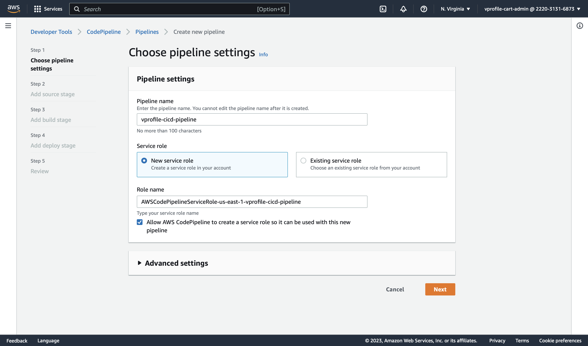

- Add Source Stage:
  - Source Provider: AWS CodeCommit 
  - Repository Name: vprofile-code-repo
  - Branch Name: cd-aws
  - Change Detection Options: Amazon Clodwatch Events 
  - Output Artifact Format: Codepipeline Default 

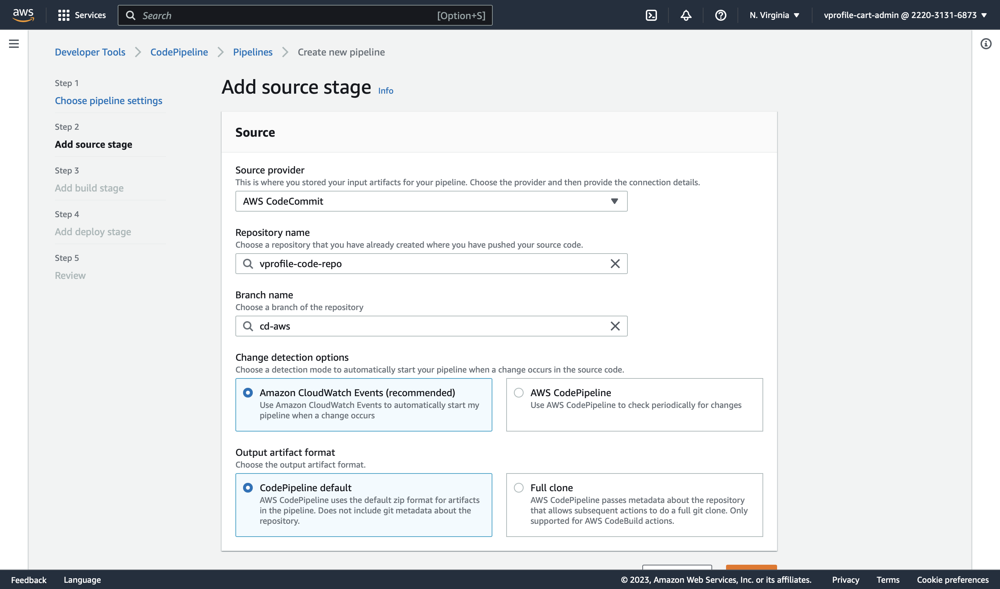

- Add Build Stage:
  - Build Provider: AWS CodeCommit
  - Project Name: vprofile-build-release
  - Build Type: Single Build 

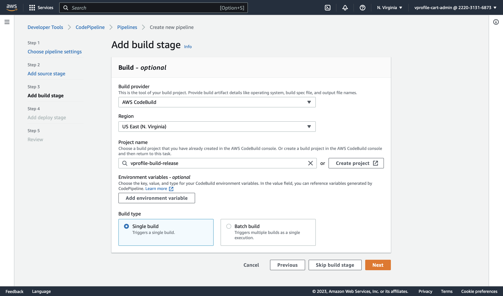

- Add Deploy Stage:
  - Deploy Provider: AWS Elastic Beanstalk
  - Application Name: vprofile-app
  - Environment Name: Vprofileapp-env


- Create the pipeline 
- Stop the Execution of pipeline 
- Add the stages for `vprofile-sonar-build` and `vprofile-build-artifact`
- Edit the Pipeline  
- Add the first stage for `CodeAnalysis` after Source
- Click on + Add Stage 

```
Name: CodeAnalysis
Action provider: CodeBuild
Input artifacts: SourceArtifact
Project name: vprofile-sonar-build
```
  
- Add the second stage for `BuildAndStore` after CodeAnalysis
- Click on + Add Stage 

```
Name: BuildAndStore
Action provider: CodeBuild
Input artifacts: SourceArtifact
Project name: vprofile-build-artifact
```

- Add the third stage for `DeployToS3` after BuildAndStore
- Click on + Add Stage 

```
Name: DeployToS3
Action provider: Amazon S3
Input artifacts: BuildArtifact
Bucket name: vprofile815-build-artifact
Extract file before deploy
```

- Edit Build Job `vprofile-build-release` and change the Output Artifact name to `BuildArtifactToBean`

- Edit Deploy stage and change Input artifact to `BuildArtifactToBean`

- After the Deploy Job, add new stage for SoftwareTesting using selenium suite.
- Click on + Add Stage 

```
Name: SoftwareTesting
Action provider: CodeBuild
Input artifacts: SourceArtifact
ProjectName: vprofile-selenium-testing
```

- Click on Save to save the pipeline.
- Click on `Release Change` to start the pipeline execution.

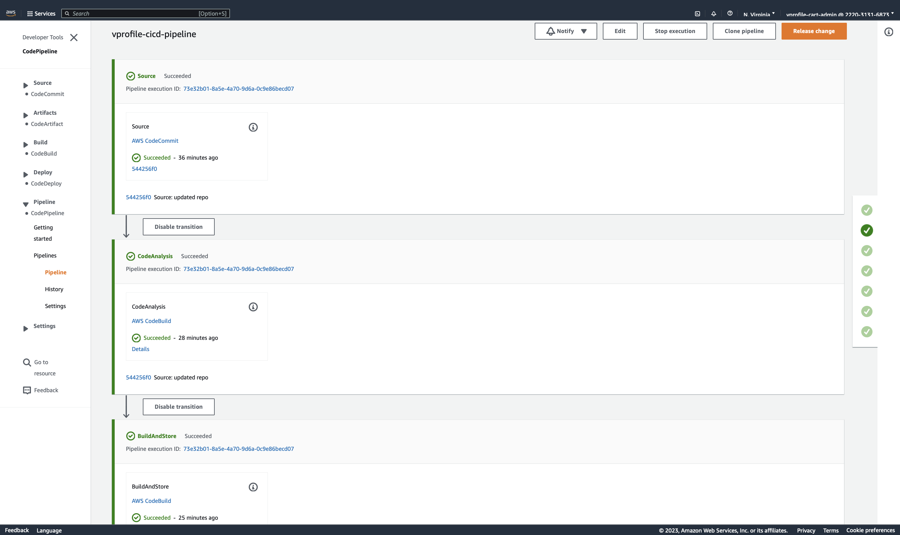
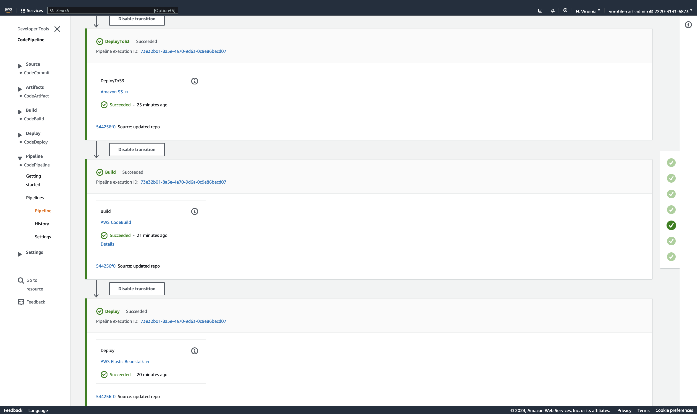
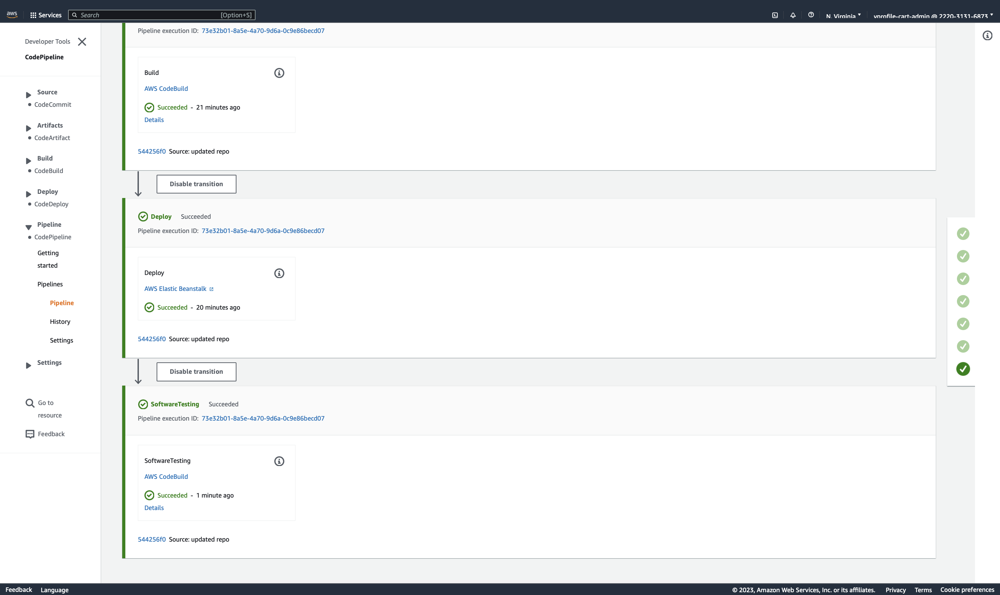


### Step 16: Validate the Application:

- Go to the Elastic beanstalk service 
- Select the Application `vprofile-app`
- Copy the url of application
- Open the url and test the url.

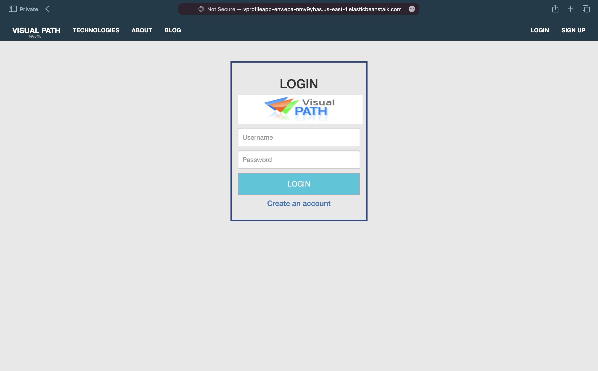
