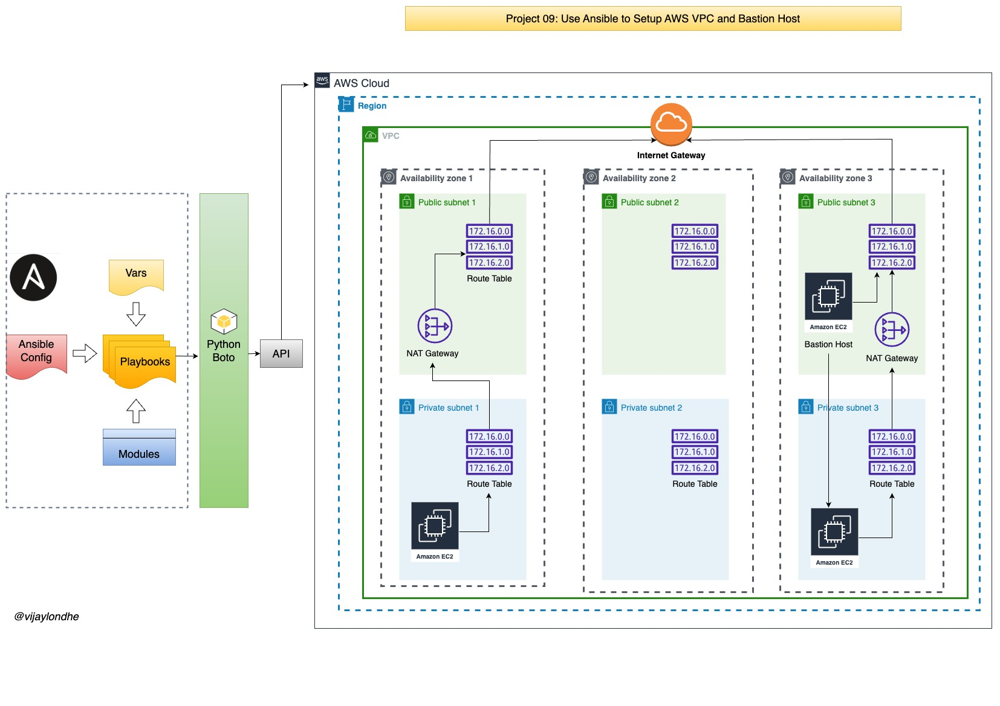

# Project-09: Use Ansible to Setup AWS VPC with Bastion Host

### Objective:

- Configuration Management of VPC: 
  - Using Ansible, setup the AWS VPC and its component (Subnets, Internet Gateway, NAT Gateway, Route Tables, NACL, Security Groups etc.) with Bastion host.

- Automatic Setup 

- Centralize Change Management

- Version Control 

### Architecture:

### Flow of Execution:
- Login to AWS
- Create EC2 instance to create playbook
- Install ansible 
- Install boto 
- Setup EC2 role for ansible 
- Create project directory
- Sample cloud task (with key pair)
- Create variable file for VPC and bastion host
- Create VPC setup playbook
- Create Bastion host setup playbook
- Site.yml to call both playbook at once

