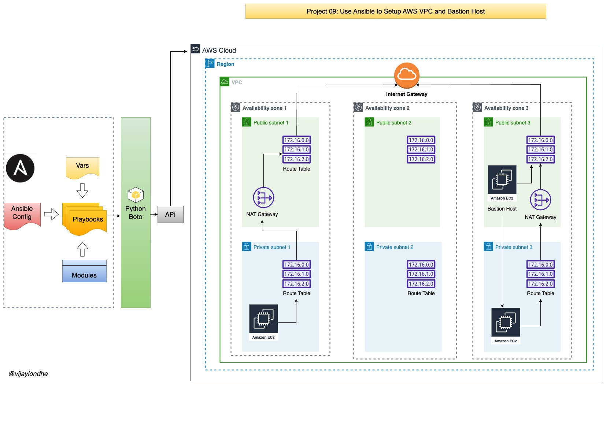

# Project-09: Use Ansible to Setup AWS VPC with Bastion Host

### Objective:

- Configuration Management of VPC: 
  - Using Ansible, setup the AWS VPC and its component (Subnets, Internet Gateway, NAT Gateway, Route Tables, NACL, Security Groups etc.) with Bastion host.

- Automatic Setup 

- Centralize Change Management

- Version Control 

### Architecture:




### Flow of Execution:
- Login to AWS
- Create EC2 instance to create playbook
- Install ansible 
- Install boto 
- Setup EC2 role for ansible 
- Create project directory
- Sample cloud task (with key pair)
- Create variable file for VPC and bastion host
- Create VPC setup playbook
- Create Bastion host setup playbook
- Site.yml to call both playbook at once


### Step 1: Create EC2 insatnce for Ansible and IAM Role: 

- Login to AWS account
- Go to EC2 service 
- Click on Launch instance
  - Instane Name: ansible-control-plane
  - AMI: Ubuntu 20.04
  - Key Pair: Create New, Name: ansible-control-plane
  - VPC: default
  - Security Group: Port 22 Access to MyIP
  - Userdata: 
  ```
  #!/bin/bash
  apt update
  apt install ansible -y 
  apt install awscli -y 
  ```

- Create IAM Role:
  - Go to IAM Service
  - Create Role 
  - Trusted entity type: AWS Service 
  - Use Case: EC2
  - Add Permissions: AdministratorAccess
  - Role Name: ansible-admin-role
  - Click on Create Role

- Attach Role to EC2 instance.
  - Go to the EC2 service 
  - Select the EC2 instance
  - Go to Actions -> Security -> Modify IAM Role 
  - Choose ansible-admin-role
  - Click on Update IAM Role 

- Log in to the EC2 instance and verify the installation 
  - Check IAM role is attached or not  
  - Run the command `aws sts get-caller-identity` 
  - Check ansible is installed or not 
  - Run the command `ansible --version`


### Step 2: Create Sample Playbooks:

- Login to EC2 instance
- Install boto packages 
```
apt install python3-boto -y
apt install python3-boto3 -y
apt install python3-botocore -y
```

- Create separate directory for playbooks 

```
mkdir vpc-stack-vprofile
cd vpc-stack-vprofile
```

- Create sample playbook
- `vim test-aws.yml`

```
- hosts: localhost
  connection: local
  gather_facts: False
  tasks:
    - name: sample keypair 
      ec2_key:
       name: my-keypair
       region: us-east-1 
```

- Run the playbook, this will create the key pair 
- `ansible-playbook test-aws.yml`

- Go to the AWS console in EC2 serive 
- Click on Key Pair and delete the sample-key 
- We will store the key in file using copy module 
- `vim test-aws.yml`
```
- hosts: localhost
  connection: local
  gather_facts: False
  tasks:
    - name: create sample key 
      ec2_key: 
        name: sample-key
        region: us-east-1
      register: keyout

    - debug:
        var: keyout 

    - name: store login key 
      copy: 
        content: "{{keyout.key.private_key}}"
        dest: ./sample-key.pem
      when: keyout.changed

```