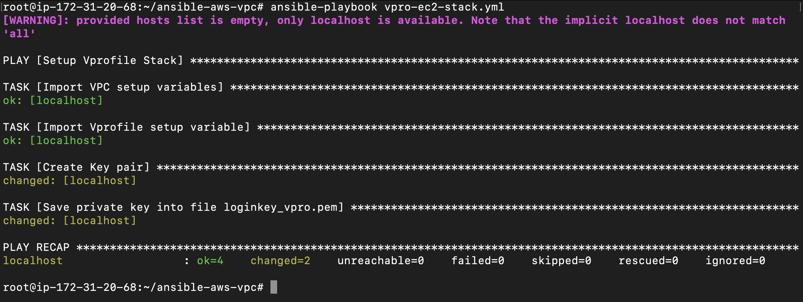

# Project-10: Use Ansible to Deploy Web Application Stack on AWS

### Objective:

- Setup VPC [Secure and HA] (Refer Previous Project-09)
- Provision EC2 instances, ELB, Security Groups etc.
- Provision Web Application Stack on EC2 instances
  - Build Artifact
  - MySQL
  - Memcached
  - RabbitMQ
  - Tomcat
  - Nginx 

### Flow of Execution:
- Login to the AWS
- Create EC2 instance to run ansible playbook
- Install Ansible
- Install Boto
- Setup IAM Role for ansible and attach to EC2
- Fetch source code from project ansible for AWS
- Execute VPC playbook
- Playbook to launch EC2, ELB, Security groups for web application stack
- Get into VPC
- Playbooks for web application stack


### Step 1: Create EC2 insatnce for Ansible and IAM Role: 

- Login to AWS account
- Go to EC2 service 
- Click on Launch instance
  - Instane Name: ansible-control-plane
  - AMI: Ubuntu 20.04
  - Key Pair: Create New, Name: ansible-control-plane
  - VPC: default
  - Security Group: Port 22 Access to MyIP
  - Userdata: 
  ```
  #!/bin/bash
  apt update
  apt install ansible -y 
  apt install awscli -y 
  apt install python3-boto -y
  apt install python3-boto3 -y
  apt install python3-botocore -y
  ```

- Create IAM Role:
  - Go to IAM Service
  - Create Role 
  - Trusted entity type: AWS Service 
  - Use Case: EC2
  - Add Permissions: AdministratorAccess
  - Role Name: ansible-admin-role
  - Click on Create Role

- Attach Role to EC2 instance.
  - Go to the EC2 service 
  - Select the EC2 instance
  - Go to Actions -> Security -> Modify IAM Role 
  - Choose ansible-admin-role
  - Click on Update IAM Role 

- Log in to the EC2 instance and verify the installation 
  - Check IAM role is attached or not  
  - Run the command `aws sts get-caller-identity` 
  - Check ansible is installed or not 
  - Run the command `ansible --version`


### Step 2: Setup New Branch and Create VPC: 

- Pull the code from the Github
- git clone https://github.com/vijaylondhe/ansible-aws-vpc.git
- Create new branch `vprofile-stack`
  - git checkout -b vprofile-stack
  - git branch --all
- Move the content of `vars/bastion_setup` file to `vpc_setup` file
- Delete the `bastion_setup` file 
- Create new file `site.yml`, import the vpc and bastion playbook in it.

```
---
- import_playbook: vpc-setup.yml
- import_playbook: bastion-instance.yml
```
- Commit and Push the code to the GitHub

- Run the playbook
- `ansible-playbook site.yml`
- This will create VPC with all its component and bastion host.
- This will also create the `bastion-key.pem` file for bastion host access and `vars/output_vars` file for the output.
- Make sure to ignore key file while pushing our code to github.
- Create git ignore file, add .pem files and push to the github.
- vi .gitignore
```
*.pem
```
- git add .
- git commit -m "ignore keys"
- git push origin vprofile-stack


### Step 3: Create Playbook for EC2 stack:

#### 3.1 Setup variable files and key pair for the instance

- Locate the AMI ID which is required for EC2 instances.
- Go to the `https://cloud-images.ubuntu.com/locator/` website.
- Search for Ubuntu 18.04 image for AWS cloud `us-east-1` region.
- Copy the Image ID in below variable file.
- We will be using same AMI for all the EC2 instances.
- Create new variable file 
- `vi vars/vprostacksetup`
```
nginx_ami: ami-0263e4deb427da90e
tomcat_ami: ami-0263e4deb427da90e
memcache_ami: ami-0263e4deb427da90e
rmq_ami: ami-0263e4deb427da90e
mysql_ami: ami-0263e4deb427da90e
```

- Create new file for playbook
- `vi vpro-ec2-stack.yml`
```
- name: Setup Vprofile Stack
  hosts: localhost
  connection: local
  gather_facts: False
  tasks:
    - name: Import VPC setup variables
      include_vars: vars/vpc_setup

    - name: Import Vprofile setup variable
      include_vars: vars/vprostacksetup

    - name: Create Key pair
      ec2_key:
        name: vprokey
        region: "{{region}}"
      register: vprokey_out

    - name: Save private key into file loginkey_vpro.pem
      copy:
        content: "{{vprokey_out.key.private_key}}"
        dest: "./loginkey_vpro.pem"
        mode: 0600
      when: vprokey_out.changed
```
 
- Push the code to the github 
- git add .
- git commit -m "added playbook and var files for vprofile stack"
- git push origin vprofile-stack


- Run the playbook
- `ansible-playbook vpro-ec2-stack.yml`




#### 3.2 Create Security Groups for Load Balancer and EC2 Instances:

- Add `vars/output_vars` file inside the playbook
- Add Security Group for Load Balancer
- Note: If we execute the playbook multiple times, ec2_group module will update the security group rules everytime, by default it is not idempotent, to avoid this add `purge_rule: no` option in ec2_group module.


- vi vpro-ec2-stack.yml
```
    - name: Create Security Group for Load Balancer
      ec2_group:
        name: vproELB-sg
        description: Allow port 80 from everywhere and all port within sg
        region: "{{region}}"
        vpc_id: "{{vpcid}}"
        rules:
          - proto: tcp
            from_port: 80
            to_port: 80
            cidr_ip: 0.0.0.0/0
      register: vproELBSG_out

    - name: Create Security Group for Vprofile stack
      ec2_group:
        name: vproStack-sg
        description: Allow port 80 from ELB SG and all port within sg
        region: "{{region}}"
        vpc_id: "{{vpcid}}"
        purge_rules: no
        rules:
          - proto: tcp
            from_port: 80
            to_port: 80
            group_id: "{{vproELBSG_out.group_id}}"

          - proto: tcp
            from_port: 22
            to_port: 22
            group_id: "{{BastionSGid}}"
      register: vproStackSG_out

    - name: Update Security Group with its own sg id
      ec2_group:
        name: vproStack-sg
        description: allow all ports within the sg
        region: "{{region}}"
        vpc_id: "{{vpcid}}"
        purge_rules: no
        rules:
          - proto: all
            group_id: "{{vproStackSG_out.group_id}}"

```

- Push the code to the github 
- git add .
- git commit -m "added sg for vprofile stack"
- git push origin vprofile-stack


- Run the playbook
- `ansible-playbook vpro-ec2-stack.yml`


#### 3.3 Upgrade the Ansible Version from 2.9 to 2.10:
```
sudo apt remove ansible -y 
sudo apt install python3-pip -y
sudo pip3 install ansible 
```

#### 3.4 Add the module for EC2 instances in playbook:

- Add the ec2 module to create ec2 instances for nginx, tomcat, memcached, rabbitmq and mysql.

- vim vpro-ec2-stack.yml
```
    - name: Creating Nginx web01
      ec2:
        key_name: vprokey
        region: "{{region}}"
        instance_type: t2.micro
        image: "{{nginx_ami}}"
        wait: yes
        wait_timeout: 300
        instance_tags:
          Name: "web01"
          Project: Vprofile
          Owner: DevOps Team
        exact_count: 1
        count_tag:
          Name: "web01"
          Project: Vprofile
          Owner: DevOps Team
        group_id: "{{vproStackSG_out.group_id}}"
        vpc_subnet_id: "{{privsub1id}}"
      register: app01_out


    - name: Creating tomcat app01
      ec2:
        key_name: vprokey
        region: "{{region}}"
        instance_type: t2.micro
        image: "{{tomcat_ami}}"
        wait: yes
        wait_timeout: 300
        instance_tags:
          Name: "app01"
          Project: Vprofile
          Owner: DevOps Team
        exact_count: 1
        count_tag:
          Name: "app01"
          Project: Vprofile
          Owner: DevOps Team
        group_id: "{{vproStackSG_out.group_id}}"
        vpc_subnet_id: "{{privsub1id}}"
      register: app01_out


    - name: Creating memcache mc01
      ec2:
        key_name: vprokey
        region: "{{region}}"
        instance_type: t2.micro
        image: "{{memcache_ami}}"
        wait: yes
        wait_timeout: 300
        instance_tags:
          Name: "mc01"
          Project: Vprofile
          Owner: DevOps Team
        exact_count: 1
        count_tag:
          Name: "mc01"
          Project: Vprofile
          Owner: DevOps Team
        group_id: "{{vproStackSG_out.group_id}}"
        vpc_subnet_id: "{{privsub1id}}"
      register: mc01_out


    - name: Creating RabbitMQ rmq01
      ec2:
        key_name: vprokey
        region: "{{region}}"
        instance_type: t2.micro
        image: "{{rmq_ami}}"
        wait: yes
        wait_timeout: 300
        instance_tags:
          Name: "rmq01"
          Project: Vprofile
          Owner: DevOps Team
        exact_count: 1
        count_tag:
          Name: "rmq01"
          Project: Vprofile
          Owner: DevOps Team
        group_id: "{{vproStackSG_out.group_id}}"
        vpc_subnet_id: "{{privsub1id}}"
      register: rmq01_out


    - name: Creating Mysql db01
      ec2:
        key_name: vprokey
        region: "{{region}}"
        instance_type: t2.micro
        image: "{{mysql_ami}}"
        wait: yes
        wait_timeout: 300
        instance_tags:
          Name: "db01"
          Project: Vprofile
          Owner: DevOps Team
        exact_count: 1
        count_tag:
          Name: "db01"
          Project: Vprofile
          Owner: DevOps Team
        group_id: "{{vproStackSG_out.group_id}}"
        vpc_subnet_id: "{{privsub1id}}"
      register: db01_out

    - debug:
        var: db01_out.tagged_instances[0].id

```

- Push the code to the github 
- git add .
- git commit -m "added ec2 for vprofile stack"
- git push origin vprofile-stack


- Run the playbook
- `ansible-playbook vpro-ec2-stack.yml`


#### 3.5 Add ELB module in Playbook:

- vim vpro-ec2-stack.yml

```
    - local_action:
        module: ec2_elb_lb
        name: "vprofile-elb"
        region: "{{region}}"
        state: present
        instance_ids:
          - "{{ web01_out.tagged_instances[0].id }}"
        purge_instance_ids: true
        security_group_ids: "{{ vproELBSG_out.group_id }}"
        subnets:
          - "{{ pubsub1id }}"
          - "{{ pubsub2id }}"
          - "{{ pubsub3id }}"
        listeners:
          - protocol: http # options are http, https, ssl, tcp
            load_balancer_port: 80
            instance_port: 80
```

- Push the code to the github 
- git add .
- git commit -m "added elb for vprofile stack"
- git push origin vprofile-stack


- Run the playbook
- `ansible-playbook vpro-ec2-stack.yml`


#### 3.6 Create Dynamic inventory for instances:

- Create new folder `provision-stack/group_vars`

- Create empty file `inventory-vpro` inside `provision-stack` for dynamic inventory.

- Create empty file `hostsip` inside `provision-stack/group_vars` to store the ip address information of all ec2 instances.

- Edit the playbook and add the dynamic inventory file with all the details of instances.

- Also copy access file inside the `provision-stack` folder

- vi vpro-ec2-stack.yml

```
    - name: Insert/Update Hosts IP & Name in file provision-stack/group_vars/hostsip
      blockinfile:
        path: provision-stack/group_vars/hostsip
        block: |
          web01_ip: {{ web01_out.tagged_instances[0].private_ip }}
          app01_ip: {{ app01_out.tagged_instances[0].private_ip }}
          rmq01_ip: {{ rmq01_out.tagged_instances[0].private_ip }}
          mc01_ip: {{ mc01_out.tagged_instances[0].private_ip }}
          db01_ip: {{ db01_out.tagged_instances[0].private_ip }}
    

    - name: Copy login key to provision_stack directory
      copy:
        src: loginkey_vpro.pem
        dest: provision-stack/loginkey_vpro.pem
        mode: '0400'


    - name: Insert/Update Inventory file provision-stack/inventory-vpro
      blockinfile:
        path: provision-stack/inventory-vpro
        block: |
          web01 ansible_host={{ web01_out.tagged_instances[0].private_ip }}
          app01 ansible_host={{ app01_out.tagged_instances[0].private_ip }}
          rmq01 ansible_host={{ rmq01_out.tagged_instances[0].private_ip }}
          mc01 ansible_host={{ mc01_out.tagged_instances[0].private_ip }}
          db01 ansible_host={{ db01_out.tagged_instances[0].private_ip }}
          cntl ansible_host=127.0.0.1 ansible_connection=local
          
          [websrvgrp]
          web01
          
          [appsrvgrp]
          app01
          
          [rmqsrvgrp]
          rmq01
          
          [mcsrvgrp]
          mc01
          
          [dbsrvgrp]
          db01
          
          [control]
          cntl
          
          [stack_inst:children]
          websrvgrp
          appsrvgrp
          rmqsrvgrp
          mcsrvgrp
          dbsrvgrp
          
          [stack_inst:vars]
          ansible_user=ubuntu
          ansible_ssh_private_key_file=loginkey_vpro.pem
          #ansible_python_interpreter=/usr/bin/python3

```

- Push the code to the github 
  - git add .
  - git commit -m "added dynamic inventory for vprofile stack"
  - git push origin vprofile-stack


- Run the playbook
- `ansible-playbook vpro-ec2-stack.yml`

- Push the code to GitHub:
  - This will create the hostsip file and inventory-vpro file 
  - Push back code to the github for this both the files 
  - git status 
  - git add .
  - git commit -m "added inventory file"
  - git push origin vprofile-stack


### Step 4: Setup Configuration for EC2 instances:

#### 4.1 Move Ansible Controller to vprofile-vpc

- Ansible control node is launched in default vpc, so it is not able to connect to the instances launched in Vprofile-vpc.

- There are two options available to make connectivity between ansible control node and EC2 instances launched in Vprofile-vpc.
  - Configure VPC Peering between default vpc and Vprofile-vpc.
  - Create AMI of ansible control node and create the new instance from that AMI in Vprofile-vpc.

- We will choose the second option.

- Create AMI of ansible control node:
  - Select the ansible control node instance in EC2 service 
  - Click on Actions -> Image -> Create Image 
  - Image Name: controller-ami

- Launch the instance from AMI:
  - Go to EC2 service 
  - Click on AMI's option inside Image
  - Select the AMI and click on Launch
  - Instance type: t2.medium
  - VPC: Vprofile-vpc
  - Subnet: vprofile_pubsub2
  - Security Group: Bastion-host-sg
  - Key Pair: ansible-control-node

- Terminate the old ansible control node.
- Login to the new ansible control node and test the ssh connection with any one EC2 instance of vprofile stack.

  - ssh -i ansible-control-plane ubuntu@<public_ip_of_ansible_control_node_instance>
  - ansible --version
  - ssh -i loginkey_vpro.pem ubuntu@<private_ip_of_ec2_instance_vpro_stack>


#### 4.2 Create Variable/Template & Inventory files:

- Create variable file `dbsrvgrp` inside the `provision-stack/group_vars`
- vi dbsrvgrp
```
dbuser: admin
dbpass: admin123
dbname: accounts
```

- We need to create template files for `application.properties` and `ngnix` configuration file.

- Create `templates` directory inside the `provision-stack` directory.

- Create `application.j2` file inside the `templates` directory

- vi application.j2
```
#JDBC Configutation for Database Connection
jdbc.driverClassName=com.mysql.jdbc.Driver
jdbc.url=jdbc:mysql://db01:3306/accounts?useUnicode=true&characterEncoding=UTF-8&zeroDateTimeBehavior=convertToNull
jdbc.username=admin
jdbc.password=admin123

#Memcached Configuration For Active and StandBy Host
#For Active Host
memcached.active.host=mc01
memcached.active.port=11211
#For StandBy Host
memcached.standBy.host=127.0.0.2
memcached.standBy.port=11211

#RabbitMq Configuration
rabbitmq.address=rmq01
rabbitmq.port=5672
rabbitmq.username=test
rabbitmq.password=test

#Elasticesearch Configuration
elasticsearch.host =192.168.1.85
elasticsearch.port =9300
elasticsearch.cluster=vprofile
elasticsearch.node=vprofilenode
```

- Create `nginxvpro.j2` file inside the `templates` directory
- vi nginxvpro.j2
```
upstream vproapp {
 server app01:8080;
}
server {
  listen 80;
location / {
  proxy_pass http://vproapp;
}
}
```

- Create `ansible.cfg` file inside the `provision-stack` directory.
- vi ansible.cfg
```
[defaults]
inventory = inventory-vpro
host_key_checking = False
forks = 5
log_path = ./ansible.log
timeout = 15
#ask_vault_pass = True

[privilege_escalation]
become = yes
become_method = sudo
become_user = root
become_pass = False

[ssh_connection]
retries = 2
```

- Push the code to the github 
  - git add .
  - git commit -m "added variables and templates"
  - git push origin vprofile-stack

#### 4.3 Create Master Playbook

- Create `site.yml` file inside the `provision-stack` directory.
- vi `site.yml`
```
- name: Build Artifact ROOT.war & SQL file to be copied in files/ directory
  import_playbook: build.yml

- name: Set Hosts to Ip MApping in /etc/hosts file of all servers
  import_playbook: set_host_ip_map.yml

- name: Setup dbserver
  import_playbook: db.yml

- name: Deploy SQL file on Dbserver
  import_playbook: dbdeploy.yml

- name: Setup Memcached service
  import_playbook: memcache.yml

- name: Setup rabbitmq service
  import_playbook: rabbitmq.yml

- name: Setup Tomcat application server
  import_playbook: appserver.yml

- name: Setup Nginx webserver
  import_playbook: web.yml
```

- Push the code to the github 
  - git add .
  - git commit -m "added site.yml"
  - git push origin vprofile-stack


#### 4.3 Create Child Playbook to Build the artifact 

- Create `files` directory under the `provision-stack` directory.

- Create `test` file inside the `files` directory.

- Create Playbook `build.yml` inside `provision-stack` directory.

- In this playbook we will install the required packages (jdk, maven, git), clone the source code and build the artifact

- Then we will copy the artifact and `db_backup.sql` file which is required to initialize the mysql database.

- Note: This playbook will run on the ansible controller node i.e. locally.

- vi `build.yml`
```
- name: Generate artifact, copy artifact & sql file to files directory
  hosts: localhost
  connection: local
  become: yes
  tasks:
    - name: Install  jdk, maven, git
      apt:
        name: "{{item}}"
        state: present
        update_cache: yes
      loop:
        - git
        - openjdk-8-jdk
        - maven


    - name: Clone source code from github
      git:
        repo: 'https://github.com/vijaylondhe/vprofileproject-complete.git'
        dest: ./Vprofile-repo
        version: vp-rem
      register: git_status


    - name: mvn install command to build artifact
      command: "mvn install"
      args:
        chdir: Vprofile-repo
      when: git_status.changed
      register: mvn_info


    - name: Copy artifacts to files directory
      copy:
        src: "{{item}}"
        dest: files/ROOT.war
      with_fileglob: Vprofile-repo/target/*.war

    - name: Copy SQL file to files directory
      copy:
        src: Vprofile-repo/src/main/resources/db_backup.sql
        dest: files/db_backup.sql
```

- Push the code to the github 
  - git add .
  - git commit -m "added build.yml"
  - git push origin vprofile-stack

#### 4.4 Create Hostname IP Mapping Child Playbook

- This playbook will be used to create /etc/hosts file on all the EC2 instances including the ansible control node 

- In this playbook, we will use `hostsip` output file which contains ip address details of EC2 instances.

- Create `set_host_ip_map.yml` file inside the `provision-stack` directory.

- vi set_host_ip_map.yml

```
- name: Set host to ip mapping in /etc/hosts file of all the instances in the stack
  hosts: all
  tasks:
    - name: Import VPC setup Variable
      include_vars: group_vars/hostsip

    - name: Update hosts file for all the hosts
      blockinfile:
        path: /etc/hosts
        block: |
          {{web01_ip}} web01
          {{app01_ip}} app01
          {{rmq01_ip}} rmq01
          {{mc01_ip}} mc01
          {{db01_ip}} db01
```

- Test the SSH with hostname from the ansible control node 
- `ssh -i loginkey_vpro.pem ubuntu@web01`

- Push the code to the github 
  - git add .
  - git commit -m "set_host_ip_map.yml"
  - git push origin vprofile-stack


#### 4.5 Create Playbook for Database

- Create playbook file `db.yml` inside the the `provision-stack` directory.

- This playbook includes
  - Install mysql package and its dependencies
  - Create the database user
  - Create database `accounts`
  - Enable the remote logins using `lineinfile` module
  - Use Ansible `handlers` to restart the mysql service

- vi db.yml
```
---
- name: Setup Mysql with accounts db and remote login
  hosts: dbsrvgrp
  gather_facts: no
  tasks:
    - name: Installing MySQL service and dependencies
      package: 
        name: "{{item}}"
        state: present
        update_cache: yes
        cache_valid_time: 86400
      loop:
        - mysql-server
        - mysql-client
        - python-mysqldb
        - python3-mysqldb
        - libmysqlclient-dev
      ignore_errors: yes
      tags:
        - package

- name: Start and enable mysql service
  service:
    name: mysql
    state: started
    enabled: yes
  tags: 
    - svc

- name: Creating mysql user 
  mysql_user:
    name: "{{dbuser}}"
    password: "{{dbpass}}"
    priv: '*.*:ALL'
    host: '%'
    state: present
  
- name: Creating accounts DB
  mysql_db:
    name: "{{dbname}}"
    state: present

- name: Enable remote login to mysql svc
  lineinfile:
    path: /etc/mysql/mysql.conf.d/mysqld.cnf
    regexp: '^bind-address'
    line: 'bind-address = 0.0.0.0'
    backup: yes
  notify:
    - Restart mysql
  tags:
    - conf

handlers:
  - name: Restart mysql
    service:
      name: mysql
      state: restarted
```

- Push the code to the github 
  - git add .
  - git commit -m "db.yml"
  - git push origin vprofile-stack

#### 4.6 Create Playbook for DB Deploy

- Edit `.gitignore` file 
- vi .gitignore
```
*.pem
*.war
*.sql
```

- Push to the GitHub
  - git add .
  - git rm --cached provision-stack/Vprofile-repo -f 
  - git commit -m "test"
  - git push origin vprofile-stack


- Create playbook file `dbdeploy.yml` inside the the `provision-stack` directory.
- vi dbdeploy.yml
```
---
- name: Deploy SQL file on accounts db
  hosts: dbsrvgrp
  gather_facts: no
  tasks:
    - name: Copy SQL to dbsrv
      copy:
        src: files/db_backup.sql
        dest: /tmp/db_backup.sql
      tags:
        - deploy

    - name: Restoring DB
      mysql_db:
        name: "{{dbname}}"
        login_user: "{{dbuser}}"
        login_password: "{{dbpass}}"
        state: import
        target: /tmp/db_backup.sql
      notify:
        - Restart mysql
      tags:
        - deploy


  handlers:
    - name: Restart mysql
      service:
        name: mysql
        state: restarted
```

- Push the code to the github 
  - git add .
  - git commit -m "dbdeploy.yml"
  - git push origin vprofile-stack


#### 4.7 Create Playbook for Memcached

- Create playbook file `memcache.yml` inside the the `provision-stack` directory.
- This playbook includes
  - Install memcached package 
  - Start the memcached service
  - Enable remote login to memcached using `lineinfile` module
  - Using Ansible `handlers` restart the memcached service

- vi memcache.yml
```
---
- name: Install Memcache, Start & enable SVC
  hosts: mcsrvgrp
  gather_facts: no
  tasks:
    - name: Install Memcache
      apt:
        name: memcached
        state: present
        update_cache: yes
        cache_valid_time: 86400
      tags:
        - package

    - name: Start & Enable Memcache
      service:
        name: memcached
        state: started
        enabled: yes
      tags:
        - svc

    - name: Enable remote login to memecache
      lineinfile:
        path: /etc/memcached.conf
        regexp: '^-l '
        line: '-l 0.0.0.0'
        backup: yes
      notify:
        - Restart memcached
      tags:
        - conf

  handlers:
    - name: Restart memcached
      service:
        name: memcached
        state: restarted
```

- Push the code to the github 
  - git add .
  - git commit -m "memcache.yml"
  - git push origin vprofile-stack


#### 4.8 Create Playbook for RabbitMQ

- Create playbook file `rabbitmq.yml` inside the the `provision-stack` directory.
- This playbook includes
  - Install Erlang repository package using `apt` module
  - Add an Erlang solution public key using `apt_key` module
  - Install Erlang using `apt` module 
  - Add apt signing key using `apt_key` module
  - Install RabbitMQ using `apt` module
  - Start and Enable RabbitMQ service using `service` module
  - Configure RabbitMQ setting using `copy` module
  - Configure RabbitMQ user using `rabbitmq_user` module 
  - Enable the rabbitmq_management plugin using `rabbitmq_plugin` module 
  - Use the Ansible `handler` to restart the RabbitMQ service


- vi rabbitmq.yml
```
---
- name: Install & Setup RabbitMQ with user
  hosts: rmqsrvgrp
  gather_facts: no
  tasks:
    - name: Install Erlang Repository Package
      apt:
        deb: https://packages.erlang-solutions.com/erlang-solutions_1.0_all.deb
      tags:
        - package

    - name: Add an Erlang Solution public Key
      apt_key:
        url: https://packages.erlang-solutions.com/ubuntu/erlang_solutions.asc
        state: present
      tags:
        - package

    - name: Install Erlang
      apt:
        name: erlang
        update_cache: yes
        cache_valid_time: 86400
        state: present
      tags:
        - package

    - name: Add an Apt signing key, uses whichever key is at the URL
      apt_key:
        url: https://github.com/rabbitmq/signing-keys/releases/download/2.0/rabbitmq-release-signing-key.asc
        state: present
      tags:
        - package

    - apt_repository:
        repo: deb https://dl.bintray.com/rabbitmq/debian bionic main
        state: present
      tags:
        - package

    - name: Install Rabbit MQ
      apt:
        name: rabbitmq-server
        state: present
        update_cache: yes
      tags:
        - package


    - name: Start & Enable RMQ
      service:
        name: rabbitmq-server
        state: started
        enabled: yes
      tags:
        - svc

    - name: Config setup
      copy:
        content: |
          [{rabbit, [{loopback_users, []}]}].
        dest: /etc/rabbitmq/rabbitmq.config
      notify:
        - Restart RMQ
      tags:
        - conf


    - rabbitmq_user:
        user: test
        password: test
        configure_priv: .*
        read_priv: .*
        write_priv: .*
        tags: administrator
        state: present
      notify:
        - Restart RMQ
      tags:
        - conf


    - name: Enables the rabbitmq_management plugin
      rabbitmq_plugin:
        names: rabbitmq_management
        state: enabled
      notify:
        - Restart RMQ
      tags:
        - package

  handlers:
    - name: Restart RMQ
      service:
        name: rabbitmq-server
        state: restarted
```

- Push the code to the github 
  - git add .
  - git commit -m "rabbitmq.yml"
  - git push origin vprofile-stack


#### 4.9 Create Playbook for Tomcat

- Create template file for the tomcat service 
- Create file `tomcat8-ubuntu-svcfile.j2` inside the `provision-stack/templates` directory.

- vi tomcat8-ubuntu-svcfile.j2
```
[Unit]
Description=Tomcat
After=network.target

[Service]
User=tomcat
WorkingDirectory=/usr/local/tomcat8
Environment=JRE_HOME=/usr/lib/jvm/java-1.8.0-openjdk-amd64/jre
Environment=JAVA_HOME=/usr/lib/jvm/java-1.8.0-openjdk-amd64/jre
Environment=CATALINA_HOME=/usr/local/tomcat8
Environment=CATALINE_BASE=/usr/local/tomcat8
ExecStart=/usr/local/tomcat8/bin/catalina.sh run
ExecStop=/usr/local/tomcat8/bin/shutdown.sh
SyslogIdentifier=tomcat-%i

[Install]
WantedBy=multi-user.target
```

- Create playbook file `appserver.yml` inside the the `provision-stack` directory.
- This playbook includes
  - Create variable using `vars` for timestamp and tomcat url.
  - Install JDK using `apt` module.
  - Download tomcat tar binary using `get_url` module.
  - Create tomcat group using `group` module.
  - Create tomcat user using `user` module.
  - Create temporary directory `tomcat8` inside /tmp using `file` module.
  - Extract tomcat binary inside `/tmp/tomcat8` using unarchive module. 
  - Use `register` module to store the tomcat directory name. 
  - Use `debug` module to get the exact name of tomcat directory.
  - Synchronize the directory content with /usr/local/tomcat8 using `synchronize` module.
  - Change the ownership of directory using `file` module. 
  - For tomcat service use `template` module to include the template file.
  - Reload the tomcat configuration using `systemd` module.
  - Start and Enable the tomcat service using `service` module
  - Using `stat` module check ROOT directory in webapps and store stat using in `register` module 
  - Stop the tomcat service using `service` module. 
  - Use `block` and `rescue` for the steps requited to deploy the artifact.
  - Archive ROOT directoey with `archive` module only when `stat` exists.
  - Copy ROOT directory with old_ROOT directory name using `shell` module.
  - Delete the current artifact ROOT and ROOT.war using `file` module.
  - Deploy the artifact in /usr/local/tomcat8/webapps using `copy` module, if it fails use `rescue` block to restore the old_ROOT directory.
  - Start the tomcat service using `service` module.
  - Use `wait_for` module to extract ROOT directory
  - Deploy web configuration file i.e. template `application.j2` to the destination `/usr/local/tomcat8/webapps/ROOT/WEB-INF/classes/application.properties`
  - Using `handlers` restart the tomcat service.


- vi appserver.yml

```
---
- name: Setup Tomcat8 & Deploy Artifact
  hosts: appsrvgrp
  #  gather_facts: no
  vars:
    timestamp: "{{ansible_date_time.date}}_{{ansible_date_time.hour}}_{{ansible_date_time.minute}}"
    tom_url: https://archive.apache.org/dist/tomcat/tomcat-8/v8.5.37/bin/apache-tomcat-8.5.37.tar.gz
  tasks:
    - name: Install JDK on Ubuntu 18/20
      apt:
        name: openjdk-8-jdk
        state: present
        update_cache: yes

    - name: Download Tomcat Tar Ball/Binaries
      get_url:
        url: "{{tom_url}}"
        dest: /tmp/tomcat-8.tar.gz

    - name: Add tomcat group
      group:
        name: tomcat
        state: present

    - name: Add tomcat user
      user:
        name: tomcat
        group: tomcat
        shell: /bin/nologin
        home: /usr/local/tomcat8

    - file:
        path: /tmp/tomcat8
        state: directory

    - name: Extract tomcat
      unarchive:
        src: /tmp/tomcat-8.tar.gz
        dest: /tmp/tomcat8/
        remote_src: yes
        list_files: yes
      register: unarchive_info

    - debug:
        msg: "{{unarchive_info.files[0].split('/')[0]}}"

    - name: Synchronize /tmp/tomcat8/tomcat_cont /usr/local/tomcat8.
      synchronize:
        src: "/tmp/tomcat8/{{unarchive_info.files[0].split('/')[0]}}/"
        dest: /usr/local/tomcat8/
      delegate_to: "{{ inventory_hostname }}"

    - name: Change ownership of /usr/local/tomcat8
      file:
        path: /usr/local/tomcat8
        owner: tomcat
        group: tomcat
        recurse: yes

    - name: Setup tomcat SVC file on ubuntu 16 and 18
      template:
        src: templates/tomcat8-ubuntu-svcfile.j2
        dest: /etc/systemd/system/tomcat8.service
        mode: "a+x"

    - name: just force systemd to reread configs (2.4 and above)
      systemd:
        daemon_reload: yes

    - name: Start & Enable tomcat SVC
      service:
        name: tomcat8
        state: started
        enabled: yes
      tags:
        - svc

    - stat:
        path: /usr/local/tomcat8/webapps/ROOT
      register: artifact_stat
      tags:
        - deploy

    - name: Stop tomcat8 svc
      service:
        name: tomcat8
        state: stopped
      tags:
        - deploy

    - name: Try Backup and Deploy
      block:
        - name: Archive ROOT dir with timestamp
          archive:
            path: /usr/local/tomcat8/webapps/ROOT
            dest: "/opt/ROOT_{{timestamp}}.tgz"
          when: artifact_stat.stat.exists
          register: archive_info
          tags:
            - deploy

        - name: copy ROOT dir with old_ROOT name
          shell: cp -r ROOT old_ROOT
          args:
            chdir: /usr/local/tomcat8/webapps/

        - name: Delete current artifact
          file:
            path: "{{item}}"
            state: absent
          when: archive_info.changed
          loop:
            - /usr/local/tomcat8/webapps/ROOT
            - /usr/local/tomcat8/webapps/ROOT.war
          tags:
            - deploy

        - name: Try deploy artifact else restore from previos old_ROOT
          block:
            - name: Deploy vprofile artifact
              copy:
                src: files/ROOT.war
                dest: /usr/local/tomcat8/webapps/ROOT.war
              register: deploy_info
              tags:
                - deploy
          rescue:
            - shell: cp -r old_ROOT ROOT
              args:
                chdir: /usr/local/tomcat8/webapps/

      rescue:
        - name: Start tomcat8 svc
          service:
            name: tomcat8
            state: started

    - name: Start tomcat8 svc
      service:
        name: tomcat8
        state: started
      when: deploy_info.changed
      tags:
        - deploy

    - name: Wait until ROOT.war is extracted to ROOT directory
      wait_for:
        path: /usr/local/tomcat8/webapps/ROOT
      tags:
        - deploy

    - name: Deploy web configuration file
      template:
        src: templates/application.j2
        dest: /usr/local/tomcat8/webapps/ROOT/WEB-INF/classes/application.properties
        force: yes
      notify:
        - Restart Tomcat
      tags:
        - deploy

  handlers:
    - name: Restart Tomcat
      service:
        name: tomcat8
        state: restarted
```