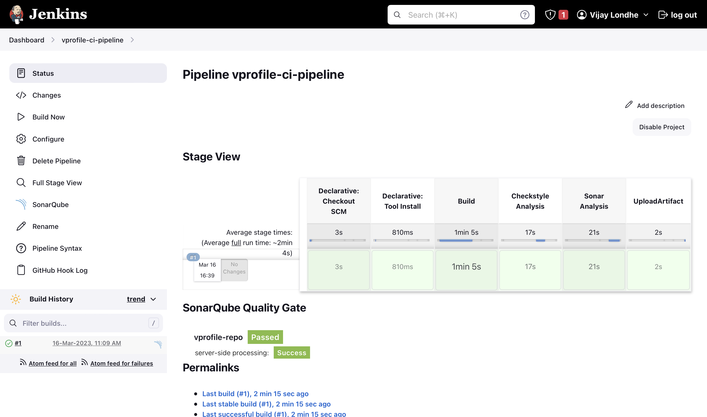
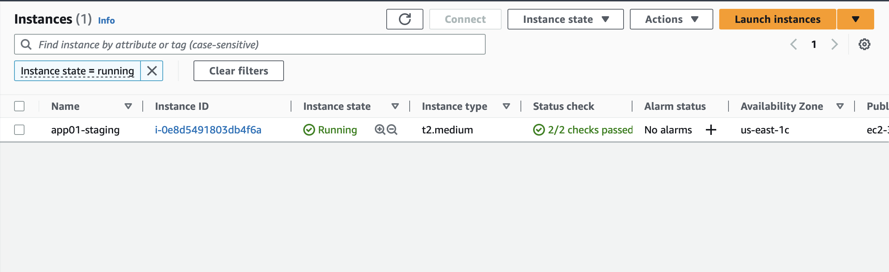
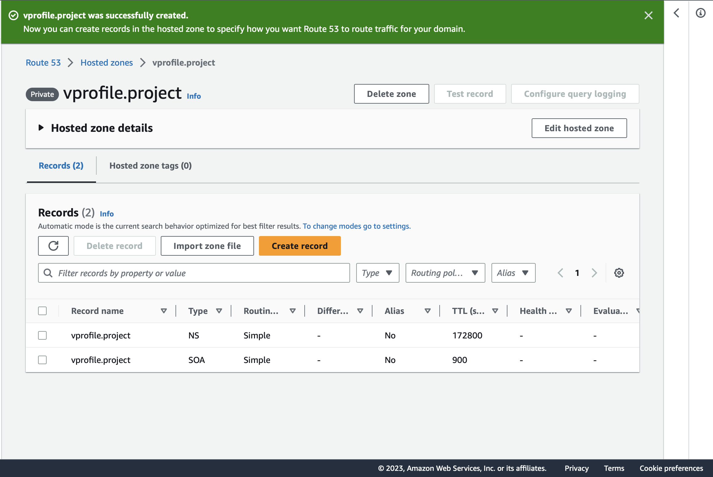
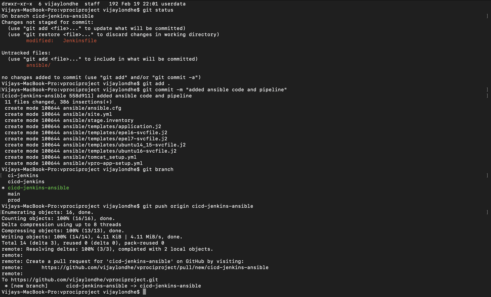
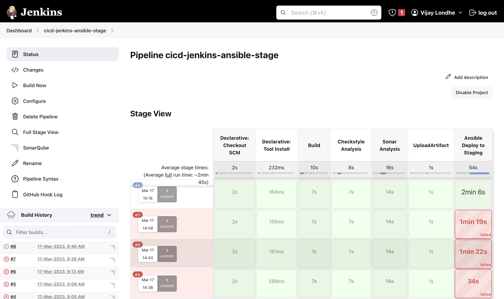
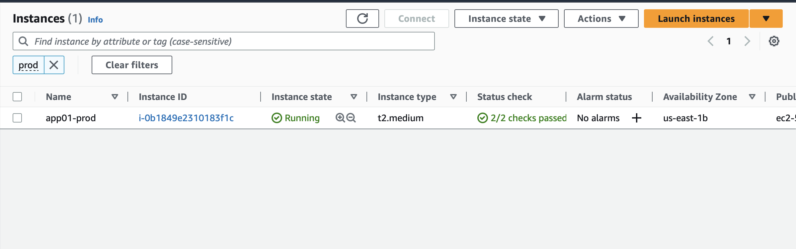
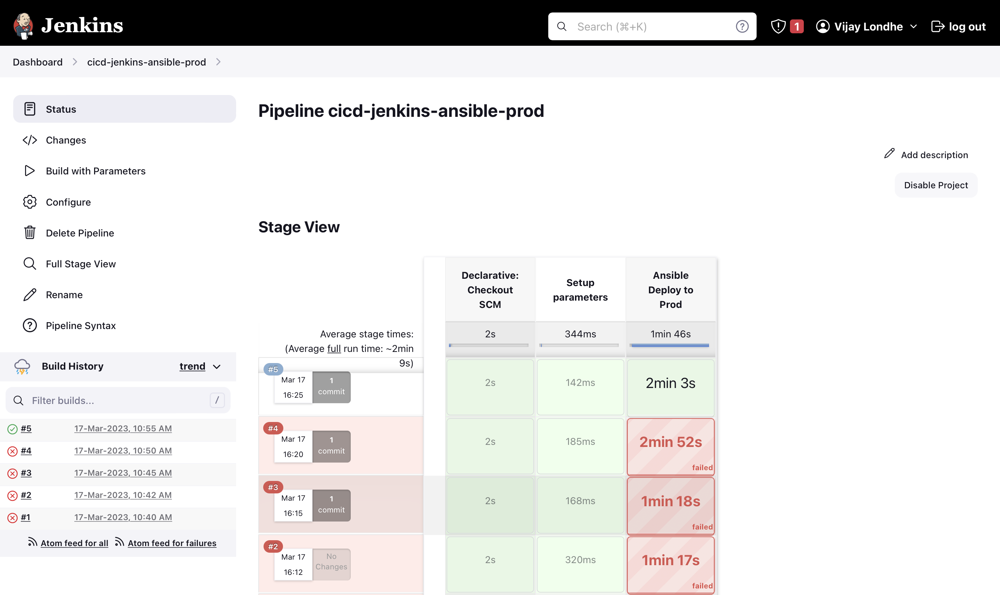

# Project-11: Continuos Deilvery and Configuration Management with Jenkins & Ansible 

### Objective:

- Continuos Integration: Build, test and deploy the artifact to nexus repository 
- Continuos Delivery: Using ansible download the artifact from the nexus repository and deploy it to the tomcat server in staging and production environment.

### Tools & Services Used:
- Jenkins 
- Nexus Sonatype Repository
- Sonarqube 
- Maven
- Git 
- Slack
- AWS EC2
- Tomcat
- Ansible 

### Architecture:


### Flow of Execution:
 
1. Launch the new instance for app01-staging 
2. Jenkins Prerequisite
   - Install Ansible 
   - Install Ansible Plugin 
   - Create Credentials for app01-staging instance 
   - Timestamp varibale 
3. Create separate branch for the pipeline in source code (Gitrepo)
   - Copy ansible code from vprofile-project repository to our own repository
4. Create DNS record in Route53 for app01-staging
5. Create inventory file in ansible code  
6. Update the security group rules
   - Allow port 22 in App SG from Jenkins SG
   - Allow port 8081 in Nexus SG from App SG   
7. Write Jenkinsfile to run Ansible Playbook from the Jenkins 
8. Create Pipeline in Jenkins and test it 
8. Update Ansible code in prod branch
9. Launch app01-prod, dns record in route53, create inventory file
10. Create Pipeline in Jenkins and test it
11. Use git merge to promote the changes to prod branch


### Step 1: Check CI Pipeline and Webhook:

- Please refer Project-05 for CI pipeline 
- This project is continuation of Project-05
- Make Sure following pre-requisites are already configured
  - Sonar Token and Sonar Server configuration in Jenkins 
  - Credential for nexus 
  - Github token
  - Update the Github Webhook with Jenkins Public IP Address

- Below is the Pipeline output of CI-Pipeline from Project-05




### Step 2: Create EC2 Instance for Staging Environment:

- Go to the AWS Console 
- Click on EC2 service -> Launch the Instance
  - Name: app01-staging
  - AMI: Ubuntu 18.04 
  - InstanceType: t2.medium
  - Keypair: ansible-remote-key
  - Security Group: 
    - SSH Port 22 From MyIP (To login tp instance through SSH)
    - Custom Port 8080 From MyIP (To access the Apache Tomcat)
    - Custom Port 8081 From Nexus Server (To download the artifact)





#### Create Route53 Private Hosted Zone:
- Go to the Route53 Service 
- Create Private Hosted Zone 
  - Name: vprofile.project
  - Region: us-east-1
  - VPC: default-vpc



- Create `A record` by using `Private IP` of the instance (app01-staging)


#### Add Credential in Jenkins for Staging Instance and Nexus Password:

- Go to the Jenkins Console 
- Manage Jenkins -> Manage Credentials
- Create New Credentials 
  - Type: SSH login with private key
  - ID: applogin
  - Description: login to staging instance
  - User: ubuntu
  - Private Key: Copy the content from `ansible-remote-key`

- Create New Credentials 
  - Type: Secret text
  - Secret: <nexus_admin_password>
  - ID: nexuspass
  - Description nexuspass

### Step 3: Install Ansible In Jenkins:

- Login to the Jenkins Instance using SSH
- ssh -i keyname.pem ubuntu@<public_ip_of_jenkins_instance>
```
sudo -i
apt update
apt install software-properties-common
add-apt-repository --yes --update ppa:ansible/ansible
apt install ansible -y
ansible --version
```

#### Add Plugin for Ansible in Jenkins:
- Go to the Jenkins Console 
- Manage Jenkins -> Manage Plugins -> Available 
- Search for Ansible 
- Select and Install without restart 


### Step 4: Prepare Playbooks and Jenkinsfile for Staging Environment

Reference Repository: `https://github.com/vijaylondhe/vprociproject.git`

- Create new branch from the `ci-jenkins` branch
```
git checkout ci-jenkins
git checkout -b cicd-jenkins-ansible
``` 

- Create directory `ansible`
- Create directory `templates` inside the  `ansible` directory
- Add templates for `ansible.cfg` and other template files for tomcat service for ubuntu and centos distribution
- Inside `ansible` directory create the `site.yml` playbook

- vi ansible/site.yml
```
---
- import_playbook: tomcat_setup.yml
- import_playbook: vpro-app-setup.yml
```

- Create Playbook for apache tomcat setup `tomcat_setup.yml`
- vi ansible/tomcat_setup.yml
```
- name: Apache Tomcat Setup 
  hosts: appsrvgrp
  become: yes
  vars:
    tomcat_url: https://archive.apache.org/dist/tomcat/tomcat-8/v8.5.37/bin/apache-tomcat-8.5.37.tar.gz
  tasks:
    - name: Install JDK on CentOS6/7
      yum:
        name: java-1.8.0-openjdk.x86_64
        state: present
      when: ansible_distribution == 'CentOS'

    - name: Install JDK on Ubuntu 14/15/16/18
      apt: 
        name: openjdk-8-jdk
        state: present
        update_cache: yes
      when: ansible_distribution == 'Ubuntu'

    - name: Download the Apache Tomcat
      get_url:
        url: "{{ tomcat_url }}"
        dest: /tmp/tomcat-8.tar.gz
    
    - name: Add Tomcat Group
      group:
        name: tomcat
        state: present
      
    - name: Add Tomcat User
      user:
        name: tomcat
        group: tomcat
        shell: /bin/nologin
        home: /usr/local/tomcat8 

    - name: Create a directory /tmp/tomcat8/
      ansible.builtin.file:
        path: /tmp/tomcat8/
        state: directory
        mode: '0777'


    - name: Extract Tomcat 
      unarchive:
        src: /tmp/tomcat-8.tar.gz
        dest: /tmp/tomcat8/
        remote_src: yes
        list_files: yes
      register: unarchive_info

    - debug:
        msg: "/tmp/tomcat8/{{unarchive_info.files[0].split('/')[0]}}" 

    - name: Synchronize the /tmp/tomcat8/tomcat_cont /usr/local/tomcat8
      synchronize:
        src: "/tmp/tomcat8/{{unarchive_info.files[0].split('/')[0]}}/"
        dest: /usr/local/tomcat8
      delegate_to: "{{ inventory_hostname }}" 

    - name: Change ownership of /usr/local/tomcat8
      file: 
        path: /usr/local/tomcat8
        owner: tomcat 
        group: tomcat
        recurse: yes

    
    - name: Srtup tomcat service file in CentOS 7
      template: 
        src: templates/epel7-svcfile.j2
        dest: /etc/systemd/system/tomcat.service
        mode: "a+x"
      when: ansible_distribution == 'CentOS' and ansible_distribution_major_version == '7' 


    - name: Setup tomcat SVC file on Centos 6
      template:
         src: templates/epel6-svcfile.j2
         dest: /etc/init.d/tomcat
         mode: "a+x"
      when: ansible_distribution == 'CentOS' and ansible_distribution_major_version == '6'


    - name: Setup tomcat SVC file on ubuntu 14/15
      template:
         src: templates/ubuntu14_15-svcfile.j2
         dest: /etc/init.d/tomcat
         mode: "a+x"
      when: ansible_distribution == 'Ubuntu' and ansible_distribution_major_version < '16'


    - name: Setup tomcat SVC file on ubuntu 16 and 18
      template:
         src: templates/ubuntu16-svcfile.j2
         dest: /etc/systemd/system/tomcat.service
         mode: "a+x"
      when: ansible_distribution == 'Ubuntu' and ansible_distribution_major_version >= '16'


    - name: Reload tomcat svc config in ubuntu 14/15
      command: update-rc.d tomcat defaults 
      when: ansible_distribution == 'Ubuntu' and ansible_distribution_major_version < '16'
    

    - name: Reload tomcat svc config in Centos 6
      command: chkconfig --add tomcat
      when: ansible_distribution == 'CentOS' and ansible_distribution_major_version == '6'


    - name: just force systemd to reread configs (2.4 and above)
      systemd:
        daemon_reload: yes 
      when: ansible_distribution_major_version > '6' or ansible_distribution_major_version > '15'


    - name: Start & Enable Tomcat 8
      service:
        name: tomcat
        state: started
        enabled: yes
```


- Create Playbook for application setup setup `vpro-app-setup.yml`
- In this playbook, we will write the steps for deployment of war file from the nexus repository to the staging server.

- vi ansible/vpro-app-setup.yml
```
- name: Setup Tomcat and Deploy Artifact
  hosts: appsrvgrp
  become: yes 
  vars:
    timestamp: "{{ansible_date_time.date}}_{{ansible_date_time.hour}}_{{ansible_date_time.minute}}"
  tasks:
    - name: Download latest VProfile.war from nexus
      get_url:
        url: "http://{{USER}}:{{PASS}}@{{nexusip}}:8081/repository/{{reponame}}/{{groupid}}/{{artifactid}}/{{build}}/{{vprofile_version}}" 
        dest: "/tmp/vproapp-{{vprofile_version}}"
      register: wardeploy
      tags:
       - deploy


    - stat: 
        path: /usr/local/tomcat8/webapps/ROOT
      register: artifact_stat
      tags:
       - deploy

    - name: Stop tomcat svc
      service:
        name: tomcat
        state: stopped
      tags:
       - deploy


    - name: Try Backup and Deploy
      block:
      - name: Archive ROOT dir with timestamp
        archive:
          path: /usr/local/tomcat8/webapps/ROOT
          dest: "/opt/ROOT_{{timestamp}}.tgz"
        when: artifact_stat.stat.exists
        register: archive_info
        tags:
         - deploy

      - name: copy ROOT dir with old_ROOT name
        shell: cp -r ROOT old_ROOT
        args:
          chdir: /usr/local/tomcat8/webapps/

      - name: Delete current artifact
        file:
          path: "{{item}}"
          state: absent
        when: archive_info.changed
        loop:
         - /usr/local/tomcat8/webapps/ROOT
         - /usr/local/tomcat8/webapps/ROOT.war
        tags:
         - deploy

      - name: Try deploy artifact else restore from previos old_ROOT
        block:
         - name: Deploy vprofile artifact
           copy:
             src: "/tmp/vproapp-{{vprofile_version}}"
             dest: /usr/local/tomcat8/webapps/ROOT.war
             remote_src: yes
           register: deploy_info
           tags:
            - deploy
        rescue:
          - shell: cp -r old_ROOT ROOT
            args:
              chdir: /usr/local/tomcat8/webapps/

      rescue:
       - name: Start tomcat svc
         service:
          name: tomcat
          state: started


    - name: Start tomcat svc
      service:
        name: tomcat
        state: started
      when: deploy_info.changed
      tags:
       - deploy

    - name: Wait until ROOT.war is extracted to ROOT directory
      wait_for:
        path: /usr/local/tomcat8/webapps/ROOT
      tags:
       - deploy

#    - name: Deploy web configuration file
#      template:
#        src: templates/application.j2
#        dest: /usr/local/tomcat8/webapps/ROOT/WEB-INF/classes/application.properties
#        force: yes
#      notify:
#       - Restart Tomcat
#      tags:
#       - deploy

  handlers:
   - name: Restart Tomcat
     service:
      name: tomcat
      state: restarted
```

- Create Ansible configuration file `ansible.cfg`
- vi ansible/ansible.cfg
```
[defaults]
host_key_checking = False 
timeout = 30 
```

- Create Inventory file `stage.inventory` for the Staging server 
- vi stage.inventory
```
[appsrvgrp]
3.95.175.212
```


- Prepare Jenkinsfile for the staging environment 
- vi Jenkinsfile
```
def COLOR_MAP = [
    'SUCCESS': 'good',
    'FAILURE': 'danger',
]
pipeline {
    agent any 
    tools {
        maven "MAVEN3"
        jdk "OracleJDK8"
    }
    environment {
        SNAP_REPO = 'vprofile-snapshot'
        NEXUS_USER = 'admin'
        NEXUS_PASS = 'admin123'
        RELEASE_REPO = 'vprofile-release'
        CENTRAL_REPO = 'vpro-maven-central'
        NEXUSIP = '172.31.28.209'
        NEXUSPORT = '8081'
        NEXUS_GRP_REPO = 'vpro-maven-group'
        NEXUS_LOGIN = 'nexuslogin'
        SONARSERVER = 'sonarserver'
        SONARSCANNER = 'sonarscanner'
        NEXUSPASS = credentials('nexuspass')
    }
    stages {
        stage('Build') {
            steps {
                sh 'mvn -s settings.xml -DskipTests install'
            }
        }
        stage('Checkstyle Analysis'){
            steps {
                sh 'mvn -s settings.xml checkstyle:checkstyle'
            }
        }
        stage('Sonar Analysis'){
            environment {
                scannerHome = tool "${SONARSCANNER}"
            }
            steps {
                withSonarQubeEnv("${SONARSERVER}"){
                    sh '''${scannerHome}/bin/sonar-scanner -Dsonar.projectKey=vprofile \
                    -Dsonar.projectName=vprofile-repo \
                    -Dsonar.projectVersion=1.0 \
                    -Dsonar.sources=src/ \
                    -Dsonar.java.binaries=target/test-classes/com/visualpathit/account/controllerTest/ \
                    -Dsonar.junit.reportsPath=target/surefire-reports/ \
                    -Dsonar.jacoco.reportsPath=target/jacoco.exec \
                    -Dsonar.java.checkstyle.reportPaths=target/checkstyle-result.xml'''
                }
            }
        }
        stage('Quality Gate'){
            steps {
                timeout(time: 10, unit: 'MINUTES'){
                    waitForQualityGate abortPipeline:true
                }
            }
        }
        stage('UploadArtifact'){
            steps {
                    nexusArtifactUploader(
                    nexusVersion: 'nexus3',
                    protocol: 'http',
                    nexusUrl: "${NEXUSIP}:${NEXUSPORT}",
                    groupId: 'QA',
                    //version: "${env.BUILD_ID}-${env.BUILD_TIMESTAMP}",
                    version: "${env.BUILD_ID}",
                    repository: "${RELEASE_REPO}",
                    credentialsId: "${NEXUS_LOGIN}",
                    artifacts: [
                        [artifactId: 'vproapp',
                        classifier: '',
                        file: 'target/vprofile-v2.war',
                        type: 'war']
                    ]
                )
            }
        }

        stage('Ansible Deploy to Staging'){
            steps {
                ansiblePlaybook([
                inventory       : 'ansible/stage.inventory',
                playbook        : 'ansible/site.yml',
                installation    : 'ansible',
                colorized       : true,
                credentialsId   : 'applogin',
                disableHostKeyChecking : true,
                extraVars  : [
                    USER: "admin",
                    PASS: "${NEXUSPASS}",
                    nexusip: "13.235.80.88",
                    reponame: "vprofile-release",
                    groupid: "QA",
                    time: "${env.BUILD_TIMESTAMP}",
                    build: "${env.BUILD_ID}",
                    artifactid: "vproapp",
                    vprofile_version: "vproapp-${env.BUILD_ID}.war"
                ] 
                ])
            }
        }
    }
}
```


- Push the code to Github
  - git add . 
  - git commit -m "added ansible code and pipeline"
  - git push origin cicd-jenkins-ansible




### Step 5: Configure Pipeline in Jenkins for Staging:

- Go to the Jenkins Console 
- Create New Pipeline
  - Name: cicd-jenkins-ansible-stage
  - Build Trigger: GitSCM pollong
  - Pipeline from: SCM
   - Git
   - URL: SSH url of vprofileci project 
   - Credentials: githublogin
   - Branch: */cicd-jenkins-ansible

- Click on Build 
- Pipeline will started the execution



### Step 6: Create EC2 Instance for Prouction Environment: 

- Go to the AWS Console 
- Click on EC2 service -> Launch the Instance
  - Name: app01-prod
  - AMI: Ubuntu 18.04 
  - InstanceType: t2.medium
  - Keypair: ansible-remote-key-prod
  - Security Group: 
    - SSH Port 22 From MyIP (To login tp instance through SSH)
    - Custom Port 8080 From MyIP (To access the Apache Tomcat)
    - Custom Port 8081 From Nexus Server (To download the artifact)





#### Create A Record in Route53:

- Create `A record` by using `Private IP` of the instance (app01-prod)


#### Add Credential in Jenkins for Staging Instance and Nexus Password:

- Go to the Jenkins Console 
- Manage Jenkins -> Manage Credentials
- Create New Credentials 
  - Type: SSH login with private key
  - ID: applogin1
  - Description: login to staging instance
  - User: ubuntu
  - Private Key: Copy the content from `ansible-remote-key-prod`

### Step 7: Prepare Playbooks and Jenkinsfile for Production Environment

- Create new branch from the `ci-jenkins-ansible` branch
```
git checkout ci-jenkins
git checkout -b cicd-jenkins-ansible-prod
``` 

- Edit the `stage.inventory` file and update the IP Address of production instance
- vi stage.inventory
```
[appsrvgrp]
54.165.31.118
```

- Edit the Jenkins file remove the stages (build/sonarqube/checkstyle/nexus upload) which are not required
- vi Jenkinsfile
```
def COLOR_MAP = [
    'SUCCESS': 'good',
    'FAILURE': 'danger',
]
pipeline {
    agent any 
    environment {
        NEXUSPASS = credentials('nexuspass')
    }
    stages {
        stage('Setup parameters') {
            steps {
                script { 
                    properties([
                        parameters([
                            string(
                                defaultValue: '', 
                                name: 'BUILD', 
                            )
                        ])
                    ])
                }
            }
		}
        stage('Ansible Deploy to Prod'){
            steps {
                ansiblePlaybook([
                inventory       : 'ansible/stage.inventory',
                playbook        : 'ansible/site.yml',
                installation    : 'ansible',
                colorized       : true,
                credentialsId   : 'applogin',
                disableHostKeyChecking : true,
                extraVars  : [
                    USER: "admin",
                    PASS: "${NEXUSPASS}",
                    nexusip: "13.235.80.88",
                    reponame: "vprofile-release",
                    groupid: "QA",
                    time: "${env.BUILD_TIMESTAMP}",
                    build: "${env.BUILD}",
                    artifactid: "vproapp",
                    vprofile_version: "vproapp-${env.BUILD}.war"
                ] 
                ])
            }
        }
    }
}
```

- Push the code to Github
  - git add . 
  - git commit -m "added ansible code and pipeline for prod"
  - git push origin cicd-jenkins-ansible-prod


### Step 8: Create Jenkins Pipeline for Prod:

- Go to the Jenkins Console 
- Create New Pipeline
  - Name: cicd-jenkins-ansible-prod
  - Build Trigger: GitSCM pollong
  - Pipeline from: SCM
   - Git
   - URL: SSH url of vprofileci project 
   - Credentials: githublogin
   - Branch: */cicd-jenkins-ansible-prod

- Click on Build with Parameter
- Enter the last successful build number of staging pipeline
- Pipeline will started the execution

 

