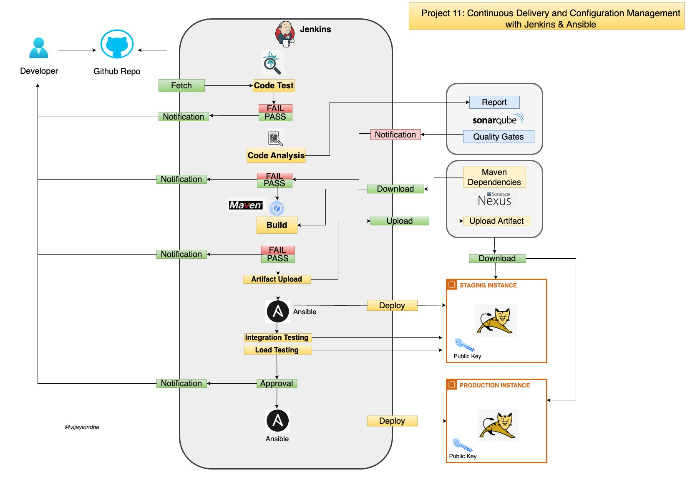

# Project-11: Continuos Deilvery and Configuration Management with Jenkins & Ansible 

### Objective:

- Continuos Integration: Build, test and deploy the artifact to nexus repository 
- Continuos Delivery: Using ansible download the artifact from the nexus repository and deploy it to the tomcat server in staging and production environment.

### Tools & Services Used:
- Jenkins 
- Nexus Sonatype Repository
- Sonarqube 
- Maven
- Git 
- Slack
- AWS EC2
- Tomcat
- Ansible 

### Architecture:

