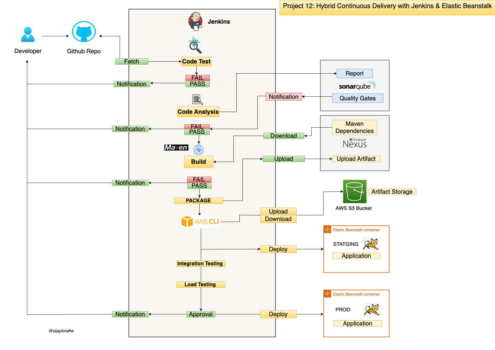
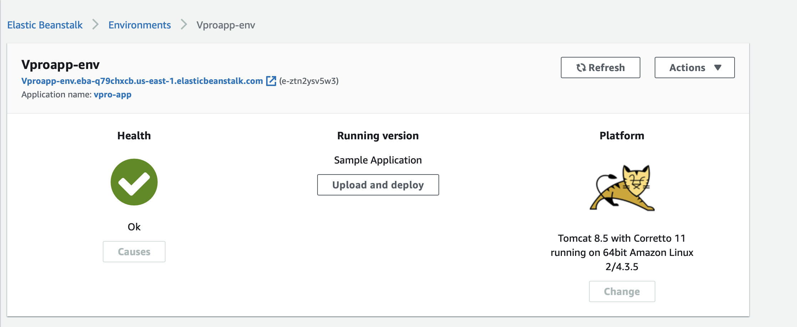
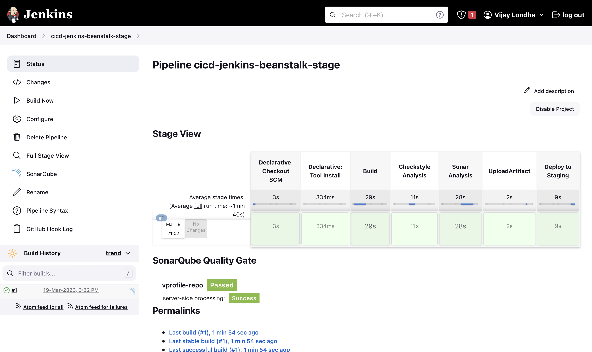
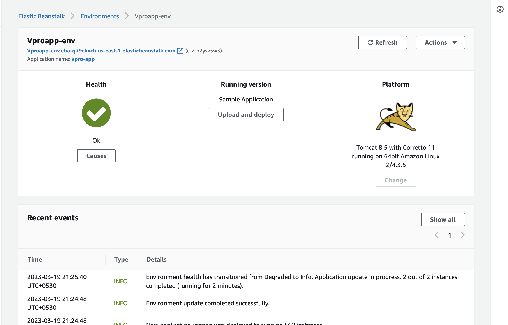
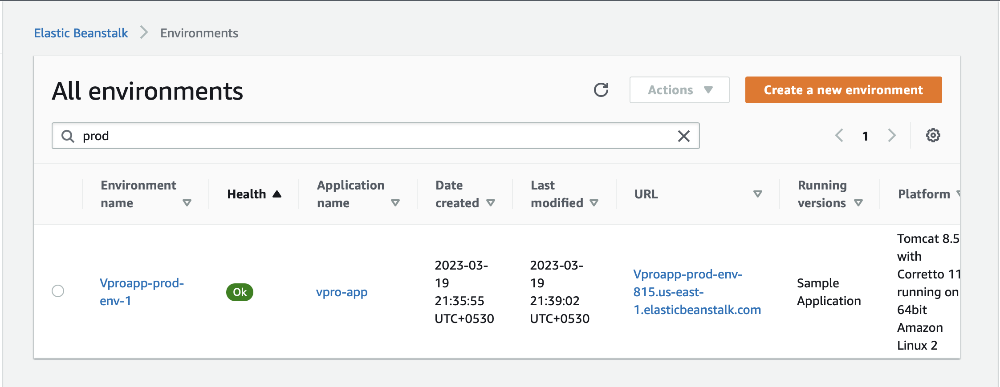
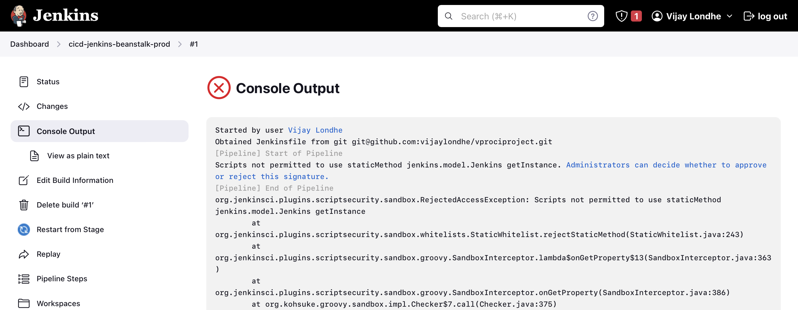
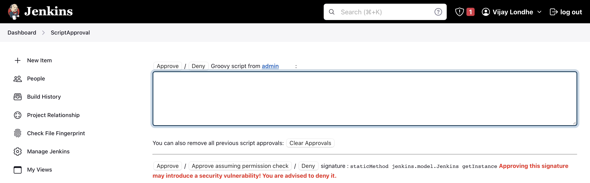
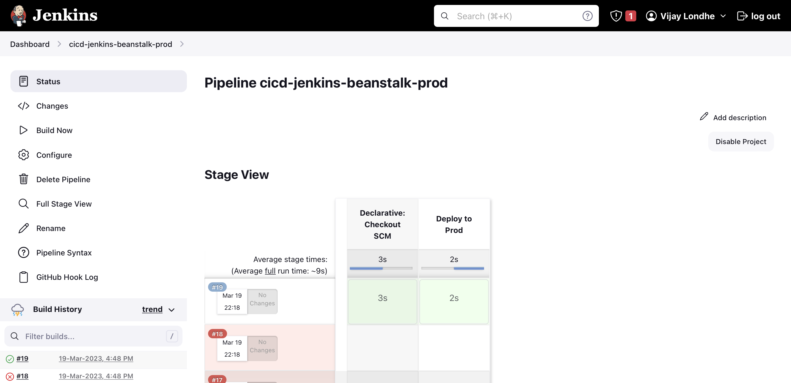
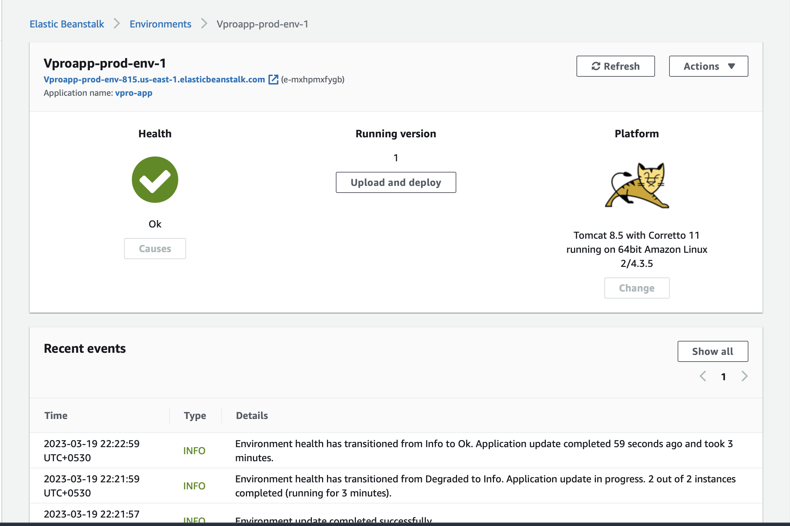

# Project-12: Hybrid Continuous Deilvery with Jenkins & AWS Elastic Beanstalk 

### Objective:

In this project we will use Jenkins as continuous integration tool to build the artifact from the java project and upload the artifact to the S3 bucket then using that artifact deploy it to the Elastic Beanstalk application environment.

### Tools & Services Used:
- Jenkins 
- Nexus Sonatype Repository
- Sonarqube 
- Maven
- Git 
- Slack
- AWS S3
- AWS Elastic Beanstalk
- AWS CLI

### Architecture:



### Flow of Execution:

1. Validate the CI Pipeline from previous project (Project-05)
2. Install AWS CLI in Jenkins server 
3. Create new branch for the project `cicd-jenkins-eb-stage`
4. AWS Services
   - Create S3 bucket
   - IAM user with access keys and beanstalk and s3 policy 
   - Create beanstalk application with the name vproapp
5. Create Jenkinsfile in git repo and test the pipeline 
6. Jenkinsfile for prod environment
   - Create new beanstalk environment for prod 
   - Create new branch for prod `cicd-jenkins-eb-prod`
   - Jenkinsfile, create new pipeline for the prod 


### Step 1: Check CI Pipeline and Webhook:

- Please refer Project-05 for CI pipeline 
- This project is continuation of Project-05
- Make Sure following pre-requisites are already configured
  - Sonar Token and Sonar Server configuration in Jenkins 
  - Credential for nexus 
  - Github token
  - Update the Github Webhook with Jenkins Public IP Address

- Below is the Pipeline output of CI-Pipeline from Project-05


### Step 2: Create IAM User, S3 Bucket & Elastic Beanstalk Application: 

#### Create IAM User with required access
  - Log in to AWS console 
  - Go to the IAM Service 
```
Username: cicd-eb
Set Permissions: Attach policies directly
- AmazonS3FullAccess
- AdministratorAccess-AWSElasticBeanstalk
```
- Click on user -> Security Credentials -> Access Keys (Click on Create Access key)


#### Create Credentials in Jenkins for IAM User

- Go to the Jenkins console 
- Install Jenkins Plugin : CloudBees AWS Credentials
- Click on Manage Jenkins -> Manage Credentials -> Add Credentials

```
Kind: AWS Credentials
ID: awsebcreds
Description: awsebcreds
Provide AccessKeyID
Provide Secret Access Key
```

#### Create S3 bucket to store the artifact

- Go to the S3 service
- Bukcet Name: vproapp-cicd-eb-815
- Create Bucket 


#### Create Elastic Beanstalk Application

- Go to the Elastic Beanstalk service
- Click on Create Application 

```
Name: vpro-app
Platform: Tomcat
Click on Custom configuration
Capacity:
- Load Balanced
  - Min: 2
  - Max: 4
InstanceType: t2.medium
- Rolling updates and deployments
  - Policy: Rolling
  - 50 %
```

- After creation of environment make sure to change the health check path of load balancer to `/login`




### Step 3: Create Jenkins Pipeline for Staging Environment:

- Go to `vprociproject` repository
- Reference: `https://github.com/vijaylondhe/vprociproject.git`
- Create new branch `cicd-jenkins-eb-stage`
```
git checkout ci-jenkins
git checkout -b cicd-jenkins-eb-stage
```

- Edit the Jenkinsfile and add environment variables and the stage for deploy to elastic beanstack.

- In this stage we will add some environment variables and use the AWS CLI commands (create-application-version & update-application-version) to update the beanstalk application environment using the artifact stored at S3 bucket.

- Add the below environment variables in Jenkinsfile 
```
ARTIFACT_NAME = "vprofile-v${BUILD_ID}.war"
AWS_S3_BUCKET = 'vproapp-cicd-eb-815'
AWS_EB_APP_NAME = 'vpro-app'
AWS_EB_ENVIRONMENT = 'Vproapp-env'
AWS_EB_APP_VERSION = "${BUILD_ID}"
```

- Add below stage for deploy to staging environment

```
stage('Deploy to Staging'){
    steps {
        withAWS(credentials: 'awsebcreds', region: 'us-east-1'){
            sh 'aws s3 cp ./target/vprofile-v2.war s3://$AWS_S3_BUCKET/$ARTIFACT_NAME'
            sh 'aws elasticbeanstalk create-application-version --application-name $AWS_EB_APP_NAME --version-label $AWS_EB_APP_VERSION --source-bundle S3Bucket=$AWS_S3_BUCKET,S3Key=$ARTIFACT_NAME'
            sh 'aws elasticbeanstalk update-environment --application-name $AWS_EB_APP_NAME --environment-name $AWS_EB_ENVIRONMENT --version-label $AWS_EB_APP_VERSION' 
        }
    }
}
```

- Commit and Push to the git repository
- git add . 
- git commit -m "added stage for eb deploy to stage"
- git push origin cicd-jenkins-eb-stage


#### Install AWS CLI Package on Jenkins instance
- Log in to the Jenkins instance using SSH
- Install AWS CLI package 
- sudo apt install awscli -y 

#### Create Pipeline 
- Go to the Jenkins console 
- Create New Pipeline 

```
Name: cicd-jenkins-beanstalk-stage
Kind: pipeline
Pipeline from SCM
SSH GitHub URL
githublogin credentials
Branch: */cicd-jenkins-eb-stage
```
- Click on Build Now 



- Go to the Elastic beanstalk service 
- Check the Environment `Vproapp-env`




### Step 4: Create Prod Environment in Elastic Beanstalk

- Go to the Elastic beastalk service 
- Click on `Create New Environment`
- Select the `web server enviroment`
```
Envirorment Name: Vproapp-prod-env-1
Domain Name: Vproapp-prod-env-815
Platform: Tomcat 
Application Code: Sample Application
Click on Custom configuration
Capacity:
- Load Balanced
  - Min: 2
  - Max: 4
InstanceType: t2.medium
- Rolling updates and deployments
  - Policy: Rolling
  - 50 %
```

- After creation of environment make sure to change the health check path of load balancer to `/login`




### Step 5: Create Jenkins Pipeline for Production Environment:

#### Create New Branch for prod

- Go to `vprociproject` repository
- Create new branch `cicd-jenkins-eb-prod`
```
git checkout -b cicd-jenkins-eb-prod
```

- In Jenkinsfile get the last successful build number from the staging pipeline and store in it variable.

- Edit the Jenkinsfile and add environment variables and the stage for deploy to elastic beanstack prod environment.

- vi Jenkinsfile
```
def buildNumber = Jenkins.instance.getItem('cicd-jenkins-bean-stage').lastSuccessfulBuild.number
pipeline {
    agent any 
    environment {
        //environment for prod eb env 
        ARTIFACT_NAME = "vprofile-v${BUILD_ID}.war"
        AWS_S3_BUCKET = 'vproapp-cicd-eb-815'
        AWS_EB_APP_NAME = 'vpro-app'
        AWS_EB_ENVIRONMENT = 'Vproapp-prod-env-1'
        AWS_EB_APP_VERSION = "${buildNumber}"

    }
    stages {
        stage('Deploy to Prod'){
            steps {
                withAWS(credentials: 'awsebcreds', region: 'us-east-1'){
                    sh 'aws elasticbeanstalk update-environment --application-name $AWS_EB_APP_NAME --environment-name $AWS_EB_ENVIRONMENT --version-label $AWS_EB_APP_VERSION' 
                }
            }
        }
    }
}

```

- Commit and Push to the git repository
- git add . 
- git commit -m "added stage for eb deploy to prod"
- git push origin cicd-jenkins-eb-prod


#### Create Pipeline 
- Go to the Jenkins console 
- Create New Pipeline 

```
Name: cicd-jenkins-beanstalk-prod
Kind: pipeline
Pipeline from SCM
SSH GitHub URL
githublogin credentials
Branch: */cicd-jenkins-eb-prod
```
- Click on Build Now 

- See the build output, you will get an error like below 



- Click on the link `Administrators can decide whether to approve or reject this signature`




- Click on Approve

- Run the pipeline again, now our pipeline will get executed successfully.




- Go to the Elastic beanstalk service 
- Check the Environment `Vproapp-prod-env-1`


