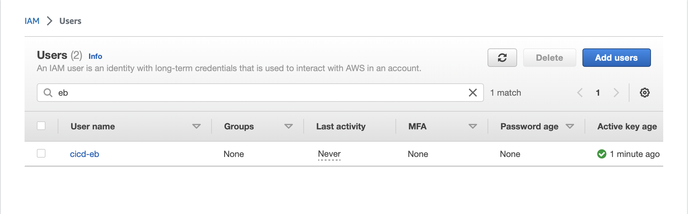
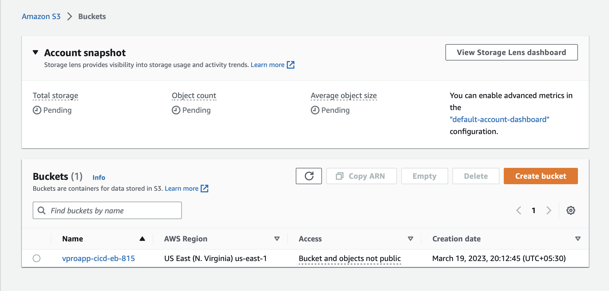

# Project-12: Hybrid Continuous Deilvery with Jenkins & AWS Elastic Beanstalk 

### Objective:

In this project we will use Jenkins as continuous integration tool to build the artifact from the java project and upload the artifact to the S3 bucket then using that artifact deploy it to the Elastic Beanstalk application environment.

### Tools & Services Used:
- Jenkins 
- Nexus Sonatype Repository
- Sonarqube 
- Maven
- Git 
- Slack
- AWS S3
- AWS Elastic Beanstalk
- AWS CLI

### Architecture:


### Flow of Execution:

1. Validate the CI Pipeline from previous project (Project-05)
2. Install AWS CLI in Jenkins server 
3. Create new branch for the project `cicd-jenkins-beanstalk`
4. AWS Services
   - Create S3 bucket
   - IAM user with access keys and beanstalk and s3 policy 
   - Create beanstalk application with the name vproapp
5. Create Jenkinsfile in git repo and test the pipeline 
6. Jenkinsfile for prod environment
   - Create new beanstalk environment for prod 
   - Create new branch for prod 
   - Jenkinsfile, create new pipeline for the prod 


### Step 1: Check CI Pipeline and Webhook:

- Please refer Project-05 for CI pipeline 
- This project is continuation of Project-05
- Make Sure following pre-requisites are already configured
  - Sonar Token and Sonar Server configuration in Jenkins 
  - Credential for nexus 
  - Github token
  - Update the Github Webhook with Jenkins Public IP Address

- Below is the Pipeline output of CI-Pipeline from Project-05


### Step 2: Create IAM User, S3 Bucket & Elastic Beanstalk Application: 

#### Create IAM User with required access
  - Log in to AWS console 
  - Go to the IAM Service 
```
Username: cicd-eb
Set Permissions: Attach policies directly
- AmazonS3FullAccess
- AdministratorAccess-AWSElasticBeanstalk
```
- Click on user -> Security Credentials -> Access Keys (Click on Create Access key)




#### Create Credentials in Jenkins for IAM User

- Go to the Jenkins console 
- Install Jenkins Plugin : CloudBees AWS Credentials
- Click on Manage Jenkins -> Manage Credentials -> Add Credentials

```
Kind: AWS Credentials
ID: awsebcreds
Description: awsebcreds
Provide AccessKeyID
Provide Secret Access Key
```

#### Create S3 bucket to store the artifact

- Go to the S3 service
- Bukcet Name: vproapp-cicd-eb-815
- Create Bucket 



#### Create Elastic Beanstalk Application

- Go to the Elastic Beanstalk service
- Click on Create Application 

```
Name: vpro-app
Platform: Tomcat
Click on Custom configuration
Capacity:
- Load Balanced
  - Min: 2
  - Max: 4
InstanceType: t2.medium
- Rolling updates and deployments
  - Policy: Rolling
  - 50 %
```

