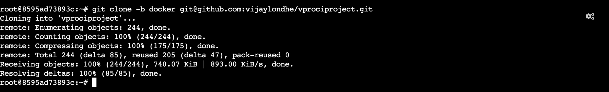

# Project-13: Use Docker to Containerize the Java Application

### Objective:
- In this project we will use the docker to containerize the complete web application stack. We will build the docker images from the base images available in the dockerhub public repository then store this images in dockerhub and later using docker compose to run the multiple containers. 


### Tools & Services Used:
- Docker
- Dockerhub
- Docker Compose

### Architecture:


### Flow of Execution:
- Find the right base images from the dockerhub.
- Write dockerfile to customize the images.
- Write docker-compose.yml file to run multi containers.
- Test it & host images on dockerhub.

### Step 1: Create DockerHub Account:
- Go to the `https://hub.docker.com`
- Sign Up with your details (username and emailid).
- Login with the new user. 
- Search the base images required for our application. 
- We need base images of nginx, tomcat, mysql, rabbitmq & memcached.


### Step 2: Setup Docker Engine:
- Login to the AWS console
- Go to the EC2 service
- Launch the new instance with Ubuntu 20.04 AMI
- Follow the official documentation of docker to install the docker engine on the ubuntu server

Reference: `https://docs.docker.com/engine/install/ubuntu/`

### Step 3: Create Repositories in Dockerhub & Setup github repo with New branch:

- Create three repositories in dockerhub
- Repository Names:
  - vprofileapp
  - vprofileapp
  - vprofiledb 


- Create new branch `docker` for our git repository
- Reference: `https://github.com/vijaylondhe/vprociproject.git`
- git checkout ci-jenkins
- git checkout -b docker 
- mkdir Docker-files


### Step 4: Create Dockerfiles:

#### Create Dockerfile for Tomcat App

- cd Docker-files
- mkdir app && cd app
- vi Dockerfile 

```
FROM tomcat:8-jre11
LABEL "Project"="Vprofile"
LABEL "Author"="Vijay"
RUN rm -rf /usr/local/tomcat/webapps/*
COPY target/vprofile-v2.war /usr/local/tomcat/webapps/ROOT.war

EXPOSE 8080
WORKDIR /usr/local/tomcat/
VOLUME /usr/local/tomcat/webapps

CMD ["catalina.sh", "run"]
```


#### Create Dockerfile for MySQL DB

- cd Docker-files
- mkdir db && cd db
- vi Dockerfile 

```
FROM mysql:5.7.25
LABEL "Project"="Vprofile"
LABEL "Author"="Vijay"
ENV MYSQL_ROOT_PASSWORD="vprodbpass"
ENV MYSQL_DATABASE="accounts"

ADD accountsdb.sql docker-entrypoint-initdb.d/db_backup.sql
```

- copy `accountsdb.sql` from `src/main/resources/` to the current directory 

#### Create Dockerfile for Nginx

- cd Docker-files
- mkdir web && cd web
- vi Dockerfile 

```
FROM nginx
LABEL "Project"="Vprofile"
LABEL "Author"="Vijay"
RUN rm -rf /etc/nginx/conf.d/default.conf
COPY nginxvproapp.conf /etc/nginx/conf.d/vproapp.conf
```

- Create the `nginxvproapp.conf` file in the same directory 
```
upstream vproapp{
  server vproapp:8080;
}
server{
listen 80;
location / {
 proxy_pass http://vproapp;
 }
}
```

- Commit the code to the github
- git add . 
- git commit -m "added Dockerfiles"
- git push origin docker


### Step 5: Create Docker Images:

- Download the source code from the git repository
- `git clone -b docker https://github.com/devopshydclub/vprofile-project.git`



- cd vprofile-project
- Build the project to create the war file 
- mvn install

- Copy the `target` directroy inside the `Docker-files/app/`
- cp -r target Docker-files/app


- Build docker image for tomcat app
  - cd Docker-files/app
  - docker build -t vijay815/vprofileapp:V1 .
  - docker images 

- Build docker image for MySQL
  - cd Docker-files/db
  - docker build -t vijay815/vprofiledb:V1 .
  - docker images

- Build docker image for Nginx
  - cd Docker-files/web
  - docker build -t vijay815/vprofileweb:V1 .
  - docker images


