# Project-14: Install Kubernetes Cluster On AWS Using kOps

### Objective:
- Install multi node kubernetes cluster on AWS Cloud using kOps.

### Prerequisites:
- Domain Name for Kubernetes DNS Records
- Create Linux Instance and Setup
  - kOps, kubectl, ssh-keys, aws-cli
- Login to AWS account and Setup
  - S3 bucket, IAM User for AWS cli, Route 53 hosted zone.

Note: In this project, we will use GoDaddy as our domain registrar, create NS records for subdomain pointing to Route 53 hosted zone NS servers.


### Architecture:

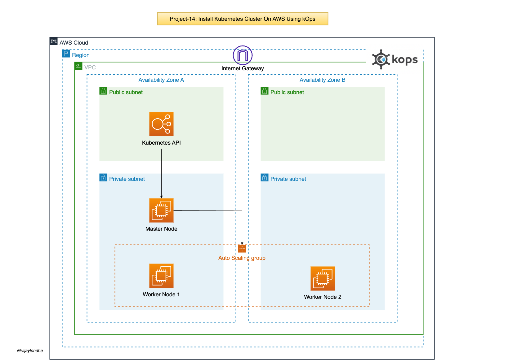


### Step 1: Setup AWS prereqisite for kOps:

- Create EC2 Instance:
  - Go to the AWS console
  - Click on EC2 service 
  - Launch New Instance
```
Instance Name: 
AMI: Ubuntu 20.04 
Instance Type: t2.medium
VPC: Default 
Security Group: Port 22 From MyIP 
Tags: Name: kops
Key Pair: kops-key 
```

- Create S3 Bucket:
  - Go to the S3 service 
  - Click on Create Bucket
  - Bucket Name: `vprofile-kops-state-815`
  - Region: `us-east-1`

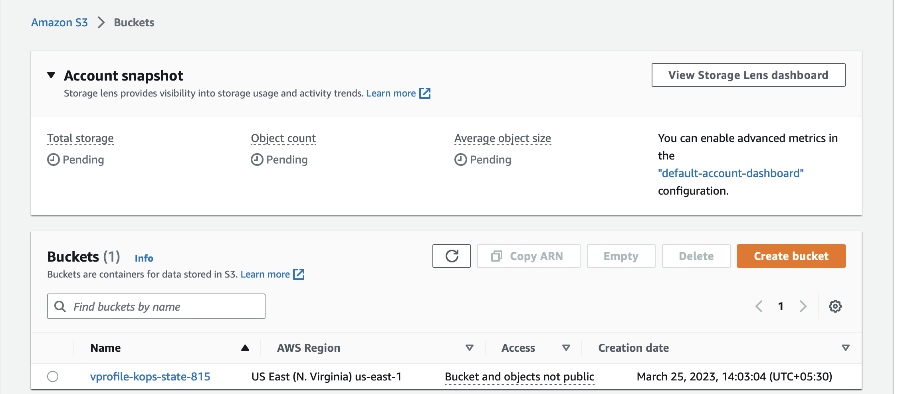

- Create IAM User: 
  - Go to the IAM service 
  - Click on Create User
  - Username: kopsadmin
  - Access Type: Programatic Access
  - Set Permissions: Attach existing policies directly
  - Policy Name: AdministratorAccess
  - Click on Create User
  - Note down Access Key ID and Secret Access Key 

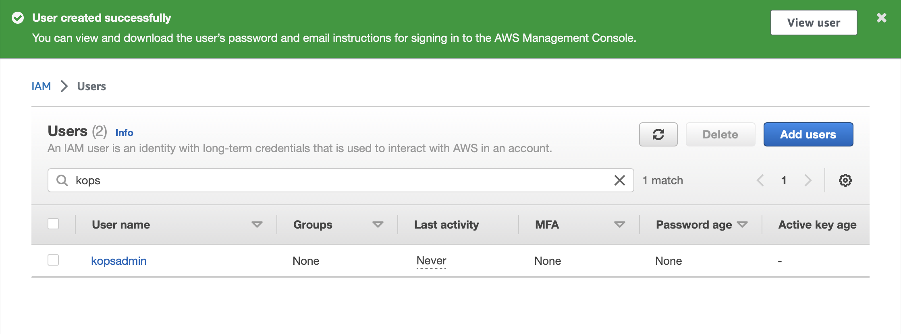

- Create Route53 hosted zone:
  - Go to Route53 service
  - Click on Create Hosted Zone 
  - Domain Name: kubevpro.cloudndevops.in
  - Select: Public Hosted Zone 
  - Check and note down the NS records 

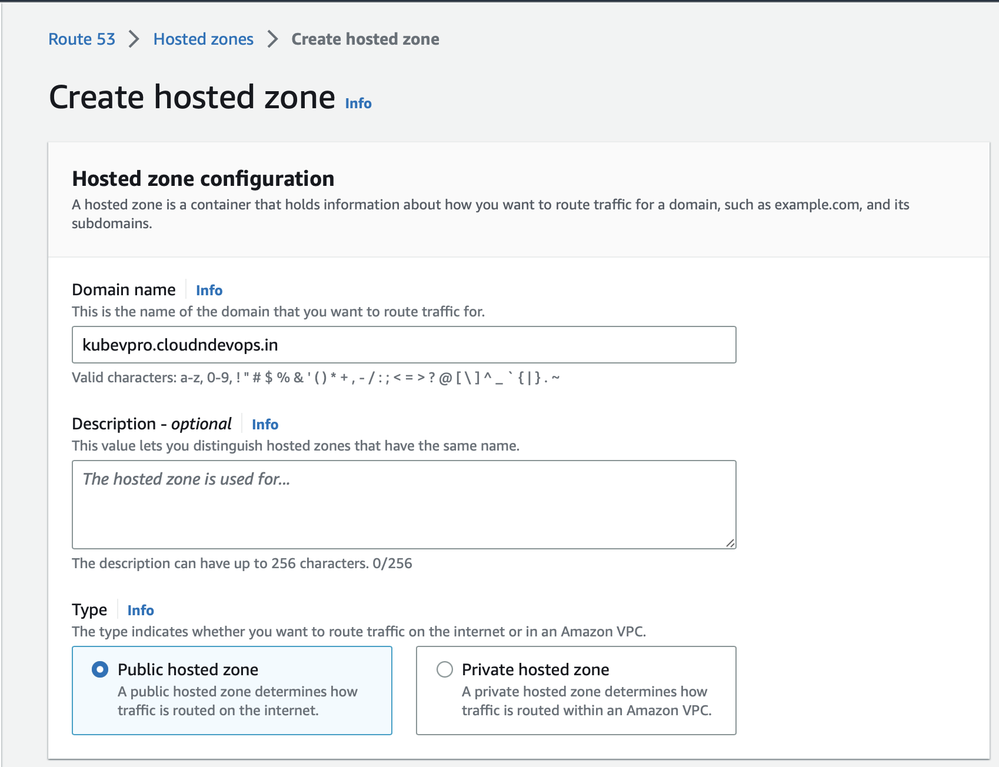


### Step 2: Add NS Records in DNS Registrar:
- Log in to GoDaddy account 
  - Create Nameserver record for our public hosted zone configured in Route53 
  - Type: Nameserver
  - Host: kubevpro
  - Points-to: Copy NS record value from the Route53 
- Create Nameserver record for NS values 


### Step 3: Install kOps on EC2 instance:
- Log in to the EC2 instance created in Step 1.
  - `ssh -i kops-key ubuntu@<public_ip_of_instance>`

- Generate the SSH keys 
  - `ssh-keygen`

- Install the AWS CLI package:
  - 'sudo apt update && sudo apt install awscli'

- Configure the AWS CLI:
  - `aws configure`
  - Provide Access Key ID
  - Provide Secret Access Key
  - Region Name: us-east-1
  - Default Output Format: json 

- Install kubectl:
```
curl -LO "https://dl.k8s.io/release/$(curl -L -s https://dl.k8s.io/release/stable.txt)/bin/linux/amd64/kubectl"

chmod +x kubectl

sudo mv kubectl /usr/local/bin/

kubectl --version
```

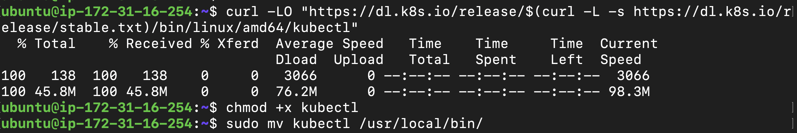

- Install kOps:

```
curl -LO https://github.com/kubernetes/kops/releases/download/$(curl -s https://api.github.com/repos/kubernetes/kops/releases/latest | grep tag_name | cut -d '"' -f 4)/kops-linux-amd64

chmod +x kops-linux-amd64

sudo mv kops-linux-amd64 /usr/local/bin/kops

nslookup -type=ns kubevpro.cloudndevops.in

```
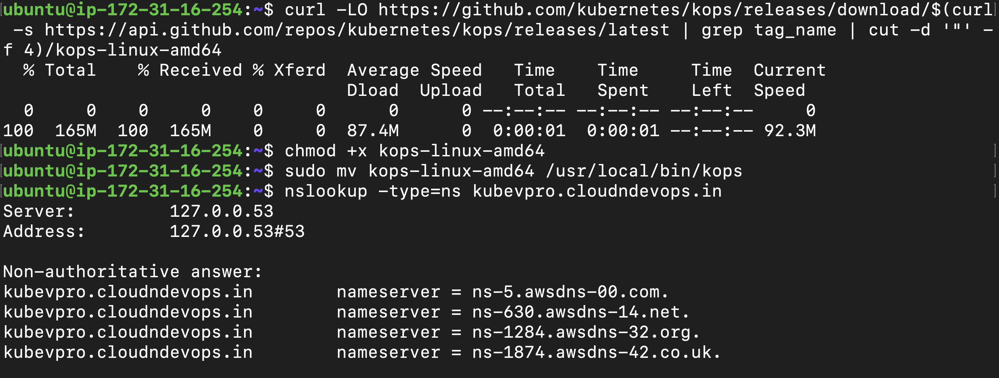


- Create the Cluster:

```
kops create cluster --name=kubevpro.cloudndevops.in \
--state=s3://vprofile-kops-state-815 --zones=us-east-1a,us-east-1b \
--node-count=2 --node-size=t3.medium --master-size=t3.medium \
--dns-zone=kubevpro.cloudndevops.in \
--node-volume-size=8 --master-volume-size=8 
```

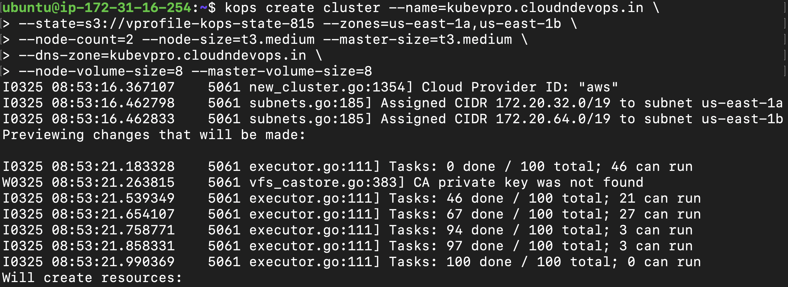


- Update the cluster using command shows in create cluster command output suggestion.

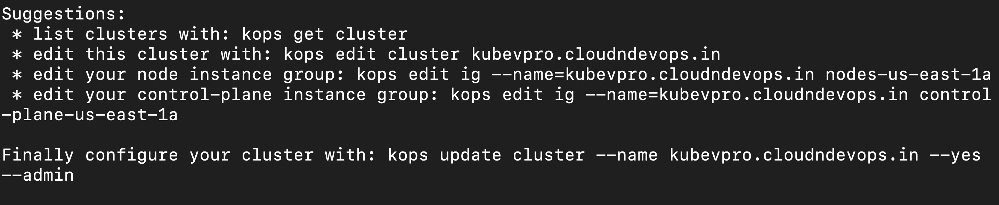


```
kops update cluster --name=kubevpro.cloudndevops.in \
--state=s3://vprofile-kops-state-815 --yes --admin 
```

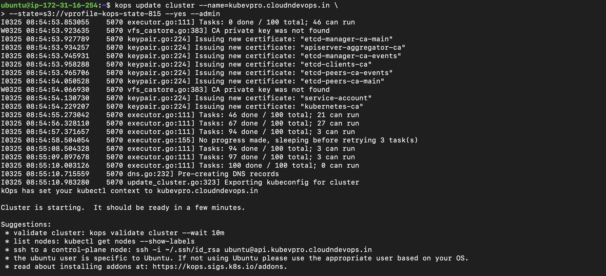


- Validate the Cluster:
```
kops validate cluster --state=s3://vprofile-kops-state-815

cat ~/.kube/config 

kubectl get nodes
```

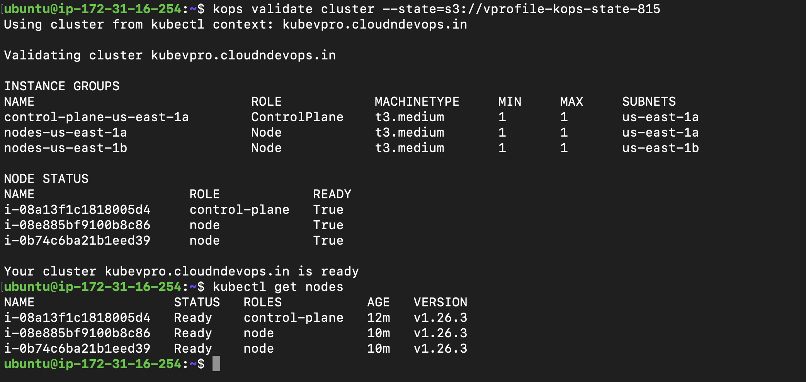


- Go to the AWS console and check the EC2 service for instance and auto scaling groups.

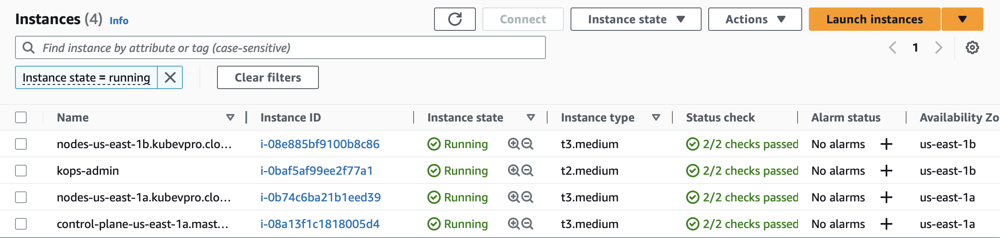