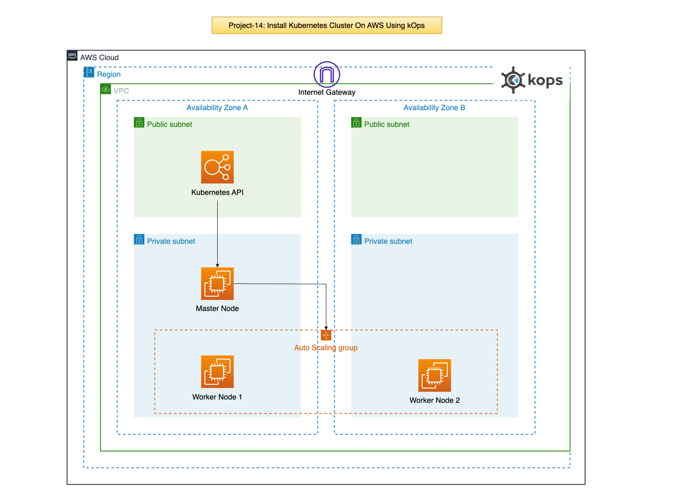

# Project-14: Install Kubernetes Cluster On AWS Using kOps

### Objective:
- Install multi node kubernetes cluster on AWS Cloud using kOps.

### Prerequisites:
- Domain Name for Kubernetes DNS Records
- Create Linux Instance and Setup
  - kOps, kubectl, ssh-keys, aws-cli
- Login to AWS account and Setup
  - S3 bucket, IAM User for AWS cli, Route 53 hosted zone.

Note: In this project, we will use GoDaddy as our domain registrar, create NS records for subdomain pointing to Route 53 hosted zone NS servers.

### Architecture:

### Step 1: Create EC2 Instance:

