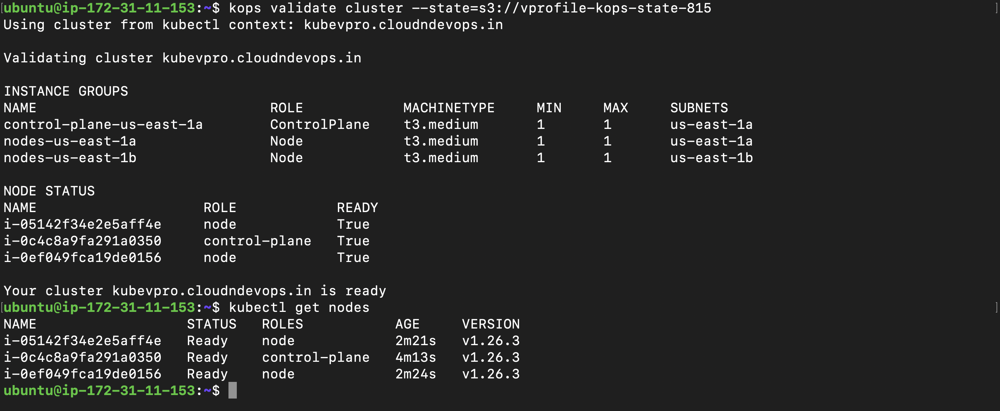
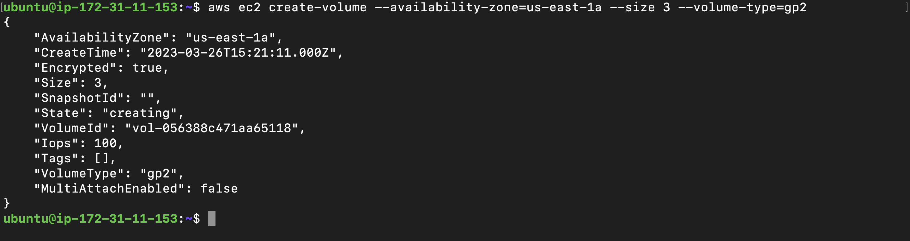
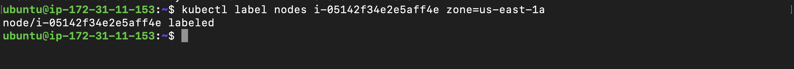
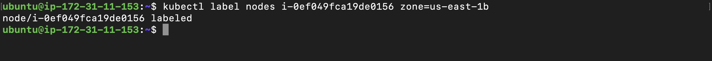
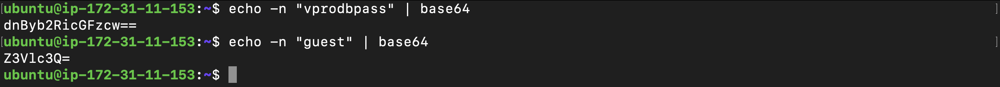
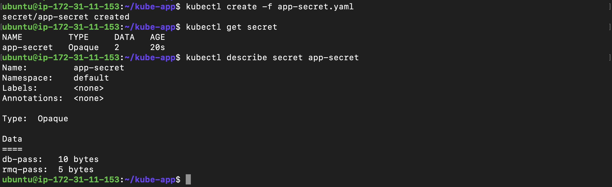
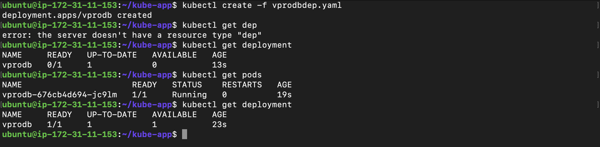
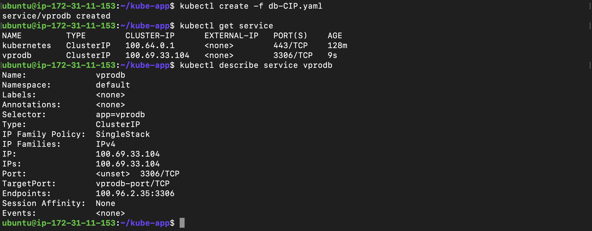

# Project-15: Deploy Java Application On Kubernetes Cluster

### Objective:
- Deploy Java based web application on the kubernetes cluster 

### Prerequisites:
- Kubernetes cluster

Note: Please refer Project-14 for the installation of kubernetes cluster on AWS using kOps.


### Flow of Execution:

- Setup Kubernetes Cluster 
- Containerize apps
- Create EBS volume for DB Pod
- LABEL nodes with zones names 
- Prepare Kubernetes Defination file for 
  - Deployment
  - Service 
  - Secret 
  - Volume 

### Step 1: Verify Kubernetes Cluster Setup:

- Login to the instance deployed for the kOps 
- kops validate cluster --state=s3://vprofile-kops-state-815
- cat ~/.kube/config 
- kubectl get nodes



### Step 2: Create EBS Volume for DB Pod:

- Use AWS CLI command to create the EBS voulme 
```
aws ec2 create-volume --availability-zone=us-east-1a --size 3 --volume-type=gp2
```




### Step 3: Set the Label for Kubernetes Nodes:

- We need to place the DB pod in the same availability zone where our EBS volume is created.

- Get the details of kubenetes nodes, find out the node which runs in the us-east-1a zone.

```
kubectl get nodes --show-labels
kubectl get nodes 
kubectl describe node <node_name> | grep us-east-1a
```

- Set the label
```
kubectl label nodes <node_name> zone=us-east-1a
```



- Find the node running in us-east-1b zone

```
kubectl get nodes --show-labels
kubectl get nodes 
kubectl describe node <node_name> | grep us-east-1b
```

- Create label for 
```
kubectl label nodes <node_name> zone=us-east-1b
```




### Step 4: Clone the source code:

- Create new repository to keep kubernetes manifest files for deployment, service and secret.

- Reference: `https://github.com/vijaylondhe/kube-app.git`

- In Project-13, we have created docker images for our application and pushed all images to dockerhub.

- In this project we will use those images to deploy to the kubernetes cluster.

- Our Java application are using application.properties file to connect with the different services like DB, Memcached, Rabbitmq etc. We need to create kubernetes service with the same name mentioned in the application.properties file for the host.

```
#JDBC Configutation for Database Connection
jdbc.driverClassName=com.mysql.jdbc.Driver
jdbc.url=jdbc:mysql://vprodb:3306/accounts?useUnicode=true&characterEncoding=UTF-8&zeroDateTimeBehavior=convertToNull
jdbc.username=root
jdbc.password=vprodbpass

#Memcached Configuration For Active and StandBy Host
#For Active Host
memcached.active.host=vprocache01
memcached.active.port=11211
#For StandBy Host
memcached.standBy.host=vprocache02
memcached.standBy.port=11211

#RabbitMq Configuration
rabbitmq.address=vpromq01
rabbitmq.port=15672
rabbitmq.username=guest
rabbitmq.password=guest

#Elasticesearch Configuration
elasticsearch.host =vprosearch01
elasticsearch.port =9300
elasticsearch.cluster=vprofile
elasticsearch.node=vprofilenode
```

### Step 5: Create Kubernetes Secret for Passwords:

- In application.properties file we have password for mysql database and rabbitmq. We need to encode this passwords using base64.




- Create Kubernets Secret Manifest file 

- vi app-secret.yaml

```
apiVersion: v1
kind: Secret
metadata: 
  name: app-secret
type: Opaque
data:
  db-pass: 
  rmq-pass: 
```

- Commit the code and push to the remote repository
- git add .
- git commit -m "added secret"
- git push origin main

- On the kOps instance clone the source code and execute the secret manifest
- git clone https://github.com/vijaylondhe/kube-app.git




### Step 6: Create DB Deployment and Service:

- Go to the AWS console -> EC2 Service -> Volumes
- Search the EBS created in Step 2
- Create Tag for EBS volume 
```
KubernetesCluster = kubevpro.cloudndevops.in
```

- Create file for DB Deployment
- vi vprodbdep.yaml
```
apiVersion: apps/v1
kind: Deployment
metadata:
  name: vprodb
  labels:
    app: vprodb
spec:
  selector:
    matchLabels:
      app: vprodb
  replicas: 1
  template:
    metadata:
      labels:
        app: vprodb
    spec:
      containers:
        - name: vprodb
          image: vprofile/vprofiledb:V1
          args:
            - "--ignore-db-dir=lost+found"
          volumeMounts:
            - mountPath: /var/lib/mysql
              name: vpro-db-data
          ports:
            - name: vprodb-port
              containerPort: 3306
          env:
            - name: MYSQL_ROOT_PASSWORD
              valueFrom:
                secretKeyRef:
                  name: app-secret
                  key: db-pass
      nodeSelector:
        zone: us-east-1a
      volumes:
        - name: vpro-db-data
          awsElasticBlockStore:
            volumeID: vol-056388c471aa65118
            fsType: ext4
```

- kubectl create -f vprodbdep.yaml
- kubectl get deployment
- kubectl get pods 



- Create Service for DB Pod: 
- vi db-CIP.yaml
```
apiVersion: v1 
kind: Service 
metadata:
  name: vprodb
spec:
  ports:
    - port: 3306 
      targetPort: vprodb-port
      protocol: TCP
  selector:
    app: vprodb
```

- kubectl create -f db-CIP.yaml
- kubectl get service 


