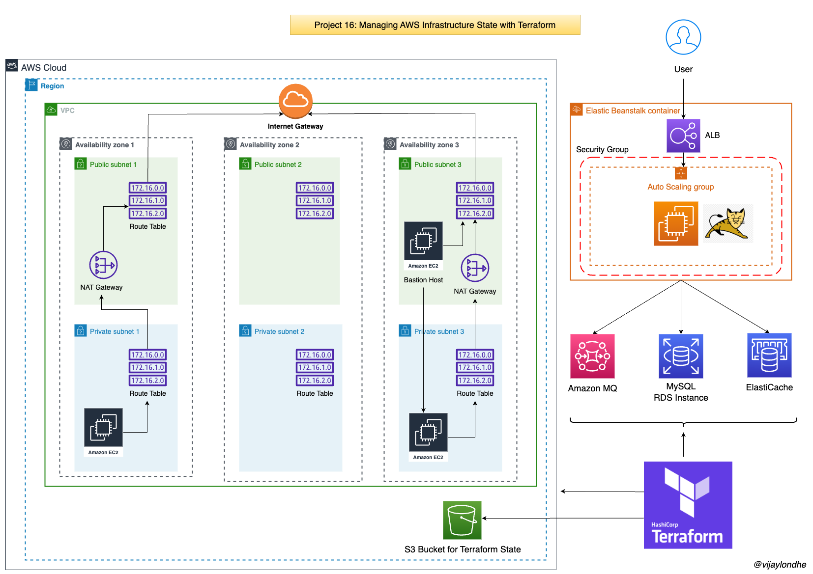

# Project-16: Managing AWS Infrastructure State with Terraform

### Objective:
Deploy and manage the state of the AWS Infrastructre using terraform.

### Prerequisites:
- Install Terraform and AWS CLI on the local machine 

### Architecture:



### Flow of Execution:
- Setup Terarform with Backend
- Setup VPC and it's component
- Provision Beanstalk Environment
- Provision Backend Services 
  - RDS
  - ElastiCache
  - Amazon MQ
- Setup Security Group, Key Pair, Bastion Host etc.


### Step 1: Create IAM User and S3 Bucket:
- Create IAM User: 
  - Go to the AWS Console -> IAM Service 
  - Create New User -> terradmin
  - Permissions -> AdministratorAccess
  - Generate the Access Keys
  - Login to local machine and execute `aws configure` and enter access key, secret acess key, region and output format.


- Create S3 Bucket to Store the State file:
  - Go to S3 Service
  - Create Bucket -> terraform-state-bucket-815
  - Region -> us-east-1
  - Block all public access

### Step 2: Create Git Repository for Terraform Code:
- Go to the GitHub
- Create New Repository
- Repository Name -> terraform-aws-vprofile
- Login to local machine 

```
mkdir terraform-aws-vprofile
cd terraform-aws-vprofile
git init 
echo "terraform project" >> README.md 
git add . 
git commit -m "first commit"
git branch -M main
git remote add origin https://github.com/vijaylondhe/terraform-aws-vprofile.git
git push -u origin main

```

### Step 3: Create Terraform file for Backend Configuration:

- vi backend.tf
```
terraform {
  backend "s3" {
    bucket = "terraform-state-bucket-815"
    key    = "terraform/backend"
    region = "us-east-1"
  }
}
```

### Step 4: Create Terraform file for Provider:

- vi provider.tf
```
provider "aws" {
  region = var.REGION
}
```

### Step 5: Create Terraform file for Variables:

- vi vars.tf
```
variable "REGION" {
  default = "us-east-1"
}

variable "AMIS" {
  type = map(any)
  default = {
    us-east-1 = "ami-006e00d6ac75d2ebb"
    us-east-2 = "ami-06397100adf427136"
  }
}

variable "PRIV_KEY_PATH" {
  default = "vprofilekey"
}

variable "PUB_KEY_PATH" {
  default = "vprofilekey.pub"
}

variable "USERNAME" {
  default = "ubuntu"
}

variable "MY_IP" {
  default = "0.0.0.0/0"
}

variable "rmquser" {
  default = "rabbit"
}

variable "rmqpass" {
  default = "Gr33n@pple123456"
}

variable "dbname" {
  default = "accounts"
}
variable "dbpass" {
  default = "admin123"
}
variable "dbuser" {
  default = "admin"
}

variable "instance_count" {
  default = "1"
}

variable "VPC_NAME" {
  default = "vprofile-VPC"
}

variable "ZONE1" {
  default = "us-east-1a"
}

variable "ZONE2" {
  default = "us-east-1b"
}

variable "ZONE3" {
  default = "us-east-1c"
}

variable "VpcCIDR" {
  default = "172.21.0.0/16"
}

variable "PubSub1CIDR" {
  default = "172.21.1.0/24"
}
variable "PubSub2CIDR" {
  default = "172.21.2.0/24"
}
variable "PubSub3CIDR" {
  default = "172.21.3.0/24"
}

variable "PrivSub1CIDR" {
  default = "172.21.4.0/24"
}

variable "PrivSub2CIDR" {
  default = "172.21.5.0/24"
}

variable "PrivSub3CIDR" {
  default = "172.21.6.0/24"
}

```

### Step 6: Create Terraform file for VPC Configuration:
- To setup the VPC, we will use the `vpc` module from the terraform.

- Plese check terraform documentation for module registry `https://registry.terraform.io`

- vi vpc.tf
```
module "vpc" {
  source = "terraform-aws-modules/vpc/aws"
  name   = var.VPC_NAME
  cidr   = var.VpcCIDR

  azs             = [var.ZONE1, var.ZONE2, var.ZONE3]
  private_subnets = [var.PrivSub1CIDR, var.PrivSub2CIDR, var.PrivSub3CIDR]
  public_subnets  = [var.PubSub1CIDR, var.PubSub2CIDR, var.PubSub3CIDR]

  enable_dns_hostnames = true
  enable_dns_support   = true

  enable_nat_gateway = true
  single_nat_gateway = true

  tags = {
    Terraform   = "true"
    Environment = "Prod"
  }

  vpc_tags = {
    Name = var.VPC_NAME
  }
}
```

### Step 7: Create Terraform file for Security Group Configuration:

- vi secgrp.tf

```
resource "aws_security_group" "vprofile-bean-elb-sg" {
  name        = "vprofile-bean-elb-sg"
  description = "Security group for bean-elb"
  vpc_id      = module.vpc.vpc_id
  egress {
    from_port   = 0
    protocol    = "-1"
    to_port     = 0
    cidr_blocks = ["0.0.0.0/0"]
  }
  ingress {
    from_port   = 80
    protocol    = "tcp"
    to_port     = 80
    cidr_blocks = ["0.0.0.0/0"]
  }
}

resource "aws_security_group" "vprofile-bastion-sg" {
  name        = "vprofile-bastion-sg"
  description = "Security group for bastion ec2 instance"
  vpc_id      = module.vpc.vpc_id
  egress {
    from_port   = 0
    protocol    = "-1"
    to_port     = 0
    cidr_blocks = ["0.0.0.0/0"]
  }
  ingress {
    from_port   = 22
    protocol    = "tcp"
    to_port     = 22
    cidr_blocks = [var.MY_IP]
  }
}

resource "aws_security_group" "vprofile-prod-sg" {
  name        = "vprofile-prod-sg"
  description = "Security group for beanstalk instances"
  vpc_id      = module.vpc.vpc_id
  egress {
    from_port   = 0
    protocol    = "-1"
    to_port     = 0
    cidr_blocks = ["0.0.0.0/0"]
  }
  ingress {
    from_port       = 22
    protocol        = "tcp"
    to_port         = 22
    security_groups = [aws_security_group.vprofile-bastion-sg.id]
  }
}


resource "aws_security_group" "vprofile-backend-sg" {
  name        = "vprofile-backend-sg"
  description = "Security group for RDS, active mq, elastic cache"
  vpc_id      = module.vpc.vpc_id
  egress {
    from_port   = 0
    to_port     = 0
    protocol    = "-1"
    cidr_blocks = ["0.0.0.0/0"]
  }
  ingress {
    from_port       = 0
    protocol        = "-1"
    to_port         = 0
    security_groups = [aws_security_group.vprofile-prod-sg.id]
  }
}

resource "aws_security_group_rule" "sec_group_allow_itself" {
  type                     = "ingress"
  from_port                = 0
  to_port                  = 65535
  protocol                 = "tcp"
  security_group_id        = aws_security_group.vprofile-backend-sg.id
  source_security_group_id = aws_security_group.vprofile-backend-sg.id
}
```

### Step 8: Create Terraform file Backend Services (RDS, Elasticache, AmazonMQ):

- vi backend-services.tf
```
resource "aws_db_subnet_group" "vprofile-rds-subgrp" {
  name       = "main"
  subnet_ids = [module.vpc.private_subnets[0], module.vpc.private_subnets[1], module.vpc.private_subnets[2]]

  tags = {
    Name = "Subnet group for RD"
  }
}

resource "aws_elasticache_subnet_group" "vprofile-ecache-subgrp" {
  name       = "vprofile-ecache-subgrp"
  subnet_ids = [module.vpc.private_subnets[0], module.vpc.private_subnets[1], module.vpc.private_subnets[2]]
}


resource "aws_db_instance" "vprofile-rds" {
  allocated_storage      = 20
  storage_type           = "gp2"
  engine                 = "mysql"
  engine_version         = "5.7.34"
  instance_class         = "db.t2.medium"
  db_name                = var.dbname
  username               = var.dbuser
  password               = var.dbpass
  parameter_group_name   = "default.mysql5.7"
  multi_az               = "false"
  publicly_accessible    = "false"
  skip_final_snapshot    = true
  db_subnet_group_name   = aws_db_subnet_group.vprofile-rds-subgrp.name
  vpc_security_group_ids = [aws_security_group.vprofile-backend-sg.id]
}

resource "aws_elasticache_cluster" "vprofile-cache" {
  cluster_id           = "vprofile-cache"
  engine               = "memcached"
  node_type            = "cache.t2.micro"
  num_cache_nodes      = 1
  parameter_group_name = "default.memcached1.6"
  port                 = 11211
  security_group_ids   = [aws_security_group.vprofile-backend-sg.id]
  subnet_group_name    = aws_elasticache_subnet_group.vprofile-ecache-subgrp.name
}

resource "aws_mq_broker" "vprofile-rmq" {
  broker_name        = "vprofile-rmq"
  engine_type        = "ActiveMQ"
  engine_version     = "5.15.0"
  host_instance_type = "mq.t2.micro"
  security_groups    = [aws_security_group.vprofile-backend-sg.id]
  subnet_ids         = [module.vpc.private_subnets[0]]

  user {
    username = var.rmquser
    password = var.rmqpass
  }
}
```


### Step 9: Create Terraform file for Elastic Beanstalk Application:

- vi bean-app.tf
```
resource "aws_elastic_beanstalk_application" "vprofile-prod" {
  name = "vprofile-prod"
}
```

### Step 10: Create Terraform file for Elastic Beanstalk Environment:

- Refer terraform documentation for the elastic beanstalk environemnt `https://registry.terraform.io/providers/hashicorp/aws/latest/docs/resources/elastic_beanstalk_environment`

- Refer AWS Documentation for different settings `https://docs.aws.amazon.com/elasticbeanstalk/latest/dg/command-options-general.html`

- vi bean-env.tf
```
resource "aws_elastic_beanstalk_environment" "vprofile-bean-prod" {
  name                = "vprofile-bean-prod"
  application         = aws_elastic_beanstalk_application.vprofile-prod.name
  solution_stack_name = "64bit Amazon Linux 2 v4.3.5 running Tomcat 8.5 Corretto 11"
  cname_prefix        = "vprofile-bean-prod-domain-815"
  setting {
    name      = "VPCId"
    namespace = "aws:ec2:vpc"
    value     = module.vpc.vpc_id
  }
  setting {
    namespace = "aws:autoscaling:launchconfiguration"
    name      = "IamInstanceProfile"
    value     = "aws-elasticbeanstalk-ec2-role"
  }
  setting {
    namespace = "aws:ec2:vpc"
    name      = "AssociatePublicIpAddress"
    value     = "false"
  }

  setting {
    namespace = "aws:ec2:vpc"
    name      = "Subnets"
    value     = join(",", [module.vpc.private_subnets[0], module.vpc.private_subnets[1], module.vpc.private_subnets[2]])
  }
  setting {
    namespace = "aws:ec2:vpc"
    name      = "ELBSubnets"
    value     = join(",", [module.vpc.public_subnets[0], module.vpc.public_subnets[1], module.vpc.public_subnets[2]])
  }

  setting {
    namespace = "aws:autoscaling:launchconfiguration"
    name      = "InstanceType"
    value     = "t2.micro"
  }

  setting {
    namespace = "aws:autoscaling:launchconfiguration"
    name      = "EC2KeyName"
    value     = aws_key_pair.vprofilekey.key_name
  }

  setting {
    namespace = "aws:autoscaling:asg"
    name      = "Availability Zones"
    value     = "Any 3"
  }
  setting {
    namespace = "aws:autoscaling:asg"
    name      = "MinSize"
    value     = "1"
  }
  setting {
    namespace = "aws:autoscaling:asg"
    name      = "MaxSize"
    value     = "8"
  }

  setting {
    namespace = "aws:elasticbeanstalk:application:environment"
    name      = "environment"
    value     = "prod"
  }
  setting {
    namespace = "aws:elasticbeanstalk:application:environment"
    name      = "LOGGING_APPENDER"
    value     = "GRAYLOG"
  }
  setting {
    namespace = "aws:elasticbeanstalk:healthreporting:system"
    name      = "SystemType"
    value     = "enhanced"
  }
  setting {
    namespace = "aws:autoscaling:updatepolicy:rollingupdate"
    name      = "RollingUpdateEnabled"
    value     = "true"
  }
  setting {
    namespace = "aws:autoscaling:updatepolicy:rollingupdate"
    name      = "RollingUpdateType"
    value     = "Health"
  }

  setting {
    namespace = "aws:autoscaling:updatepolicy:rollingupdate"
    name      = "MaxBatchSize"
    value     = "1"
  }
  setting {
    namespace = "aws:elb:loadbalancer"
    name      = "CrossZone"
    value     = "true"
  }

  setting {
    name      = "StickinessEnabled"
    namespace = "aws:elasticbeanstalk:environment:process:default"
    value     = "true"
  }

  setting {
    namespace = "aws:elasticbeanstalk:command"
    name      = "BatchSizeType"
    value     = "Fixed"
  }

  setting {
    namespace = "aws:elasticbeanstalk:command"
    name      = "BatchSize"
    value     = "1"
  }
  setting {
    namespace = "aws:elasticbeanstalk:command"
    name      = "DeploymentPolicy"
    value     = "Rolling"
  }

  setting {
    namespace = "aws:autoscaling:launchconfiguration"
    name      = "SecurityGroups"
    value     = aws_security_group.vprofile-prod-sg.id
  }

  setting {
    namespace = "aws:elbv2:loadbalancer"
    name      = "SecurityGroups"
    value     = aws_security_group.vprofile-bean-elb-sg.id
  }

  depends_on = [aws_security_group.vprofile-bean-elb-sg, aws_security_group.vprofile-prod-sg]

}
```

### Step 11: Create Terraform file for Bastion Host and Initialize the DB:

- Create directory `templates`
- cd templates
- Create bash script to execute inside the bastion host to intialize the mysql rds database.

- vi db-deploy.tmpl
```
sudo apt update
sudo apt install git mysql-client -y
git clone -b vp-rem https://github.com/devopshydclub/vprofile-project.git
mysql -h ${rds-endpoint} -u ${dbuser} --password=${dbpass} accounts --ssl-mode=DISABLED < /home/ubuntu/vprofile-project/src/main/resources/db_backup.sql
```

- cd ..
- Create the terraform file to launch the bastion host
- Use file provisioner to copy the script file inside the bastion host.
- Using remote exec provisioner execute the bash script to intialize the mysql rds database.

- vi bastion-host.tf
```
resource "aws_instance" "vprofile-bastion" {
  ami                    = lookup(var.AMIS, var.REGION)
  instance_type          = "t2.micro"
  key_name               = aws_key_pair.vprofilekey.key_name
  subnet_id              = module.vpc.public_subnets[0]
  count                  = var.instance_count
  vpc_security_group_ids = [aws_security_group.vprofile-bastion-sg.id]

  tags = {
    Name    = "vprofile-bastion"
    PROJECT = "vprofile"
  }

  provisioner "file" {
    content     = templatefile("templates/db-deploy.tmpl", { rds-endpoint = aws_db_instance.vprofile-rds.address, dbuser = var.dbuser, dbpass = var.dbpass })
    destination = "/tmp/vprofile-dbdeploy.sh"
  }

  provisioner "remote-exec" {
    inline = [
      "chmod +x /tmp/vprofile-dbdeploy.sh",
      "sudo /tmp/vprofile-dbdeploy.sh"
    ]
  }

  connection {
    type     = "ssh"
    user        = var.USERNAME
    private_key = file(var.PRIV_KEY_PATH)
    host        = self.public_ip
  }

  depends_on = [aws_db_instance.vprofile-rds]
}
```

### Step 12: Commit the Code to the GitHub Repository:
- git add .
- git commit -m "added tf files"
- git push origin main 


### Step 13: Execute the terraform files:
- terraform fmt
- terraform validate
- terraform init
- terraform plan
- terraform apply

### Step 14: Generate artifact from the java project and upload the war file to create new application version in Elastic beanstalk:

- Execute below steps on the local machine.

```
git clone -b vp-rem https://github.com/vijaylondhe/vprofileproject-complete.git
vi vprofileproject-complete/src/main/resources/application.properties
- Modify the db endpoint, memcached host and rabbitmq address
mvn install
cd target
- You will see the ROOT.war file is generated 
- Upload the war file as new application version in elastic beanstalk
```


