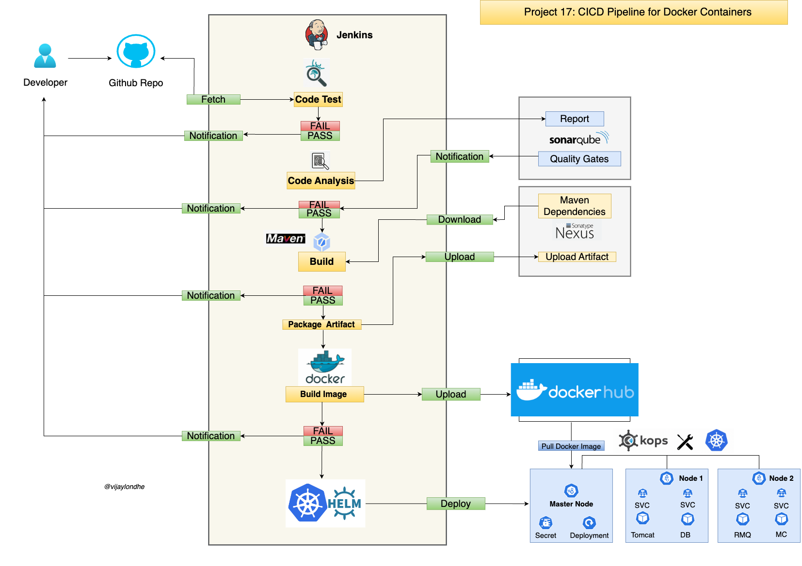

# Project-17: CICD Pipeline for Docker Containers

### Objective:
Implemention of Continuous Integration and Continuos Delivery Pipeline for the Docker Containers.

### Tools & Services:
- Jenkins 
- Git
- Maven
- Sonarqube
- Docker
- DockerHub
- Kubernetes
- Helm 

### Prerequisites:
- CI Pipeline Setup (Please refer Project-05)
- Kubernetes Setup Using kOps (Please refer Project-14)

### Architecture:

### Flow of Execution:
- Continuos Integration Setup 
  - Jenkins, Sonarqube, Nexus (Optional)
- DockerHub Account (Please refer Project-13)
- Store DockerHub Credentials in Jenkins 
- Setup Docker Engine in Jenkins
- Install Plugins in Jenkins 
  - Docker 
  - Docker Pipeline 
  - Pipeline Utility 
- Create Kubernetes Cluster using kOps (Please refer Project-14)
- Install Helm in kOps VM
- Create Helm Charts 
- Test Charts in Kubernets Cluster in test namespace
- Add kOps VM as Jenkins Slave 
- Create Declarative Pipeline in Jenkins 
- Update the Git Repository with 
  - Helm Charts 
  - Dockerfile 
  - Jenkinsfile 
- Create Jenkins Job for Pipeline 
- Run & Test the Job 