# Project-17: CICD Pipeline for Docker Containers

### Objective:
Implemention of Continuous Integration and Continuos Delivery Pipeline for the Docker Containers.

### Tools & Services:
- Jenkins 
- Git
- Maven
- Sonarqube
- Docker
- DockerHub
- Kubernetes
- Helm 

### Prerequisites:
- CI Pipeline Setup (Please refer Project-05)
- Kubernetes Setup Using kOps (Please refer Project-14)

### Architecture:


### Flow of Execution:
- Continuos Integration Setup 
  - Jenkins, Sonarqube, Nexus (Optional)
- DockerHub Account (Please refer Project-13)
- Store DockerHub Credentials in Jenkins 
- Setup Docker Engine in Jenkins
- Install Plugins in Jenkins 
  - Docker 
  - Docker Pipeline 
  - Pipeline Utility 
- Create Kubernetes Cluster using kOps (Please refer Project-14)
- Install Helm in kOps VM
- Create Helm Charts 
- Test Charts in Kubernets Cluster in test namespace
- Add kOps VM as Jenkins Slave 
- Create Declarative Pipeline in Jenkins 
- Update the Git Repository with 
  - Helm Charts 
  - Dockerfile 
  - Jenkinsfile 
- Create Jenkins Job for Pipeline 
- Run & Test the Job 


### Step 1: Jenkins Configuration:

#### Add Credential for Dockerhub account 

- Go to Manage Jenkins -> Manage Credentials -> Add credentials. 
- Type: Username with Password
- Provide dockehub account username and passsword
- Credential ID: dockerhub
- Save the credential

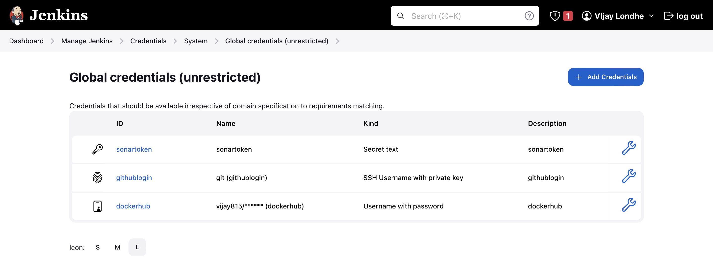

#### Install Docker on the Jenkins Instance

***Note: Please refer Project-05 for Jenkins Instance Setup for CI Pipeline.***

- Login to the Jenkins Instance
- `ssh -i <ssh_key> ubuntu@<jenkins_instance_public_ip>`
- Follow the docker documentation for the installation 
- `https://docs.docker.com/engine/install/debian/`
- After the installation check the docker service status 

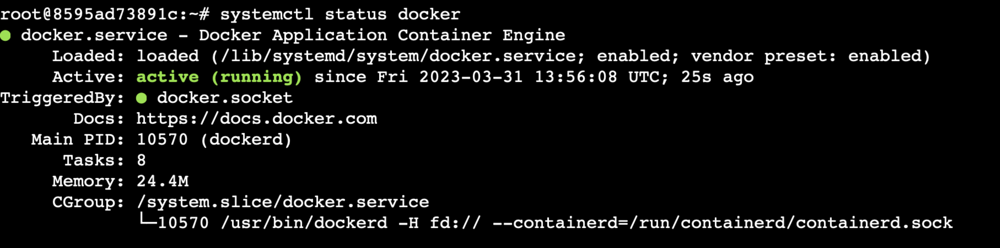

#### Add Jenkins User to Docker Group 
- Add the jenkins user to the docker group to access the docker commands from the jenkins user.

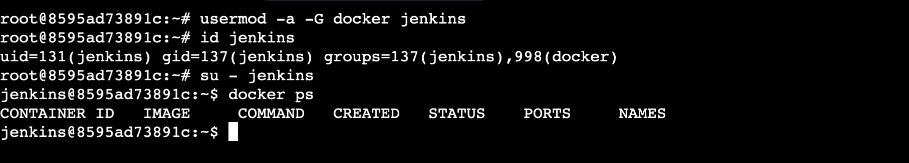


#### Install Plugins in Jenkins 
- Install below mentioned plugins in the jenkins 
```
Docker Pipeline
Docker
Pipeline Utility Steps
```
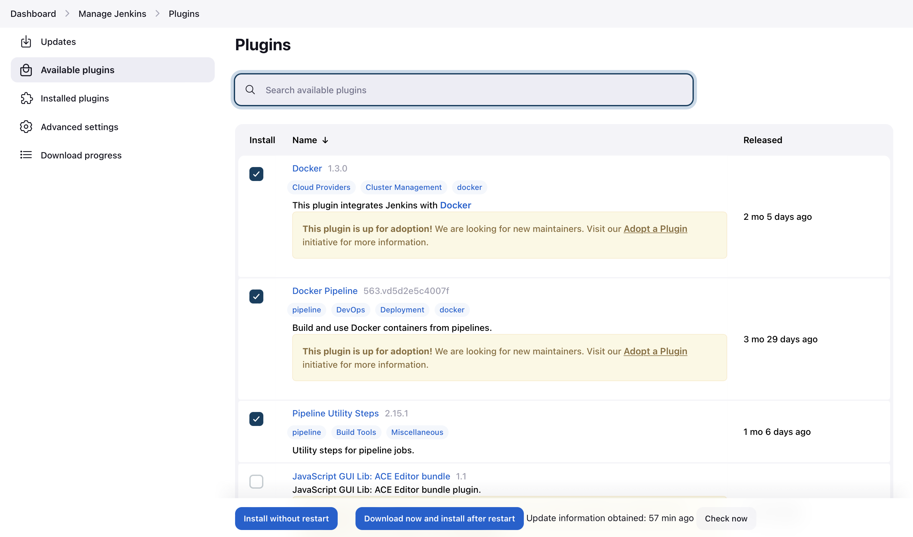


### Step 2: kOps Instance Configuration:

***Note: Please refer Project-14 for Kubernetes Cluster Setup Using kOps.***

#### Install Helm 
- Log in to kOps instance
- `ssh -i <ssh_key> ubuntu@<kops_instance_public_ip>`

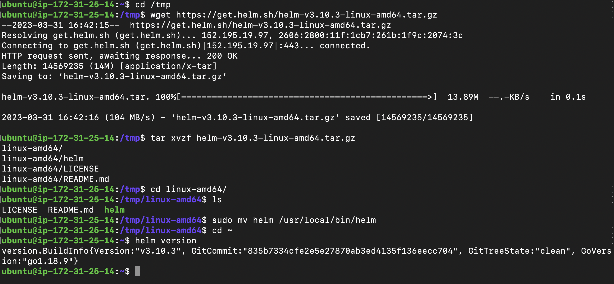

#### Clone the Project Repo
- Please refer repository: `https://github.com/vijaylondhe/cicd-kube-docker.git`
- Setup SSH between kOps instance and GitHub
  - Clone the project repository on the kOps instance
  - Create SSH keys on kOps instance using `ssh-keygen` command
  - Go to the Github setting, create SSH keys for kOps instance
  - Paste the content of `id_rsa.pub` file from the kOps instance and Save. 
  - Test the connection to github from the kOps instance
  - `ssh -T git@github.com`

- Clone the Project Repository `https://github.com/vijaylondhe/cicd-kube-docker.git`

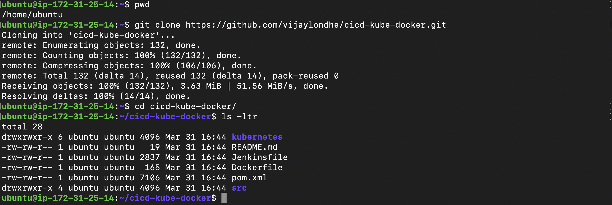


#### Create Helm Chart
- Go to `cicd-kube-docker` directory
- Create directory `helm` 
- `cd helm`
- `helm create vprofilecharts`

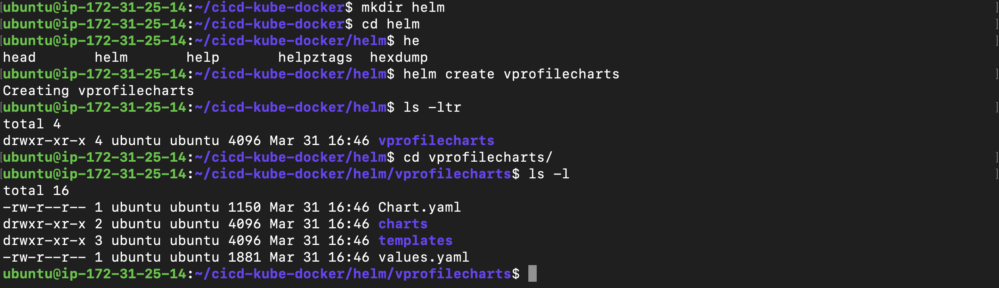

#### Add Kubernets Manifest files as Template in Helm
- Copy manifest files from `kubernetes/vpro-app/*` directory to `helm/vprofilecharts/templates/` directory

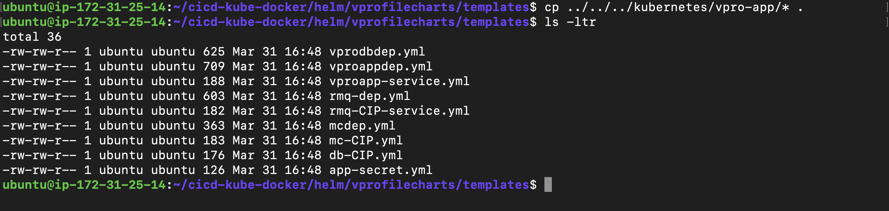

- Edit the `helm/vprofilecharts/templates/vproappdep.yml`
- Update the `image: {{ .Values.appimage }}`

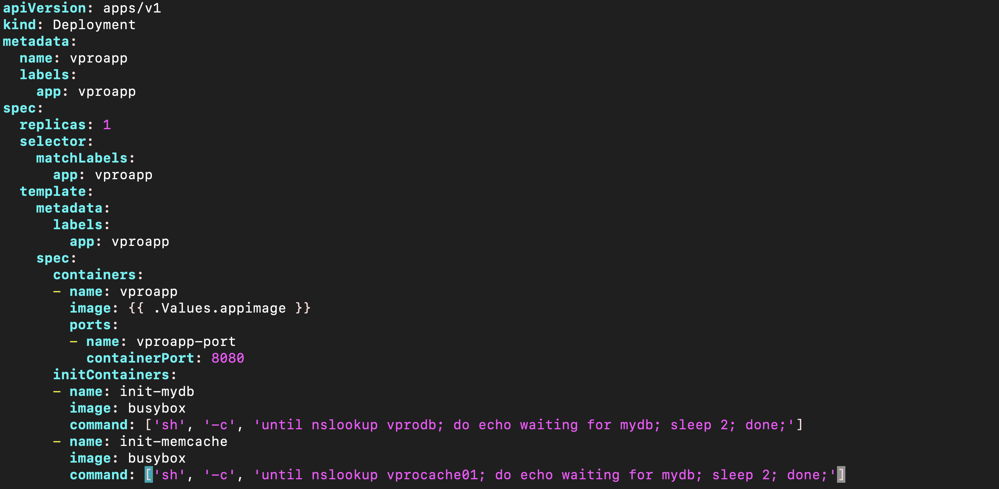


#### TESTING: Install Helm Chart in test namespace
- Create test namespace on kubernetes cluster 
- `kubectl create ns test`
- Install helm chart in test namespace

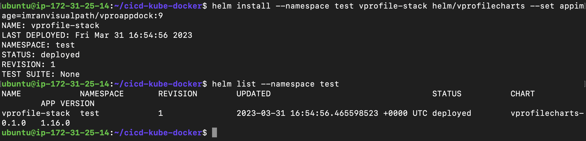


- Check all the resources created in test namespace 

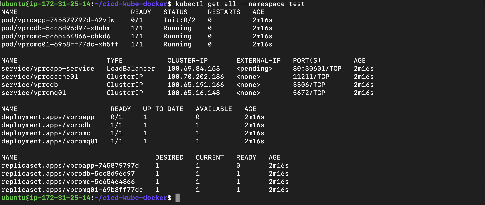

- After the testing, delete the stack from the `test` namesapce and create the `prod` namespace.

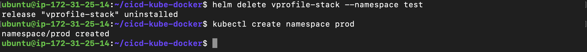


### Step 3: Add the kOps instance as Jenkins Slave:
- Login to the kOps instance
- `ssh -i <ssh_key> ubuntu@<kops_instance_public_ip>`
- Execute the below commands 
```
sudo apt update && sudo apt install openjdk-11-jdk -y
sudo mkdir /opt/jenkins-slave
sudo chown ubuntu.ubuntu /opt/jenkins-slave -R
java -version
```

- Go to the Jenkins Console 
- Manage Jenkins -> Nodes and Clouds
- click on + New Node

```
Name: kops
Type: Permanent Agent
Remote Root directory: /opt/jenkins-slave
Labels: KOPS       
Usage: Only build jobs with label expresions matching this node
Launch Method: Launch agents via SSH
Host: <private_ip_of_kops_instance>
Credentials: Add new
  - Type: SSH username with private key
  - Username: ubuntu
  - Private Key: <paste_content_of_private_key_id_rsa>
  - ID: kops-login
  - Description: kops-login
Host Key Verification Strategy: Non verifying Verification strategy
```

- Now, click on Launch Agent to test the connection. 


### Step 4: Create Jenkinsfile and Configure Pipeline Job: 
- vi Jenkinsfile 
```
pipeline {

    agent any
 
    tools {
	jdk "OracleJDK8"
	maven "MAVEN3"
        
    }

    environment {
        registry = "vijay815/vproappdock"
        registryCredential = 'dockerhub'
    }

    stages{

        stage('BUILD'){
            steps {
                sh 'mvn clean install -DskipTests'
            }
            post {
                success {
                    echo 'Now Archiving...'
                    archiveArtifacts artifacts: '**/target/*.war'
                }
            }
        }

        stage('UNIT TEST'){
            steps {
                sh 'mvn test'
            }
        }

        stage('INTEGRATION TEST'){
            steps {
                sh 'mvn verify -DskipUnitTests'
            }
        }

        stage ('CODE ANALYSIS WITH CHECKSTYLE'){
            steps {
                sh 'mvn checkstyle:checkstyle'
            }
            post {
                success {
                    echo 'Generated Analysis Result'
                }
            }
        }

        stage('Building image') {
            steps{
              script {
                dockerImage = docker.build registry + ":$BUILD_NUMBER"
              }
            }
        }
        
        stage('Deploy Image') {
          steps{
            script {
              docker.withRegistry( '', registryCredential ) {
                dockerImage.push("$BUILD_NUMBER")
                dockerImage.push('latest')
              }
            }
          }
        }

        stage('Remove Unused docker image') {
          steps{
            sh "docker rmi $registry:$BUILD_NUMBER"
          }
        }

        stage('CODE ANALYSIS with SONARQUBE') {

            environment {
                scannerHome = tool 'sonarscanner'
            }

            steps {
                withSonarQubeEnv('sonarserver') {
                    sh '''${scannerHome}/bin/sonar-scanner -Dsonar.projectKey=vprofile \
                   -Dsonar.projectName=vprofile-repo \
                   -Dsonar.projectVersion=1.0 \
                   -Dsonar.sources=src/ \
                   -Dsonar.java.binaries=target/test-classes/com/visualpathit/account/controllerTest/ \
                   -Dsonar.junit.reportsPath=target/surefire-reports/ \
                   -Dsonar.jacoco.reportsPath=target/jacoco.exec \
                   -Dsonar.java.checkstyle.reportPaths=target/checkstyle-result.xml'''
                }

                timeout(time: 10, unit: 'MINUTES') {
                    waitForQualityGate abortPipeline: true
                }
            }
        }
        stage('Kubernetes Deploy') {
	  agent { label 'KOPS' }
            steps {
                    sh "helm upgrade --install --force vprofile-stack helm/vprofilecharts --set appimage=${registry}:${BUILD_NUMBER} --namespace prod"
            }
        }
    }
}
```
- Commit and Push the code to the repository.
- Go to the Jenkins Console 
- Create New Pipeline 
```
Type: Pipeline
Pipeline Definition: Pipeline script from SCM
SCM: Git
Repository URL: git@github.com:vijaylondhe/cicd-kube-docker.git
Credentials: githublogin
branch: */main
Script Path: Jenkinsfile
```
- Save the Pipeline and Click on Build Now.
- You will see pipeline started building, check the build logs.

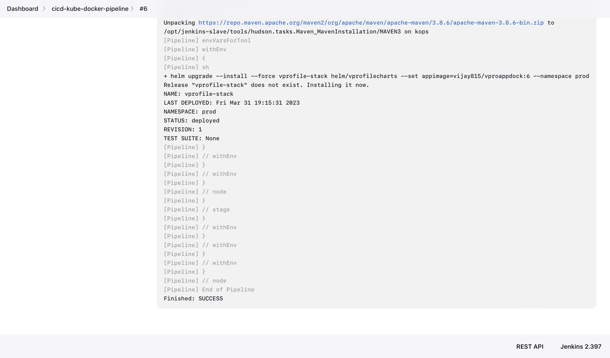

- Pipeline successfully executed, check the pipeline view.

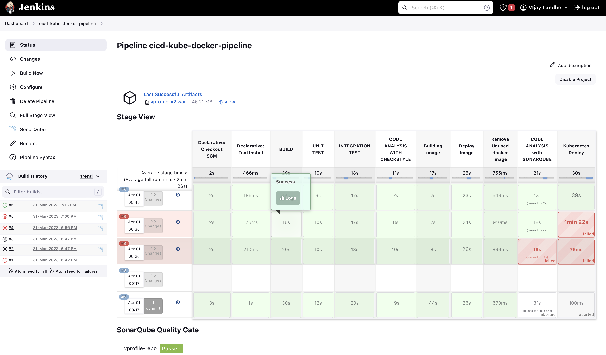