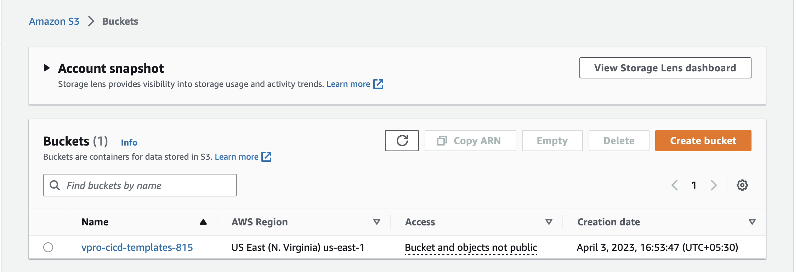
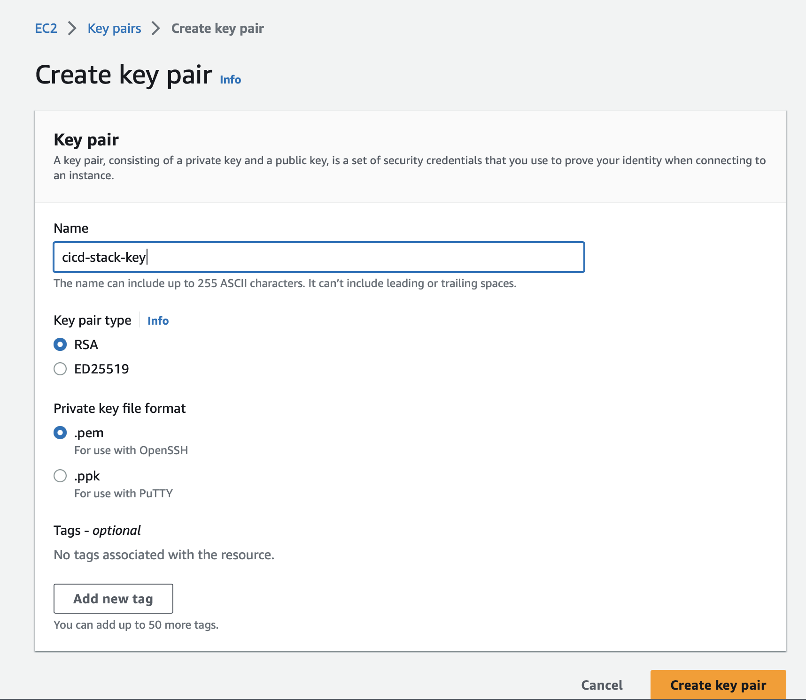

# Project-18: Use AWS CloudFormation to Deploy Web Application Stack

### Objective:
Using AWS Cloudformation, deploy the web application stack on the AWS.

### Tools & Services:
- AWS CloudFormation
- AWS S3 

<!-- ### Architecture: -->

<!--  -->

### Flow of Execution:
- Create S3 bucket to upload the templates, create folder named stack-template 
- Create Key Pair 
- Write root template named cicdtemp.yml
- Write Child templates 
  - Create S3 Role
  - Jenkins Template
  - Nexus Template 
  - Sonar Template
  - Windows Server Template
  - Tomcat Template
  - DB Template 
- Update root template with child template paths 
- Upload all child template to the S3 bucket in the folder stack-template
- Create Nested Template by using cicdtemp.yml

### Step 1: Create S3 Bucket and Key Pair:
- Create Bucket:
  - Go to the S3 Service 
  - Click on Create bucket

```
Region Name: us-east-1 
Bucket Name: vprofile-cicd-template-815
Create Folder inside the bucket
Folder Name: stack-template
```



- Create Key Pair:
  - Go to the EC2 Service -> Key Pair
  - Create New Key
  - Key Name: cicd-stack-key
  - Format: .pem 



### Step 2: Create Root Template:

- vi cicdtemp.yml
```
AWSTemplateFormatVersion: "2010-09-09"
Description: Root Template
Parameters:
  KeyPair:
    Description: Key Pair for the Instance
    Type: AWS::EC2::KeyPair::KeyName
  MyIP:
    Description: Assigning IP
    Type: String
    Default: 0.0.0.0/0

Resources:
  S3RoleforCicd:
    Type: AWS::CloudFormation::Stack
    Properties:
      TemplateURL: https://s3.amazonaws.com/vpro-cicd-templates-815/stack-template/cicds3role.yaml

  JenkinsInst:
    Type: AWS::CloudFormation::Stack
    Properties:
      TemplateURL: https://s3.amazonaws.com/vpro-cicd-templates-815/stack-template/jenk.yaml
      Parameters:
        KeyName: !Ref KeyPair
        MyIp: !Ref MyIP

  App01qa:
    Type: AWS::CloudFormation::Stack
    DependsOn: JenkinsInst
    Properties:
      TemplateURL: https://s3.amazonaws.com/vpro-cicd-templates-815/stack-template/app01qa.yaml
      Parameters:
        KeyName: !Ref KeyPair
        MyIP: !Ref MyIP
  NexusServer:
    Type: AWS::CloudFormation::Stack
    DependsOn: JenkinsInst
    Properties:
      TemplateURL: https://s3.amazonaws.com/vpro-cicd-templates-815/stack-template/nexus.yaml
      Parameters:
        KeyName: !Ref KeyPair
        MyIP: !Ref MyIP
  SonarServer:
    Type: AWS::CloudFormation::Stack
    DependsOn: JenkinsInst
    Properties:
      TemplateURL: https://s3.amazonaws.com/vpro-cicd-templates-815/stack-template/sonar.yaml
      Parameters:
        KeyName: !Ref KeyPair
        MyIP: !Ref MyIP
  db01qa:
    Type: AWS::CloudFormation::Stack
    DependsOn: App01qa
    Properties:
      TemplateURL: https://s3.amazonaws.com/vpro-cicd-templates-815/stack-template/db01qa.yaml
      Parameters:
        KeyName: !Ref KeyPair
        MyIP: !Ref MyIP
  WintestServer:
    Type: AWS::CloudFormation::Stack
    DependsOn: JenkinsInst
    Properties:
      TemplateURL: https://s3.amazonaws.com/vpro-cicd-templates-815/stack-template/wintest.yaml
      Parameters:
        KeyName: !Ref KeyPair
        MyIP: !Ref MyIP
```

### Step 3: Create CF Template for IAM Role:
- Create Cloudformation template for IAM role 
- This IAM Role has full access to S3 service 
- Also, this role includes the instance profile 
- We will use the Cloudformation `Outputs` to export the IAM role name which will later used to assing to the other templates 

- vi cicds3role.yaml
```
AWSTemplateFormatVersion: "2010-09-09"
Resources:
  VPS3Role:
    Type: "AWS::IAM::Role"
    Properties:
      AssumeRolePolicyDocument:
        Version: "2012-10-17"
        Statement:
          -
            Effect: "Allow"
            Principal:
              Service:
                - "ec2.amazonaws.com"
            Action:
              - "sts:AssumeRole"
      Path: "/"
      Policies:
        Type: "AWS::IAM::Policy"
        Properties:
          PolicyName: "root"
          PolicyDocument:
            Version: "2012-10-17"
            Statement:
              - Effect: "Allow"
                Action: "*"
                Resource: "arn:aws:s3:::*"
  VPInstanceProfile:
    Type: "AWS::IAM::InstanceProfile"
    Properties:
      Path: "/"
      Roles:
        - !Ref VPS3Role

Outputs:
  VPs3rolDetails:
    Description: VP CICD Pro s3 role info
    Value: !Ref VPInstanceProfile
    Export:
      Name: cicds3role-VPS3RoleProfileName
```


### Step 4: Create CF Template for Jenkins Instance:
- In this template we will use `AWS::EC2::Instance` to create the instance for jenkins 
- Use `Parameters` for Role Name, IP Address, KeyName and Instance Type.
- Use  `Mappings` for AMI ID's in different regions
- Use  `UserData` in instance resource to install the jenkins after instance resource is created 
- Use `AWS::EC2::SecurityGroup` to create the security group for the jenkins instance
- Use `Outputs` to define output for Public/Private IP, Instance ID, Security Group ID etc.
- Use `Export` to export the security group id, we will use this id later in the backend services templates.

- vi jenk.yaml

```
Parameters:
  RoleTempName:
    Description: Name of the base stack with all infra resources
    Type: String
    Default: cicds3role
  MyIP:
    Type: String
  KeyName: 
    Type: String
  InstanceType:                                        
    Type: String
    Default: t2.micro

Mappings:
  AmiRegionMap:
    us-east-1:
      AMI: ami-0bcc094591f354be2 
    us-east-2:
      AMI: ami-0bbe28eb2173f6167
    eu-west-1:
      AMI: ami-0ea3405d2d2522162
    us-west-1:
      AMI: ami-0dd005d3eb03f66e8
    ap-south-1:
      AMI: ami-02b5fbc2cb28b77b8 
    us-west-2:
      AMI: ami-0a634ae95e11c6f91 
Resources:
  JenkinsInst:
    Type: 'AWS::EC2::Instance'
    Properties:
      InstanceType: !Ref InstanceType
      KeyName: !Ref KeyName
      ImageId: !FindInMap
        - AmiRegionMap
        - !Ref AWS::Region
        - AMI
      Tags:
        - Key: "Name"
          Value: !Join 
            - ""
            - - "Jenkins in "
              - !Ref AWS::Region
      SecurityGroups: 
        - !Ref JenkinsSG
      IamInstanceProfile: 
        Fn::ImportValue:
            Fn::Sub: "${RoleTempName}-VPS3RoleProfileName"
      UserData:
        Fn::Base64:                              
          !Sub |
            #!/bin/bash
            sudo apt update
            sudo apt install openjdk-8-jdk -y
            sudo apt install maven git wget unzip -y
            sudo apt install awscli -y     
            curl -fsSL https://pkg.jenkins.io/debian-stable/jenkins.io-2023.key | sudo tee \
            /usr/share/keyrings/jenkins-keyring.asc > /dev/null
            echo deb [signed-by=/usr/share/keyrings/jenkins-keyring.asc] \
            https://pkg.jenkins.io/debian-stable binary/ | sudo tee \
            /etc/apt/sources.list.d/jenkins.list > /dev/null
            sudo apt-get update
            sudo apt-get install jenkins
            sleep 10
            systemctl stop jenkins
            systemctl start jenkins 
            systemctl enable jenkins
            reboot 

  JenkinsSG:
    Type: 'AWS::EC2::SecurityGroup'
    Properties:
      GroupName: JenkinsSG
      GroupDescription: Allow SSH & HTTP from myip
      SecurityGroupIngress:
        - IpProtocol: tcp
          FromPort: '22'
          ToPort: '22'
          CidrIp: !Ref MyIP
          
        - IpProtocol: tcp
          FromPort: '8080'
          ToPort: '8080'
          CidrIp: 0.0.0.0/0
        
Outputs:
  MyEC2InstancePublicIP:
    Value: !GetAtt JenkinsInst.PublicIp
  MyEC2InstancePrivateIP:
    Value: !GetAtt JenkinsInst.PrivateIp
  MyEC2InstanceID:
    Value: !Ref JenkinsInst
  JenkSecurityGroupId:
    Description: Security Group 1 ID
    Value:
      Fn::GetAtt:
      - JenkinsSG
      - GroupId
    Export:
      Name: jenk-SGID
```

### Step 5: Create CF Template for Nexus:

- vi nexus.yaml
```
Parameters:
  RoleTempName:
    Description: Name of the base stack with all infra resources
    Type: String
    Default: cicds3role
  JenkStackName:
    Description: Name of the base stack with all infra resources
    Type: String
    Default: jenk
  MyIP:
    Type: String
  KeyName:
    Type: String
  InstanceType:
    Type: String
    Default: t2.medium
Mappings:
  AmiRegionMap:
    us-east-1:
      AMI: ami-06cf02a98a61f9f5e
    us-east-2:
      AMI: ami-0a75b786d9a7f8144
    eu-west-1:
      AMI: ami-0d4002a13019b7703
    us-west-1:
      AMI: ami-02676464a065c9c05
    ap-south-1:
      AMI: ami-0dd861ee19fd50a16
    us-west-2:
      AMI: ami-0a248ce88bcc7bd23
Resources:
  NexusInst:
    Type: 'AWS::EC2::Instance'
    Properties:
      InstanceType: !Ref InstanceType
      KeyName: !Ref KeyName
      ImageId: !FindInMap
        #        Fn::FindInMap:
        - AmiRegionMap
        - !Ref AWS::Region
        - AMI
      Tags:
        - Key: "Name"
          Value: "Nexus Server "
      SecurityGroups:
        - !Ref nexusSG
      IamInstanceProfile:
        Fn::ImportValue:
          Fn::Sub: "${RoleTempName}-VPS3RoleProfileName"
      UserData:
        Fn::Base64:                                # YAML makes userdata much cleaner
          !Sub |
          #!/bin/bash
          yum install java-1.8.0-openjdk.x86_64 wget -y   
          yum install epel-release -y
          yum install awscli -y
          mkdir -p /opt/nexus/   
          mkdir -p /tmp/nexus/                           
          cd /tmp/nexus
          NEXUSURL="https://download.sonatype.com/nexus/3/latest-unix.tar.gz"
          wget $NEXUSURL -O nexus.tar.gz
          EXTOUT=`tar xzvf nexus.tar.gz`
          NEXUSDIR=`echo $EXTOUT | cut -d '/' -f1`
          rm -rf /tmp/nexus/nexus.tar.gz
          rsync -avzh /tmp/nexus/ /opt/nexus/
          useradd nexus
          chown -R nexus.nexus /opt/nexus 
          cat <<EOT>> /etc/systemd/system/nexus.service
          [Unit]                                                                          
          Description=nexus service                                                       
          After=network.target                                                            
          
          [Service]                                                                       
          Type=forking                                                                    
          LimitNOFILE=65536                                                               
          ExecStart=/opt/nexus/$NEXUSDIR/bin/nexus start                                  
          ExecStop=/opt/nexus/$NEXUSDIR/bin/nexus stop                                    
          User=nexus                                                                      
          Restart=on-abort                                                                
          
          [Install]                                                                       
          WantedBy=multi-user.target                                                      
          
          EOT
          
          echo 'run_as_user="nexus"' > /opt/nexus/$NEXUSDIR/bin/nexus.rc
          systemctl daemon-reload
          systemctl start nexus
          systemctl enable nexus
          reboot

  nexusSG:
    Type: 'AWS::EC2::SecurityGroup'
    Properties:
      GroupName: nexusSG
      GroupDescription: Allow SSH & HTTP from myip
      SecurityGroupIngress:
        - IpProtocol: tcp
          FromPort: '22'
          ToPort: '22'
          CidrIp: !Ref MyIP

        - IpProtocol: tcp
          FromPort: '8081'
          ToPort: '8081'
          CidrIp: !Ref MyIP
  vproappSGIngress:
    Type: 'AWS::EC2::SecurityGroupIngress'
    Properties:
      GroupId:
        Fn::GetAtt:
          - nexusSG
          - GroupId
      IpProtocol: tcp
      FromPort: 8081
      ToPort: 8081
      SourceSecurityGroupId:
        Fn::ImportValue:
          Fn::Sub: "${JenkStackName}-SGID"
```


### Step 6: Create CF Template for Sonarqube Instance:

- vi sonar.yaml
```
Parameters:
  RoleTempName:
    Description: Name of the base stack with all infra resources
    Type: String
    Default: cicds3role
  JenkStackName:
    Description: Name of the base stack with all infra resources
    Type: String
    Default: jenk
  MyIP:
    Type: String
  KeyName: 
    Type: String
  InstanceType:                                        
    Type: String
    Default: t2.medium
Mappings:
  AmiRegionMap:
    us-east-1:
      AMI: ami-0bcc094591f354be2 
    us-east-2:
      AMI: ami-0bbe28eb2173f6167
    eu-west-1:
      AMI: ami-0ea3405d2d2522162
    us-west-1:
      AMI: ami-0dd005d3eb03f66e8
    ap-south-1:
      AMI: ami-02b5fbc2cb28b77b8 
    us-west-2:
      AMI: ami-0a634ae95e11c6f91 
Resources:
  SonarInst:
    Type: 'AWS::EC2::Instance'
    Properties:
      InstanceType: !Ref InstanceType
      KeyName: !Ref KeyName
      ImageId: !FindInMap
        - AmiRegionMap
        - !Ref AWS::Region
        - AMI
      Tags:
        - Key: "Name"
          Value: !Join 
            - ""
            - - "SonarServer in "
              - !Ref AWS::Region
      SecurityGroups: 
        - !Ref sonarSG
      IamInstanceProfile: 
        Fn::ImportValue:
            Fn::Sub: "${RoleTempName}-VPS3RoleProfileName"
      UserData:
        Fn::Base64:                                
          !Sub |
              #!/bin/bash
              cp /etc/sysctl.conf /root/sysctl.conf_backup
              cat <<EOT> /etc/sysctl.conf
              vm.max_map_count=262144
              fs.file-max=65536
              ulimit -n 65536
              ulimit -u 4096
              EOT
              cp /etc/security/limits.conf /root/sec_limit.conf_backup
              cat <<EOT> /etc/security/limits.conf
              sonarqube   -   nofile   65536
              sonarqube   -   nproc    409
              EOT

              sudo apt-get update -y
              sudo apt-get install openjdk-11-jdk -y
              sudo update-alternatives --config java
              java -version

              sudo apt update
              wget -q https://www.postgresql.org/media/keys/ACCC4CF8.asc -O - | sudo apt-key add -

              sudo sh -c 'echo "deb http://apt.postgresql.org/pub/repos/apt/ `lsb_release -cs`-pgdg main" >> /etc/apt/sources.list.d/pgdg.list'
              sudo apt install postgresql postgresql-contrib -y
              #sudo -u postgres psql -c "SELECT version();"
              sudo systemctl enable postgresql.service
              sudo systemctl start  postgresql.service
              sudo echo "postgres:admin123" | chpasswd
              runuser -l postgres -c "createuser sonar"
              sudo -i -u postgres psql -c "ALTER USER sonar WITH ENCRYPTED PASSWORD 'admin123';"
              sudo -i -u postgres psql -c "CREATE DATABASE sonarqube OWNER sonar;"
              sudo -i -u postgres psql -c "GRANT ALL PRIVILEGES ON DATABASE sonarqube to sonar;"
              systemctl restart  postgresql
              #systemctl status -l   postgresql
              netstat -tulpena | grep postgres
              sudo mkdir -p /sonarqube/
              cd /sonarqube/
              sudo curl -O https://binaries.sonarsource.com/Distribution/sonarqube/sonarqube-8.3.0.34182.zip
              sudo apt-get install zip -y
              sudo unzip -o sonarqube-8.3.0.34182.zip -d /opt/
              sudo mv /opt/sonarqube-8.3.0.34182/ /opt/sonarqube
              sudo groupadd sonar
              sudo useradd -c "SonarQube - User" -d /opt/sonarqube/ -g sonar sonar
              sudo chown sonar:sonar /opt/sonarqube/ -R
              cp /opt/sonarqube/conf/sonar.properties /root/sonar.properties_backup
              cat <<EOT> /opt/sonarqube/conf/sonar.properties
              sonar.jdbc.username=sonar
              sonar.jdbc.password=admin123
              sonar.jdbc.url=jdbc:postgresql://localhost/sonarqube
              sonar.web.host=0.0.0.0
              sonar.web.port=9000
              sonar.web.javaAdditionalOpts=-server
              sonar.search.javaOpts=-Xmx512m -Xms512m -XX:+HeapDumpOnOutOfMemoryError
              sonar.log.level=INFO
              sonar.path.logs=logs
              EOT

              cat <<EOT> /etc/systemd/system/sonarqube.service
              [Unit]
              Description=SonarQube service
              After=syslog.target network.target

              [Service]
              Type=forking

              ExecStart=/opt/sonarqube/bin/linux-x86-64/sonar.sh start
              ExecStop=/opt/sonarqube/bin/linux-x86-64/sonar.sh stop

              User=sonar
              Group=sonar
              Restart=always

              LimitNOFILE=65536
              LimitNPROC=4096


              [Install]
              WantedBy=multi-user.target
              EOT
              
              systemctl daemon-reload
              systemctl enable sonarqube.service
              systemctl start sonarqube.service
              apt-get install nginx -y
              rm -rf /etc/nginx/sites-enabled/default
              rm -rf /etc/nginx/sites-available/default
              cat <<EOT> /etc/nginx/sites-available/sonarqube
              server{
                  listen      80;
                  server_name sonarqube.groophy.in;
              
                  access_log  /var/log/nginx/sonar.access.log;
                  error_log   /var/log/nginx/sonar.error.log;
              
                  proxy_buffers 16 64k;
                  proxy_buffer_size 128k;
              
                  location / {
                      proxy_pass  http://127.0.0.1:9000;
                      proxy_next_upstream error timeout invalid_header http_500 http_502 http_503 http_504;
                      proxy_redirect off;
                            
                      proxy_set_header    Host            \$host;
                      proxy_set_header    X-Real-IP       \$remote_addr;
                      proxy_set_header    X-Forwarded-For \$proxy_add_x_forwarded_for;
                      proxy_set_header    X-Forwarded-Proto http;
                  }
              }
              EOT
              ln -s /etc/nginx/sites-available/sonarqube /etc/nginx/sites-enabled/sonarqube
              systemctl enable nginx.service
              #systemctl restart nginx.service
              sudo ufw allow 80,9000,9001/tcp
              systemctl stop sonarqube
              systemctl stop postgresql
              sleep 10
              systemctl start postgresql
              systemctl start sonarqube
              sleep 10              
              reboot


  sonarSG:
    Type: 'AWS::EC2::SecurityGroup'
    Properties:
      GroupName: sonarSG
      GroupDescription: Allow SSH & HTTP from myip
      SecurityGroupIngress:
        - IpProtocol: tcp
          FromPort: '22'
          ToPort: '22'
          CidrIp: !Ref MyIP
          
        - IpProtocol: tcp
          FromPort: '80'
          ToPort: '80'
          CidrIp: !Ref MyIP

  sonarSGIngress:
   Type: 'AWS::EC2::SecurityGroupIngress'
   Properties:
      GroupId: 
        Fn::GetAtt:
        - sonarSG
        - GroupId
      IpProtocol: -1
      SourceSecurityGroupId:
        Fn::ImportValue:
            Fn::Sub: "${JenkStackName}-SGID"

  JenkinsSGIngress:
   Type: 'AWS::EC2::SecurityGroupIngress'
   Properties:
      GroupId: 
        Fn::ImportValue:
            Fn::Sub: "${JenkStackName}-SGID"
      IpProtocol: -1
      SourceSecurityGroupId:
        Fn::GetAtt:
        - sonarSG
        - GroupId
```

### Step 7: Create CF Template for Windows Test Instance:

- vi wintest.yaml
```
Parameters:
  RoleTempName:
    Description: Name of the base stack with all infra resources
    Type: String
    Default: cicds3role
  JenkStackName:
    Description: Name of the base stack with all infra resources
    Type: String
    Default: jenk
  MyIP:
    Type: String
  KeyName:
    Type: String
  InstanceType:
    Type: String
    Default: t2.small
Mappings:
  AmiRegionMap:
    us-east-1:
      AMI: ami-032c2c4b952586f02
    us-east-2:
      AMI: ami-0239d3998515e9ed1
    eu-west-1:
      AMI: ami-0b5271aea7b566f9a
    us-west-1:
      AMI: ami-08bcc13ad2c143073
    ap-south-1:
      AMI: ami-07f7b791cbd0812bf
    us-west-2:
      AMI: ami-029e27fb2fc8ce9d8
Resources:
  WintestInst:
    Type: 'AWS::EC2::Instance'
    Properties:
      InstanceType: !Ref InstanceType
      KeyName: !Ref KeyName
      ImageId: !FindInMap
        #        Fn::FindInMap:
        - AmiRegionMap
        - !Ref AWS::Region
        - AMI
      Tags:
        - Key: "Name"
          Value: !Join
            - ""
            - - "Wintest in "
              - !Ref AWS::Region
      SecurityGroups:
        - !Ref wintestSG
      IamInstanceProfile:
        Fn::ImportValue:
          Fn::Sub: "${RoleTempName}-VPS3RoleProfileName"
      UserData:
        Fn::Base64:                                # YAML makes userdata much cleaner
          !Sub |
          <powershell>
          Set-ExecutionPolicy Bypass -Scope Process -Force; iex ((New-Object System.Net.WebClient).DownloadString('https://chocolatey.org/install.ps1'))
          choco install jdk8 -y 
          choco install mvn -y 
          choco install googlechrome -y
          choco install git.install -y
          mkdir C:\jenkins
          </powershell>
  wintestSG:
    Type: 'AWS::EC2::SecurityGroup'
    Properties:
      GroupName: wintestSG
      GroupDescription: Allow SSH & HTTP from myip
      SecurityGroupIngress:
        - IpProtocol: tcp
          FromPort: '3389'
          ToPort: '3389'
          CidrIp: !Ref MyIP
  wintestSGIngress:
    Type: 'AWS::EC2::SecurityGroupIngress'
    Properties:
      GroupId:
        Fn::GetAtt:
          - wintestSG
          - GroupId
      IpProtocol: -1
      SourceSecurityGroupId:
        Fn::ImportValue:
          Fn::Sub: "${JenkStackName}-SGID"
  JenkinsSGIngress:
    Type: 'AWS::EC2::SecurityGroupIngress'
    Properties:
      GroupId:
        Fn::ImportValue:
          Fn::Sub: "${JenkStackName}-SGID"
      IpProtocol: -1
      SourceSecurityGroupId:
        Fn::GetAtt:
          - wintestSG
          - GroupId
```

### Step 8: Create CF Template for Tomcat Instance:

- vi app01qa.yaml
```
Parameters:
  RoleTempName:
    Description: Name of the base stack with all infra resources
    Type: String
    Default: cicds3role
  JenkStackName:
    Description: Name of the base stack with all infra resources
    Type: String
    Default: jenk
  MyIP:
    Type: String
  KeyName:
    Type: String
  InstanceType:
    Type: String
    Default: t2.micro
Mappings:
  AmiRegionMap:
    us-east-1:
      AMI: ami-0bcc094591f354be2
    us-east-2:
      AMI: ami-0bbe28eb2173f6167
    eu-west-1:
      AMI: ami-0ea3405d2d2522162
    us-west-1:
      AMI: ami-0dd005d3eb03f66e8
    ap-south-1:
      AMI: ami-02b5fbc2cb28b77b8
    us-west-2:
      AMI: ami-0a634ae95e11c6f91
Resources:
  App01qaInst:
    Type: 'AWS::EC2::Instance'
    Properties:
      InstanceType: !Ref InstanceType
      KeyName: !Ref KeyName
      ImageId: !FindInMap
        #        Fn::FindInMap:
        - AmiRegionMap
        - !Ref AWS::Region
        - AMI
      Tags:
        - Key: "Name"
          Value: !Join
            - ""
            - - "app01-qa-vpro in "
              - !Ref AWS::Region
      SecurityGroups:
        - !Ref vproappSG
      IamInstanceProfile:
        Fn::ImportValue:
          Fn::Sub: "${RoleTempName}-VPS3RoleProfileName"
      UserData:
        Fn::Base64:                                # YAML makes userdata much cleaner
          !Sub |
          #!/bin/bash
          sudo apt update
          sudo apt install openjdk-8-jdk -y
          sudo apt install git wget unzip -y
          sudo apt install awscli -y
          TOMURL="https://archive.apache.org/dist/tomcat/tomcat-8/v8.5.37/bin/apache-tomcat-8.5.37.tar.gz"
          cd /tmp/
          wget $TOMURL -O tomcatbin.tar.gz
          EXTOUT=`tar xzvf tomcatbin.tar.gz`
          TOMDIR=`echo $EXTOUT | cut -d '/' -f1`
          useradd --shell /sbin/nologin tomcat
          rsync -avzh /tmp/$TOMDIR/ /usr/local/tomcat8/
          #aws s3 cp s3://cicd-data-vprofile/tomcat-users.xml /usr/local/tomcat8/conf/tomcat-users.xml
          #aws s3 cp s3://cicd-data-vprofile/context.xml /usr/local/tomcat8/webapps/manager/META-INF/context.xml
          chown -R tomcat.tomcat /usr/local/tomcat8 
          cat <<EOT>> /etc/systemd/system/tomcat.service
          [Unit]
          Description=Tomcat
          After=network.target
          
          [Service]
          User=tomcat
          WorkingDirectory=/usr/local/tomcat8
          Environment=CATALINA_HOME=/usr/local/tomcat8
          Environment=CATALINE_BASE=/usr/local/tomcat8
          ExecStart=/usr/local/tomcat8/bin/catalina.sh run
          ExecStop=/usr/local/tomcat8/bin/shutdown.sh
          SyslogIdentifier=tomcat-%i
          
          [Install]
          WantedBy=multi-user.target
          EOT
          
          systemctl daemon-reload
          systemctl start tomcat
          systemctl enable tomcat


  vproappSG:
    Type: 'AWS::EC2::SecurityGroup'
    Properties:
      GroupName: vproappSG
      GroupDescription: Allow SSH & HTTP from myip
      SecurityGroupIngress:
        - IpProtocol: tcp
          FromPort: '22'
          ToPort: '22'
          CidrIp: !Ref MyIP

        - IpProtocol: tcp
          FromPort: '8080'
          ToPort: '8080'
          CidrIp: 0.0.0.0/0
  vproappSGIngress:
    Type: 'AWS::EC2::SecurityGroupIngress'
    Properties:
      GroupId:
        Fn::GetAtt:
          - vproappSG
          - GroupId
      IpProtocol: tcp
      FromPort: 8080
      ToPort: 8080
      SourceSecurityGroupId:
        Fn::ImportValue:
          Fn::Sub: "${JenkStackName}-SGID"
Outputs:
  appSecurityGroupId:
    Description: Security Group 1 ID
    Value:
      Fn::GetAtt:
        - vproappSG
        - GroupId
    Export:
      Name: app01qa-SGID
```

### Step 9: Create CF Template for DB Instance:

- vi db01qa.yaml
```
Parameters:
  appStackName:
    Description: Name of the base stack with all infra resources
    Type: String
    Default: app01qa
  MyIP:
    Type: String
  KeyName: 
    Type: String
  InstanceType:                                        
    Type: String
    Default: t2.micro
Mappings:
  AmiRegionMap:
    us-east-1:
      AMI: ami-06cf02a98a61f9f5e
    us-east-2:
      AMI: ami-0a75b786d9a7f8144
    eu-west-1:
      AMI: ami-0d4002a13019b7703
    us-west-1:
      AMI: ami-02676464a065c9c05
    ap-south-1:
      AMI: ami-0dd861ee19fd50a16
    us-west-2:
      AMI: ami-0a248ce88bcc7bd23
Resources:
  DB01qaInst:
    Type: 'AWS::EC2::Instance'
    Properties:
      InstanceType: !Ref InstanceType
      KeyName: !Ref KeyName
      ImageId: !FindInMap
#        Fn::FindInMap:
        - AmiRegionMap
        - !Ref AWS::Region
        - AMI
      Tags:
        - Key: "Name"
          Value: !Join 
            - ""
            - - "db01-qa-vpro in "
              - !Ref AWS::Region
      SecurityGroups: 
        - !Ref vprodbSG
      UserData:
        Fn::Base64:                                # YAML makes userdata much cleaner
          !Sub |
              #!/bin/bash
              DATABASE_PASS='admin123'
              yum update -y
              yum install epel-release -y
              yum install mariadb-server -y
              yum install wget git unzip -y

              #mysql_secure_installation
              sed -i 's/^127.0.0.1/0.0.0.0/' /etc/my.cnf

              # starting & enabling mariadb-server
              systemctl start mariadb
              systemctl enable mariadb

              #restore the dump file for the application
              cd /tmp/
              wget https://raw.githubusercontent.com/devopshydclub/vprofile-repo/vp-rem/src/main/resources/db_backup.sql
              mysqladmin -u root password "$DATABASE_PASS"
              mysql -u root -p"$DATABASE_PASS" -e "UPDATE mysql.user SET Password=PASSWORD('$DATABASE_PASS') WHERE User='root'"
              mysql -u root -p"$DATABASE_PASS" -e "DELETE FROM mysql.user WHERE User='root' AND Host NOT IN ('localhost', '127.0.0.1', '::1')"
              mysql -u root -p"$DATABASE_PASS" -e "DELETE FROM mysql.user WHERE User=''"
              mysql -u root -p"$DATABASE_PASS" -e "DELETE FROM mysql.db WHERE Db='test' OR Db='test\_%'"
              mysql -u root -p"$DATABASE_PASS" -e "FLUSH PRIVILEGES"
              mysql -u root -p"$DATABASE_PASS" -e "create database accounts"
              mysql -u root -p"$DATABASE_PASS" -e "grant all privileges on accounts.* TO 'admin'@'localhost' identified by 'admin123'"
              mysql -u root -p"$DATABASE_PASS" -e "grant all privileges on accounts.* TO 'admin'@'%' identified by 'admin123'"
              mysql -u root -p"$DATABASE_PASS" accounts < /tmp/db_backup.sql
              mysql -u root -p"$DATABASE_PASS" -e "FLUSH PRIVILEGES"

              # Restart mariadb-server
              systemctl restart mariadb
              # SETUP MEMCACHE
              yum install memcached -y
              systemctl start memcached
              systemctl enable memcached
              systemctl status memcached
              memcached -p 11211 -U 11111 -u memcached -d
              sleep 30
              yum install socat -y
              yum install wget -y
              wget https://www.rabbitmq.com/releases/rabbitmq-server/v3.6.10/rabbitmq-server-3.6.10-1.el7.noarch.rpm
              rpm --import https://www.rabbitmq.com/rabbitmq-release-signing-key.asc
              yum update
              rpm -Uvh rabbitmq-server-3.6.10-1.el7.noarch.rpm
              systemctl start rabbitmq-server
              systemctl enable rabbitmq-server
              systemctl status rabbitmq-server
              echo "[{rabbit, [{loopback_users, []}]}]." > /etc/rabbitmq/rabbitmq.config
              rabbitmqctl add_user test test
              rabbitmqctl set_user_tags test administrator
              systemctl restart rabbitmq-server


  vprodbSG:
    Type: 'AWS::EC2::SecurityGroup'
    Properties:
      GroupName: vprodbSG
      GroupDescription: Allow SSH & HTTP from myip
      SecurityGroupIngress:
        - IpProtocol: tcp
          FromPort: '22'
          ToPort: '22'
          CidrIp: !Ref MyIP
  vprodbSGIngress:
   Type: 'AWS::EC2::SecurityGroupIngress'
   Properties:
      GroupId: 
        Fn::GetAtt:
        - vprodbSG
        - GroupId
      IpProtocol: -1
      SourceSecurityGroupId:
        Fn::ImportValue:
            Fn::Sub: "${appStackName}-SGID"
```


### Step 10: Create Nested Stack:

- Go to the S3 service, click on `vprofile-cicd-template-815` bucket
- Upload the child templates inside the `stack-template` folder 
- Go to the Cloudformation service 
- Create Stack
- Uplaod the `cicdtemp.yml` template 
- Click on Next and Create the Stack
- Go to the stack and see the events and resources.